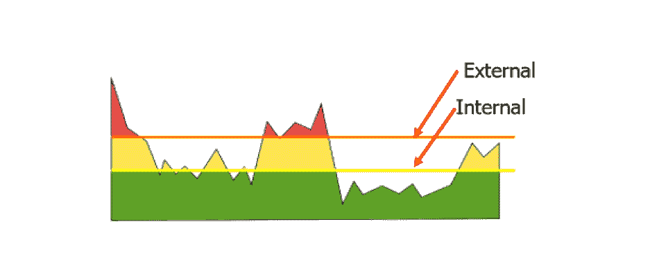
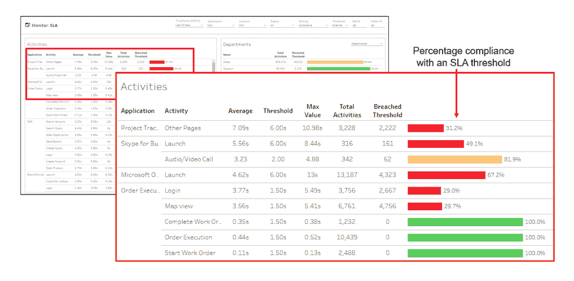

# 如何使用 APM 让云提供商负起责任

> 原文：<https://devops.com/how-to-use-apm-to-hold-cloud-providers-accountable/>

挑战在于:云提供商的服务级别协议(SLA)通常止于他们的云边缘，而您的内部服务级别期望则是端到端的。测量从最终用户到应用的性能，包括设备详情、用户工作效率和页面加载时间，对于客户满意度和持续性能调整至关重要。启动在线应用程序、打开工作订单或填写索赔表需要多长时间？不同地点的执行率和完成率如何？由[应用性能监控](https://www.riverbed.com/solutions/application-performance-monitoring.html) (APM)工具提供的指标和相关元数据可以帮助您的开发运维团队快速识别实际性能问题，快速高效地解决这些问题，并优化云支出和服务级别协议。

## 自动化数据收集

如果您必须手动标记和检测代码，那么收集多个 web 浏览器、操作系统和设备的性能细节是不可能的。现代 APM 解决方案自动将 JavaScript 片段、页面标签或代理部署到您的 web 页面、Java 和。网络应用和移动应用。小型二进制代理和高效的压缩算法确保在向 APM 后端发送遥测信息时，对最终用户设备或网络的性能影响最小。然后，您的开发运维团队可以利用每台设备的实际属性，包括制造商、型号、操作系统类型和版本以及资源消耗，来监控跨 IaaS、PaaS、SaaS 和混合环境的终端用户体验。

## APM 的早期预警

为了触发早期警告，APM 系统会自动确定应用程序基准，或者您可以手动设置特定的阈值。通常，设置内部阈值是为了在用户受到负面影响之前提供可能问题的早期警告，而外部阈值可以与您的实际 SLA 条款相关联。

这些 SLA 报告不仅仅是丰富多彩的视图。通过使用根据最终用户体验对 SLA 状态进行颜色编码的仪表盘，您可以更好地加强与云提供商的服务级别。出于分类目的，您可以根据需要按部门、地理位置、操作系统、设备类型、目标服务器、运营商和其他特征细分详细信息。您还可以一目了然地看到您的合规性测量，它显示了响应时间达到与您的云提供商商定的目标的百分比，以[让他们对性能负责](https://www.riverbed.com/products/steelcentral/end-user-experience-monitoring/hold-it-vendors-accountable.html)。

## 简化补救

自动化是缩短平均维修时间的关键(MTTR)。当触发警报时，APM 工具会与您的服务台系统集成，以自动打开故障单、识别可能的原因并分析业务影响以确定优先级。这种详细程度和集成程度大大减少了以往与性能故障排除相关的延迟，因为它为故障排除提供了必要的环境。高级 APM 解决方案的另一个选项是能够自动修复常见的终端用户体验问题，而无需服务台工作人员的参与。

## 前后对比

这些详细指标的另一个有用的结果是能够比较变更前后的参数。通过基准性能，APM 工具可以帮助您记录和验证代码发布、设备变更或服务提供商升级对最终用户体验的实际影响。用户在新版本发布后抱怨并不罕见，但是使用 APM 报告，您可以采取数据驱动的方法，通过比较不同的时间间隔来快速调查用户投诉。您可以从探索各种特征开始，并根据设备健康状况、网络子网、地理位置、服务器或云提供商来隔离受影响的组。一旦你确定了问题是否在你的控制范围之内(代码、架构等)。)或在您的服务提供商内部，然后您可以与服务提供商进行更有成效的讨论，以准确说明 SLA 违规发生的时间和地点。

## 跟踪 SaaS 应用程序

随着 SaaS 应用程序(如 [Office 365](https://www.riverbed.com/blogs/microsoft-365-monitoring-five-tips-for-ensuring-excellent-communication-and-collaboration.html) )的使用范围扩大，终端用户体验监控和 SLA 管理可用于让这些提供商承担责任。缓慢的应用程序启动、登录、页面加载和其他性能问题会影响用户的工作效率、采用率和部署时间表，从而耗费组织的支持资源和未使用的许可证费用。这就是为什么位于 SaaS 的 APM 工具可以为您提供即时的使用测量，使您能够快速调整许可证数量并优化成本。实时监控用户等待时间、崩溃、设备运行状况和其他体验指标，让您的团队全面了解性能、设备类型或操作系统版本如何影响员工的工作效率。这些信息可用于快速识别问题领域、验证迁移计划并确定未来投资的优先级。

## 问责制监测

如果您将详细的用户体验测量纳入您的 SLA，那么从您的云提供商那里获得您所支付的费用要容易得多。最佳实践是监控组织内每台设备上发生的一切，例如启动、登录、打开指定应用程序和执行关键业务任务所需的时间。如果其中任何一项不符合目标，您的 APM 解决方案可以在受影响的用户呼叫支持之前，打开一个故障单，列出可能的原因并确定其优先级。自动化的终端用户体验监控、报告和策略管理，以自我检测设备和应用为后盾，是服务提供商的承诺和您的实际结果之间的重要纽带。

— [格利·莱文](https://devops.com/author/gayle-levin/)