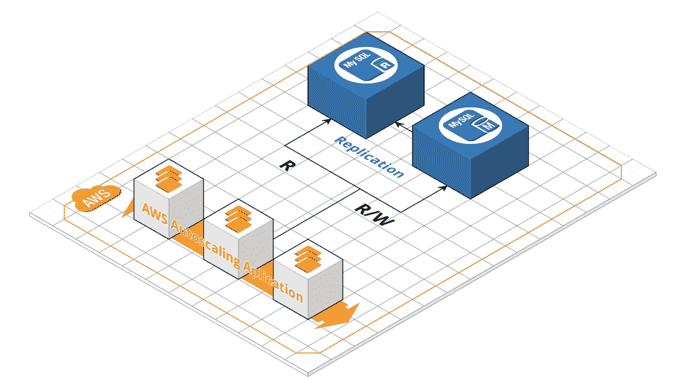
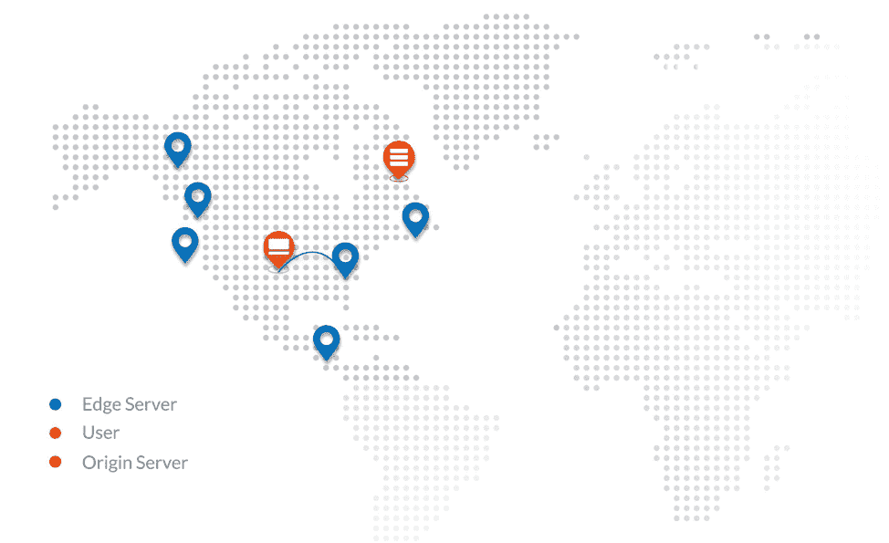
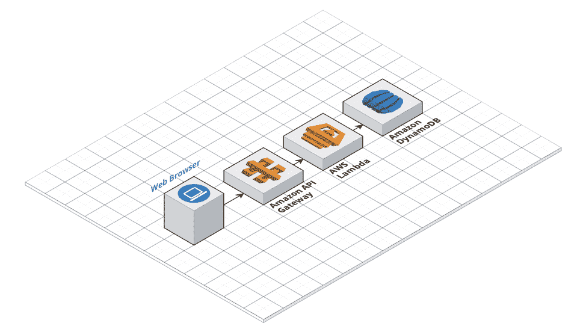

# AWS 上 SaaS·拉韦尔应用程序的最佳实践

> 原文：<https://devops.com/best-practices-for-your-saas-laravel-application-on-aws/>

在现代云生态系统中生存并不容易。然而，有一些坚实的原则可以帮助您为您的 Laravel 应用程序构建一个完美的 AWS 架构，包括 12 因素方法学、用无状态方法设计应用程序以及解耦服务组件。

我相信你已经采纳了许多这些原则。然而，我将只涉及与 AWS Laravel 架构和 AWS 自动伸缩相关的内容，以最大化基础设施的健壮性。

## 12 因素 App 方法关键原则

**应用配置文件:**这些应该在代码库之外，这些配置文件被替换为环境变量，即 Db 连接、机密、环境、主机、IP 等。

**应用依赖** **:** 这些不应该出现在你的代码库中；相反，使用依赖项管理工具来声明服务器所需的大型依赖项和库。即 Gemfile、站点包、pom.xml、清单等。

**使用控制版本系统(CVS):** 需要集成 Git 工作流。即 Github、bitbucket 或 AWS CodeCommit。

**无状态应用程序和进程:**您的应用程序不在本地文件系统中存储任何数据或者依赖于应用程序或服务器中的持久状态是至关重要的。换句话说，应用程序/服务器可以关闭并重新创建，而不会丢失任何数据。只有持久数据存储在数据库或后端服务中。

在应用程序失败的情况下，尽可能地拆分组件，使它们相互独立，这将导致一个简单的分析和孤立的问题。

**不可变的基础设施:**实例在提供后不应该被修改，应该有一个定期更新和修补的标准基础映像(AWS AMI)。因此，您将获得一个能够顺利工作的 AWS 自动扩展，减少部署失败和一致的基础架构。

**开发、测试和生产奇偶校验:**这些环境在软件、库、数据库数据和代码方面应尽可能相似，这一点至关重要。此外，使用 CVS、可重复的基础设施和持续集成/交付(CI CD)可以缩小所有环境之间的差距。

**CI/CD:** 随着应用程序和流量的增长，您需要实现一种机制来向不同的实例和企业环境发布代码。有必要设计一个连续的交付工作流，通过可伸缩性、多环境和分布式架构来提高开发效率。

显然，这些架构设计原则是 DevOps 文化的一部分，这是许多 CTO、工程总监和 VP 的计划。

## 在 AWS 上扩展和构建 SaaS 拉韦尔应用的 10 个最佳实践

以下是我们认为的设计、构建和构建 PHP Laravel 应用程序的 10 个最佳实践，以帮助您解决有关如何构建和扩展 Laravel 应用程序的问题，以及哪些技术与您的产品相关，以使它们符合您的 PHP Laravel 代码库。

### 实践 1:亚马逊 S3

在我看来，亚马逊 S3 是推动云发展的第二个组件，仅次于具有云可扩展性的按需付费模式。亚马逊 S3 是一个无限的云存储，具有卓越的功能，包括 99.99%的耐用性和高可用性，基于对象的存储充当 API，并具有托管基于 HTML、Angular 和 React 的静态网站的能力！亚马逊 S3 云存储无需太多努力就可以成为一个无服务器应用。

亚马逊 S3 是可靠的，可扩展的和安全的，不需要真正的配置。

扩展和构建 Laravel 应用程序的第一步是分离所有静态内容(媒体、图像、视频、文档等)。)到亚马逊 S3。这种划分允许并行分发应用程序的请求，动态内容由 EC2 实例(web 服务器)提供，其余的由亚马逊 S3 提供。这是一项开发工作，其中 Laravel 项目上的所有静态内容都指向亚马逊 S3 端点。

从技术上讲，您需要将您的实际内容移动到亚马逊 S3 桶中，设置正确的 IAM 角色/权限以允许读取访问，并将您的 Laravel 驱动程序配置为指向亚马逊 S3。(以下是关于如何将亚马逊 S3[与拉勒维尔](https://www.clickittech.com/aws/upload-file-amazon-s3-laravel/) 整合的更多细节)。)

亚马逊 S3 可以以完全可扩展、冗余和无服务器的方式托管静态网站和前端应用程序(HTML、Angular、React 等)。从我的经验来看，我建议把你的静态网站放在亚马逊 S3 上。本练习只需几个步骤即可完成，无需服务器(无服务器)。

### 练习 2:使用 AWS 自动伸缩进行水平伸缩(负载平衡器)

管道中的下一个 AWS 组件是 AWS 自动缩放。这个奇妙的特性彻底改变了可伸缩性范式。在 AWS 自动扩展之前，只有手动扩展，并且对不同流量事件的反应难以融合，导致了几次失败。

重要的是要考虑到 AWS 自动伸缩不同于负载平衡器；混淆这两个术语是很常见的。

AWS 自动扩展在负载平衡器(AWS 应用程序负载平衡)之后动态扩展，负载平衡器是由一组扩展策略(阈值/限制)定义的，扩展和缩减必须发生这些策略。这些实例可以根据 CPU、RAM 或任何其他实例指标的预定义标准进行伸缩，从而节省资金和不必要的 AWS 资源。

首先，要部署 AWS 自动伸缩，您需要:

*   设置 AWS 应用程序负载平衡器
*   定义在 AWS CloudWatch 上触发自动缩放事件的阈值
*   确定最小/最大服务器数量
*   设置 AWS 自动扩展组，AWS 自动扩展启动配置使用 Amazon 机器映像(AMI)预配置操作系统。

### 练习 3:带复制的 AWS RDS Aurora

亚马逊 RDS，这是一个数据库管理的服务，需要最少的维护，并兼容 MySQL，PostgreSQL，Oracle 等。RDS 是一个自我维护的数据库，具有预配置的数据库、软件更新、补丁和自动备份。要扩展和集群一个 Amazon RDS，首先您需要启用 RDS 复制特性，该特性允许您的 RDS 创建副本并与这些副本建立主从关系，类似于 MySQL/PostgreSQL 复制；这可以通过点击几下鼠标来实现。您可以使用副本(从属数据库)启用 RDS Aurora，该副本可以分配到其他可用性区域以确保更高的可用性。

###### 极光 RDS 复制

同样，亚马逊 Aurora 是来自 AWS 的高性能数据库，集高速、高可用、高性能于一身。据 AWS 称，Aurora 比标准 MySQL 快 5X，比 PostgreSQL 快 3 倍。

如果您计划提高数据库吞吐量，Amazon Aurora 是 AWS 的高性能数据库。你绝对应该考虑极光。

**提示:**具有复制和/或多 AZ 可用性的 AWS Aurora 可能非常昂贵，请注意您的云托管预算。您可以查看我们的“ [AWS 成本优化清单](https://www.clickittech.com/aws-cost-optimization-checklist/) ”来减少您的 AWS 账单。

### 练习 4:应用程序负载平衡(Laravel 负载平衡器)

几年前，Amazon 推出了应用程序负载平衡(ALB)，这是一个第 7 层 LB。它有多种好处，包括通过域/URL 平衡请求的能力，而不仅仅是通过端口/协议。它还支持包含多个 SSL 证书。它比普通的负载平衡器服务便宜得多，而且是按请求计费的。关于 ALB 的一个相关事实是，您不需要多个负载平衡器来集成不同的 APIs 域。

也就是说，我建议基于 ALB 自动伸缩集成来构建您的 Laravel 应用程序。必须启用负载平衡器来扩展和增长您的 SaaS Laravel 应用程序。您可以平衡您的 HTTP/https 服务、API 和任何 web 套接字。最后，很明显，ALB 是为具有 Docker、AWS ECS 和 Kubernetes 的微服务环境而生的，但它也可以用于单片方法，如该架构所示。

### 实践 5: CloudFront CDN

现在你的应用中已经运行了亚马逊 S3，我们需要在亚马逊 S3 前面引入 [CloudFront CDN](https://aws.amazon.com/cloudfront/) 并节省带宽！

亚马逊 CloudFront CDN 是一个令人惊叹的组件，具有众多突出的功能，通常与亚马逊 S3 合作。Amazon CloudFront 是一个内容交付网络，旨在缓存内容、分发请求、提供视频内容和更多功能。

一些 CloudFront 功能:

*   该 CDN 是全球分布的，因此，流量被路由到最近的边缘位置，有助于改善用户体验和速度。
*   它通过缓存来自亚马逊 S3 或 EC2 (origins)的静态/动态内容来帮助提高应用程序速度。
*   由于 amazon s3 的缓存魔力，它有助于降低来自 Amazon S3 的 AWS 带宽成本。
*   同样，它也用作媒体/视频流的视频托管解决方案。
*   它旨在通过提供低延迟来提高应用程序性能和可扩展性。
*   CloudFront 可以帮助保护您的后端实例，并过滤常见的僵尸网络/DDoS 攻击。这是在 AWS WAF 的帮助下实现的。
*   它减少了 web 实例的负载，使您能够使用更少的 AWS 资源。
*   它支持安全证书(SSL/TLS)。

那么，要将你的 Laravel 应用与 CloudFront CDN 集成，你需要知道什么？主要是，建议为这个 CloudFront edge 位置(即 cdn.company.com)创建一个额外的子域(C-Name 记录)。此外，如前所述，静态内容应该放在亚马逊 S3 桶上，Cloudfront 将从原点(S3 桶)提取数据。

接下来，您需要创建一个 CloudFront 发行版，其中所有内容都将跨边缘位置分发；因此，最终用户内容将开始被缓存。就是这样——考虑到您的 Laravel 代码库指向亚马逊 S3，设置它应该需要几个小时。

### 实践 6:亚马逊副总裁

亚马逊虚拟私有云(VPC)是 AWS 云上的逻辑网络；它允许您在基础架构内部构建多个隔离的逻辑网络。创建 VPC 网络和健壮的子网对于在多个小组/部门中发展架构师和结构化应用程序是必不可少的。AWS 网络(亚马逊 VPC)具有各种功能，包括子网创建、路由表、自有 IP 范围、网络 ACL、AWS 安全组(网络防火墙)、网络网关、硬件虚拟专用网络(VPN)创建等。

在为您的 SaaS Laravel 应用程序部署 VPC 时，您必须确保 web 实例、数据库和后端服务都包含在私有子网上，并且 ALB 添加在公共子网上。使用这种网络拓扑，可以考虑部署 VPN 来访问您的专用网络。

您的 SaaS Laravel 应用程序可以转换成一个超级安全的逻辑网络，符合多种 PCI/HIPAA/FedRamp 要求之一。

### 实践 7:AWS elastic cache(Redis 和 Memcached)

将 AWS Elasticache 引入您的 Laravel 应用程序，以提供更高的吞吐量和更低的数据库检索延迟。

AWS ElastiCache 是一个完全可扩展、可用和可管理的缓存和数据存储系统，旨在提高分布式缓存数据和内存中数据结构存储的应用程序性能。它是 Memcached 和 Redis 引擎的内存中的键/值存储。只需几次点击，您就可以运行这个完全自我管理的 AWS 组件。

AWS Elasticache 的一些优势:

*   它减少了后端(数据库和处理)的工作量
*   它通过缓存数据来提高应用程序的速度。
*   它有助于扩展和设计现代应用程序。
*   它管理和存储您的应用程序会话。
*   它减少了低延迟。
*   它可以从一个节点扩展到多个节点。

**AWS elastic cache 使用案例:**

*   实时交易。
*   实时聊天。
*   分析和商业智能。
*   会话存储(会话管理)。
*   数据缓存。
*   作为一个排队系统。

这里的困难是知道如何将 AWS ElastiCache 与您的应用程序功能一起使用，以及您的缓存系统可以处理哪些应用程序模块。从 PHP Laravel 框架到 AWS 组件的集成分为三个步骤:

1.  部署 AWS ElastiCache 并确定您的 Redis 端点和端口。
2.  使用 Composer 部署预测/重定向包
3.  将 config/database.php 文件与 Redis 端点连接起来

因此，开发团队必须弄清楚应用程序的哪些部分可以与 AWS ElastiCache 一起使用，以提高高性能和吞吐量。

### 实践 8:53 号公路

从 [Godaddy DNS 切换到 AWS Route 53](https://www.clickittech.com/aws/migrate-godaddy-to-aws-route53/) 。

您的 DNS 可能由 GoDaddy 管理，但整个 DNS 域由 Route 53 控制是至关重要的。这个 AWS 组件可以充当 DNS 负载平衡器，根据延迟路由流量，并帮助扩展现代云原生应用程序。

Amazon Route53 是一项现代 DNS 管理器服务，旨在从 DNS 的角度扩展和提高高可用性。类似地，它能够充当 API，并且可以与您的 API Laravel 应用程序进行互操作。它还介绍了部署可扩展应用程序所必需的敏捷性，并有助于集成到亚马逊 EC2 实例、弹性负载平衡(ELB)和亚马逊 S3 桶。我强烈建议将现代的 Laravel SaaS 应用程序迁移到 Amazon Route 53——不仅仅是应用程序，还有 DNS 记录和域名。这里有更多关于如何将你的 Godaddy 域名迁移到亚马逊 53 号公路的内容。

需要更多冗余和改进响应？在不同的 AWS 区域创建新环境，并使用路由策略部署 AWS Route53。

一些亚马逊 Route53 功能:

*   **健康检查**。Route53 可以监控应用程序的中断或停机。此外，它还可以用作监控系统。(只是一个基础的；它不会取代监控系统。)
*   **DNS 故障转移路由策略**。顾名思义，您可以获得 DNS 级别的故障转移解决方案，将您的 SaaS PHP 应用程序分离到两个环境中，主环境和备份环境在主环境出现故障时等待跳转。这为我们带来了更大的弹性和高可用性。
*   **DNS 延迟路由策略**。该策略将流量请求定向到终端用户和应用程序环境之间的最低延迟。因此，应用程序的速度和 UX 的改进。
*   **地理路由策略。**该路由策略允许您的请求被路由到您所在的同一物理区域。与上一点类似的结果降低了延迟。

一个常见的误解是，DNS 故障转移(Amazon Route53 故障转移)与负载平衡器故障转移、Haproxy 故障转移或心跳不一样。

### 实践 9:为什么不是 AWS EFS？

在 [Clickit](https://www.clickittech.com/) ，我们曾经用 AWS EFS 设计 SaaS·拉韦尔的应用程序，但是使用 EFS 在 AWS 自动缩放背后的多个实例之间共享代码降低了应用程序的性能，并在可伸缩性等式中引入了另一个网络层。AWS EFS 是一种有希望取代 NFS 的 NAS，但是很明显，当使用实例群集中共享的远程存储时，无法避免网络延迟。但是，AWS EFS 可用于多种活动，包括灾难恢复、改进的 NFS 解决方案和弹性文件存储。

不建议将 AWS EFS 包括在您的 AWS 架构中，因为网络延迟会导致为您的代码库或静态内容提供服务。

### 练习 10:用 Lambda 缩放

AWS Lambda

在过去的 10 年里，AWS 通过其现收现付模式、自动扩展、DevOps、微服务以及现在的无服务器(Lambda)彻底改变了云。AWS Lambda 于 2014 年发布，其前提是在没有服务器的情况下运行代码，引入了具有最小 IT 操作(NoOps)的无服务器应用程序范式，并跳过所有*aaS 生态系统，仅在需要时执行每个事件的代码，同样，完全可扩展、冗余，并采用按使用付费的定价模式。使用 Lambda，您需要为消耗的毫秒数、请求数和计算量付费。关于 Lambda AWS 官方资源的更多信息是 [这里是](https://docs.aws.amazon.com/lambda/latest/dg/welcome.html) 。

Lambda 是 100%无操作(NoOps)。

一些 Lambda 用例:

*   **无服务器网络应用**。Lambda 可以处理任何前端应用程序(Angular、react 和 HTML)的应用程序逻辑，例如，发送电子邮件或处理需要 Laravel 后端进程/作业的表单。
*   **灾难恢复和备份**。计划在 EC2 实例中编写备份脚本？为什么不将 bash 脚本转移到 python Lambda 函数中呢？
*   **Lambda 和 API 网关**。Lambda 通常与 AWS API gateway 结合使用。API 网关所需的任何逻辑都由 lambda 处理——例如，处理来自 AWS API 网关的 RDS 或 JSON 调用的持久数据。
*   **处理热数据。** Lambda 可以将数据从亚马逊 S3 转移到 Kinesis、DynamoDB 或 RDS。另一个很好的用途是记录，处理和转换视频文件组成的 AWS 弹性转码器，S3 和 Lambda。
*   预定事件、工人和工作。 Lambda 可以替换您的 cronjobs、workers 和托管在单个 EC2 实例上的长处理作业，作为 cronjobs/workers。
*   **搭建物联网和移动后端**。使用无服务器和 NoOps 开发您的整个数字产品(物联网和移动)，包括 AWS Lambda、AWS API 网关和移动中心。

如何将您的 Laravel PHP 应用程序与 Lambda 集成取决于您的想象力。但是您可以从给出的 Lambda 场景开始。

## 为什么我没有包括 AWS Beanstalk？

有一个组件我们没有列出来。AWS Beanstalk 是一个平台即服务(PaaS)平台，使我们能够以最少的维护来构建、部署和扩展云原生应用程序。AWS Beanstalk 与 Heroku 不相上下，但针对 AWS 平台。它有优点也有缺点，在本文中，由于各种指标，我们建立了一种不使用 AWS Beanstalk 的不同方法，这些指标包括缓慢的部署、难以实现和难以维护的自定义配置(堆栈升级)以及由于 AWS 基础架构缺乏灵活性而导致的复杂故障排除。

## 我们学到了什么？

我们探讨了 AWS 如何成为应用成功的关键，以及 AWS 如何通过具有 10 个 AWS 实践、12 因素方法和 DevOps 自动化的雄辩架构来帮助服务 100 万用户。我们已经学习了关键的 AWS 组件来扩展和设计拉勒维尔 SaaS 应用程序，这些应用程序也适用于企业。此外，我们描述了每个 AWS 组件的本质、用例以及如何处理每个原则的概述。通过将这些方法应用到您的 web 应用程序，您正在系统地转换一个云原生应用程序。最后，一旦登上 AWS 云，您就加入了 AWS 云通过惯性牵引我们的持续数字化转型之旅。

阿方索·巴尔德斯