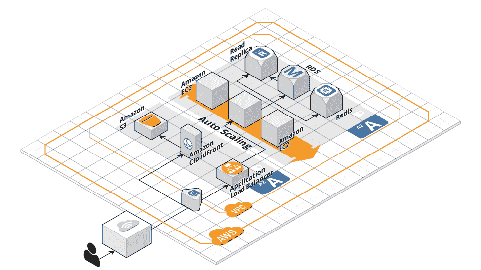

# 使用 Laravel 和 AWS:您需要知道什么

> 原文：<https://devops.com/using-laravel-and-aws-what-you-need-to-know/>

很有可能，您已经听说过开源 PHP 框架 and [Laravel](https://laravel.com/) ，并且您可能正计划进入下一个级别来更新您的 PHP Laravel 应用程序。AWS 提供了许多功能来帮助组织扩展以支持数百万用户，更不用说与云基础架构相关的敏捷性和成本优势了。这些特性和功能是将您的应用程序转变为高性能和弹性 PHP Laravel 应用程序的有力推动者。

在本文中，我将描述如何在 AWS 上使用高级可伸缩性标准来构建您的软件即服务(SaaS) Laravel 应用程序，以帮助您了解需要什么，并讨论获得业务价值和弹性的注意事项和行动项目。我们选择了 AWS 云，因为它是最成熟的基础设施即服务(IaaS)提供商，让创新变得更加容易；然而，这些实践可以应用于任何云平台。

我还将解释为什么 AWS 是扩展和发展您的 SaaS Laravel 应用程序以及展示当前/未来企业架构的重要选择。在本系列的第二部分中，我将讨论 12 因素应用程序方法的重要性，以及在基于 AWS DevOps 进行架构设计时应包含在您的策略中的多条经验。

## 将您的 Laravel 应用程序迁移到 AWS 的价值

在我为公司博客撰写的一篇关于为您的企业或 web 应用程序在 AWS 上运行 [数字化转型的文章中，我解释了采用 AWS 云带来的业务优势，包括减少 IT 劳动力、预配置服务以实现更快的实施和最少的停机时间，这是由于可重复和灵活的基础架构。云是扩展 SaaS Laravel 应用的基本环境，在这里，您可以将您的架构解耦为多个服务部分，包括云存储(亚马逊 S3 和 CDN)和自动扩展 EC2 实例(AWS 自动扩展)，并为您的现代云原生应用集成各种 PaaS 平台即服务(PaaS) AWS 组件。此外，如果您计划迁移到 AWS 云，您可以使用这个](https://www.clickittech.com/devops/aws-cloud-digital-transformation/)[AWS 迁移清单](https://www.clickittech.com/aws-migration-checklist/) 来为您的旅程做准备。

> “Web 应用和企业需要转型，他们需要向一个持续的转型转型，而云是关键。”

斯蒂芬·欧尔班

我真的很喜欢 AWS 的 Stephen Orban 的这句话，因为你不仅仅是在改造你的应用程序；一旦登上 AWS 云，你就进入了一个不断创新的无限旅程:按需付费、微服务、无服务器等等。

## Docker 和微服务上的 Laravel 架构

在整个 AWS 云之旅中，已经发生了多次颠覆性的演变，其中之一就是微服务，尽管，我不会涉及微服务(Docker)方法。作为将您的应用程序转变为云原生应用程序的第一步，从单一方法开始。随着你的应用程序的成熟和用户群的增加，我建议跳到 Laravel 微服务方法，即使用 Docker、AWS ECS、Kubernetes 或 AWS Fargate 对你的 Laravel PHP 产品进行 dockerize。我发现许多数字机构正在采用 AWS 云和 DevOps 实践以及 Docker/无服务器战略，并被这些复杂的技术淹没，这导致了项目失败，因为他们没有准备好进入这一阶段。

以下是避免这种情况的方法:逐渐成长。

然而，如果你的开发团队对 Docker 和微服务有足够的经验，我会毫不犹豫地用微服务进行架构。这将在本系列的下一篇文章“使用 Laravel、Docker 和 AWS ECS 的微服务”中讨论

## **这篇文章是写给谁的？**

无论你是在 Godaddy/Hostgator 上启动一个 MVP 应用程序，在 AWS 上部署 Laravel 的基本原则，还是准备从数百用户跳到百万用户，这篇文章都是为你准备的，将帮助你在 AWS 上构建 Laravel 架构。

## AWS 上的大型 SaaS 建筑的 Laravel

因此，让我们首先弄清楚在 AWS 上扩展 Laravel 应用程序最需要什么。

下图说明了下一代 Laravel 应用程序应如何使用全系列 AWS DevOps 组件进行架构。这个 AWS 堆栈中提到的每一个部分都具有高度的弹性、可伸缩性和弹性。

AWS Laravel Architecture Diagram

### **AWS 自动扩展和负载平衡**

最初，动态流量来自 AWS Route53，它将所有请求路由到应用程序负载平衡，AWS ALB 将在 EC2 实例群(2…N 个实例)之间进行负载平衡。该车队应根据流量需求或 AWS CloudWatch 指标水平“扩展”。

### **亚马逊 S3 和 CloudFront CDN**

包括图片、视频、HTML 在内的所有静态内容都将托管在 [亚马逊 S3](https://www.clickittech.com/aws/upload-file-amazon-s3-laravel/) 这个具有无限存储和弹性的云存储上。在亚马逊 S3 前面，我们将复合 AWS CloudFront 来缓存整个静态内容，降低带宽成本。集成这一对组件至关重要。

### **AWS RDS Aurora(托管数据库服务)**

数据库数据应该放在 AWS Aurora 或 RDS 和 AWS elastic cache(Redis)上，用于会话管理和缓存用户数据。这些 AWS 组件具有弹性和可伸缩性，这有助于设计具有最高容错和弹性的架构良好的 AWS 框架。

### **亚马逊 VPC 和网络**

在 AWS 网络级别，我们提出了具有公共/私有企业网络的 AWS VPC。遵循 PCI 和 HIPAA 实践，在专用 AWS 企业网络中应该有一个封装 Laravel 应用程序的 VPN。还应该包括一个 AWS VPN 连接和 OpenVPN 服务来访问您的多个 Laravel 环境的专用网络。

### **路线 53**

从 DNS 的角度来看，需要 Route53 来管理应用程序域、DNS 可扩展性、路由延迟和更多功能，以减少故障。

### **AWSλ**

该无服务器组件将用于异步作业和后端脚本，以最小化 AWS 自动伸缩集群中的负载。

我们将在本系列的第三篇文章中详细探讨这些 AWS 组件。

**适合此架构的网络应用:**

*   API Laravel 应用程序
*   移动后端应用程序
*   Laravel 企业应用程序:客户关系管理系统、企业资源规划系统和后台系统
*   SaaS 拉韦尔应用公司
*   前端应用。即 Angular、React、Vue.js 或任何 HTML 站点
*   任何网络平台:Python，Node.js，Ruby，PHP，Zend，CakePHP，Yii 和 Symfony

一个警告:不要对任何 web 应用程序使用 Cpanel。不建议进行扩展，因为这会降低应用程序的性能。

阿方索·巴尔德斯