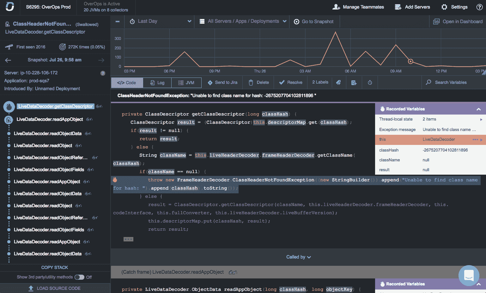

# OverOps 将机器学习带入 DevOps

> 原文：<https://devops.com/overops-brings-machine-learning-to-devops/>

OverOps 推出了一个同名平台，采用机器学习算法从 IT 环境中捕获数据，在 DevOps 团队决定将应用程序投入生产之前识别潜在问题。

公司首席技术官 Tal Weiss 表示， [OverOps 平台](https://www.prweb.com/releases/overops_debuts_platform_provides_net_new_machine_data_to_fuel_aiops/prweb15665179.htm)的独特之处在于，它不依赖于日志数据，而是在执行时结合代码的静态和动态分析来检测问题。然后，可以通过仪表板访问这些数据，或者通过开放的应用编程接口(API)与其他工具共享这些数据。OverOps 平台中包含的仪表板基于开源项目 Grafana 软件。

韦斯说，这种方法使得在 it 运营中推进人工智能(AI)的使用成为可能，而不需要升级 DevOps 管道中的每个工具，以包括对机器学习算法的支持。

OverOps 还包括在平台中访问基于 AWS Lambda 的框架或独立的本地无服务器计算框架，使开发运维团队也能够创建他们自己的定制功能和工作流。

Weiss 表示，OverOps 旨在捕捉每一个错误和异常发生时的机器数据，包括执行堆栈中所有变量的值、每个错误的频率和故障率、新错误和重新引入的错误的分类以及每个事件的相关发布号等细节。相比之下，日志数据相对较浅，因为在尝试对问题进行故障排除时，很难确定准确的根本原因分析，他说，并指出 OverOps 平台提供了对日志文件中无法获得的未捕获和隐藏的异常的可见性。

DevOps 团队花费大量时间分析日志文件，希望发现异常。但是，随着 IT 环境继续向外扩展，分析数百万甚至数十亿日志文件变得不切实际。OverOps 正在利用机器学习算法来分析事件，甚至在日志文件被创建之前，这消除了在日志文件可以被分析之前寻找某种存储日志文件的方法的需要。

当涉及到与机器学习算法和其他形式的人工智能管理它有关的任何事情时，自然会有很多恐惧。但随着 it 环境的复杂性不断增加，很明显 DevOps 团队将需要更多地依赖人工智能来管理一度被认为不可想象的规模水平的 IT。例如，虽然基于容器的微服务可以加快应用程序的开发和更新速度，但它们也会引入大量的操作复杂性。大多数 DevOps 专业人员更愿意尽可能自动化与操作相关的手工劳动，特别是如果这导致对被提升到生产环境中的软件的质量更确定的话。

当然，虽然利用机器学习算法来分析代码代表了自动化方面的一个进步，但距离完全消除对 DevOps 团队的需求还有很长的路要走。

— [迈克·维扎德](https://devops.com/author/mike-vizard/)