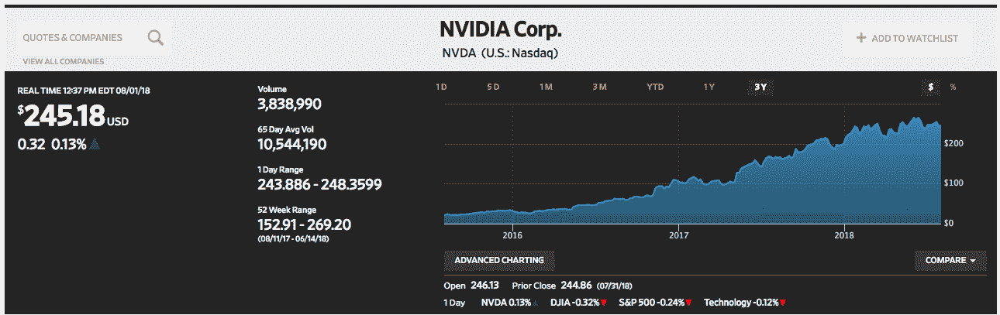

# 自动化时代的硬件

> 原文：<https://devops.com/hardware-in-the-age-of-automation/>

互联网上流传着这样一个笑话:

问:DevOps 工程师如何更换灯泡？
*他们没有。是硬件问题。*

将硬件从大多数 IT 人员的日常工作中抽象出来的趋势仍在继续。我们 DevOps 给它起了个名字:基础设施即代码。硬件已经被推到了 IT 的最深处，我敢打赌，今天大多数在信息技术领域工作的人从未见过数据中心的内部，很少有人做过像在服务器机架上布线这样的劳动密集型工作。对许多人来说，硬件只是一个概念，每个月都会因为亚马逊、Azure 或谷歌云的账单而变成现实。

但是硬件*是真实的*,它确实很重要，非常重要。如果你不这么认为，看看你的手机。这个小小的硬件几乎改变了当今世界运作的一切。手机不仅让 Tinder、Twitter、Instagram、优步、Lyft 和众多永远不会看到 IPO 或私募股权收购的创业公司成为可能，还让阿拉伯之春、英国退出欧盟和 SpaceX 登陆等翻天覆地的事件出现在全球观众的手中。

硬件很重要，而且在未来几年还会更重要。那些在创新前沿工作的人明白，在日益复杂的软件开发中，特殊硬件是并将继续是一个关键因素。我们已经看到了在 AWS 等云提供商上选择特定硬件配置的能力。比如 [g3.16xlarge](https://aws.amazon.com/about-aws/whats-new/2017/07/introducing-amazon-ec2-g3-instances-the-next-generation-of-gpu-powered-instances-for-graphics-intensive-applications/) EC2 实例类型，既有 CPU 又有 GPU 芯片做后盾。这只是冰山一角。

按，高级副总裁按 [分组](https://www.packet.net/) :

> “人们问下一步是什么。嗯，这个东西[GPU]是下一步的一个例子。这不仅仅是非常昂贵的东西，而是非常专业的东西。每当你开始做一些非常大和非常重要的事情，这些事情是我们在互联网和世界上正在做的很多事情，无论是生物信息学还是自动驾驶汽车，这些都需要非常大的工作量。有大量的数据，大量的处理，你不能用普通的硬件来完成。硬件是下一个创新层的原因是因为你们一直在编写的所有软件都是为了在几分钟内使软件在世界各地可移植和可部署，现在软件想接触新类型的硬件。我认为拥抱这是下一波浪潮。”

Packet 和类似的公司都期待着有一天计算平台将从通用平台走向专用平台。我们已经看到了这种趋势:主要 GPU 制造商 Nvidia 的股票价值在过去三年中上涨了 10 倍。(参见图 1。)

Nvidia stock has grown 10x in value in over the last three years. (The Wall Street Journal)

此外，对专用芯片的预期需求吸引了大量风险投资资金，这些资金资助了一些初创公司，如和 [Graphcore](https://www.graphcore.ai/) 。甚至谷歌也通过 [张量处理单元](https://en.wikipedia.org/wiki/Tensor_processing_unit) (TPU)涉足专门的硬件业务。硬件确实又变得非常酷了。

那么，所有这些与自动化有什么关系呢？

自动化是一项处理器密集型任务。而且，随着人工智能越来越多地融入日常数据处理和机器学习的结构，我们将会看到对专门硬件来处理这些活动的更多需求。在某种程度上，这并不新鲜；我们有专门的硬件已经有一段时间了。在蓝牙出现之前，电视遥控器就已经存在了。新的是这些新设备的智能程度。我的老式电视遥控器所要做的就是在我点击按钮时改变频道。今天，我的遥控器可以识别我的声音，帮我找到感兴趣的节目。这是一个巨大的飞跃，从一个响应按钮点击的操作到一个使用语音识别和推理查找的操作。

正如 Packet 的 Smith 在上面指出的，随着软件复杂性的增长，对驱动它的特殊硬件的需求也会增长。新的趋势将是用软件包裹硬件。因此，我可以毫不费力地想象出一种新型硬件，它被设计用来处理一个非常特殊的过程——例如， [基因编辑](https://youtu.be/AJm8PeWkiEU?t=157)，。想象一下，摄入一粒药丸，它实际上是一种纳米设备，包含在你体内旅行的智能，并从物理上改变你的基因构成。这不是一个牵强的想法。让这个想法成为现实并不是软件的问题，而是硬件的问题。我们还没有纳米技术。因此，机会来了。

目前，大多数自动化活动都是在位于世界各地远程数据中心的通用芯片上运行的。我们正在做的许多工作仍然是商品:旋转 [Kubernetes 集群](https://kubernetes.io/) ，面部识别 [Tensorflow](https://www.tensorflow.org/) ，使用 [Macie](https://aws.amazon.com/macie/) 发现安全漏洞，例如。然而，随着人工智能(AI)变得越来越普遍，人工智能适用的用例将会增加。这种增长将需要新型的专用硬件。工程师将想象软件，然后设计硬件使其运行。我们会到达一个点，这个点并不遥远，正如史密斯所描述的那样，创新就在这个点上。这确实将是围绕软件包装硬件。因此，我们将从“物联网”走向“非常非常智能的物联网，从微小到巨大。”其影响将是深远的。

鲍勃·雷瑟曼