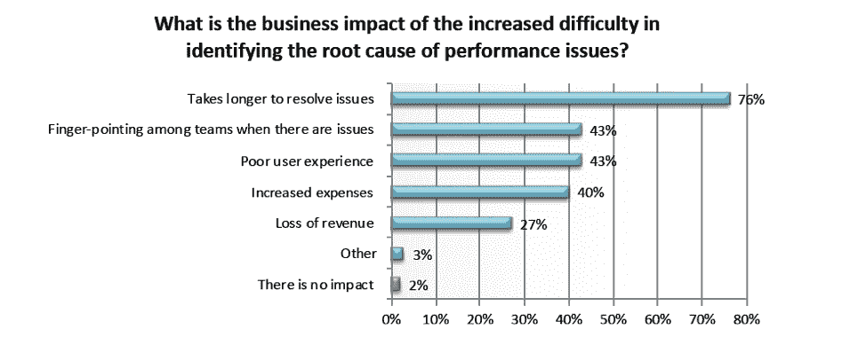
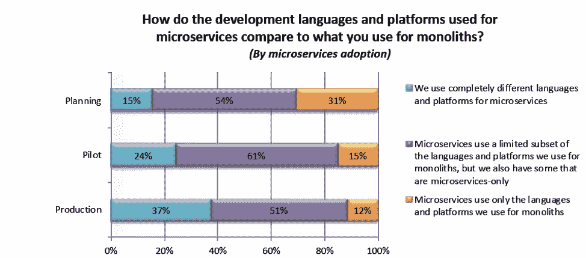

# 服务网格如何应对 3 个关键微服务挑战

> 原文：<https://devops.com/how-service-mesh-addresses-3-key-microservices-challenges/>

我最近在阅读 Dimensional Research 的“[全球微服务趋势](https://go.lightstep.com/global-microservices-trends-report-2018)”报告，发现自己在想，“服务网可以帮助解决这个问题。”让我们看一下报告中列出的三个关键挑战。

报告中的几个关键点表明微服务正在被广泛采用。同样显而易见的是，在它们带来无数好处的同时，也伴随着严峻的挑战。从报告来看:

*   91%的企业正在使用或计划使用微服务。
*   99%的用户报告了使用微服务的挑战。

## **重大微服务挑战**

该报告指出了公司面临的一系列挑战。

公司正面临着技术和组织的双重挑战。我们将重点关注服务网格解决的技术挑战，但值得注意的是，服务网格带来了一致性，因此所有团队都有可能拥有相同的视图，减少了对某些技能的需求。

### **每增加一项微服务都会增加运营挑战**

没有服务网！服务网格通过 API 而不是使用分立的设备来提供监控、可伸缩性和高可用性。这种灵活的框架消除了与现代应用程序相关的操作复杂性。基础设施服务传统上是作为独立的设备来实现的，这意味着需要通过实际的设备来获得服务。每个设备都是独一无二的，这使得监控、扩展和提供高可用性变得非常困难。服务网格通过 API 在计算集群内部提供这些服务，不需要任何额外的设备。实施服务网格意味着在不增加复杂性的情况下添加新的微服务。

### **确定性能问题的根本原因更加困难**

服务网格工具箱为您提供了一些有助于解决此问题的工具:

**分布式跟踪:**跟踪为不同的微服务提供服务依赖性分析，并在通过多个微服务跟踪请求时对请求进行跟踪。这也是一种确定性能瓶颈和放大特定请求的强大方法，以确定哪个微服务导致了请求延迟或哪个服务产生了错误。

**指标收集:**借助服务网格，您还能够收集整个网格的一致指标。指标是理解应用程序中发生的事情的关键，也是理解它们何时健康，何时不健康的关键。服务网格可以从整个网格收集遥测数据，并为每一跳生成一致的度量。这使得快速解决问题和构建更具弹性的应用程序变得更加容易。

****

### **不同的开发语言和框架**

报告受访者提到的另一个主要挑战是在多语言环境中维护分布式架构的挑战。当从整体服务转移到微服务时，许多公司都面临着这样的现实:为了让事情顺利进行，他们必须使用不同的语言和工具。大型企业尤其会受到这种影响，因为他们有许多大型的分布式团队。服务网格通过提供编程语言不可知论来提供一致性，这解决了多语言世界中的不一致性，在这个世界中，不同的团队，每个团队都有自己的微服务，很可能使用不同的编程语言和框架。网格还提供了一个统一的应用程序范围的点，用于将可见性和控制引入应用程序运行时，将服务通信移出隐含基础架构的领域，移至可以轻松查看、监控、管理和控制服务通信的地方。

微服务很酷，但服务网让它们变得冰冷。如果您正在进行微服务之旅，并且发现难以应对基础架构挑战，服务网格可能是正确的答案。如果您对如何充分利用服务网格有任何问题，请告诉我，我很乐意与您交谈，您可以找到我 [@zjory](https://twitter.com/zjory) 。

——Zach jory