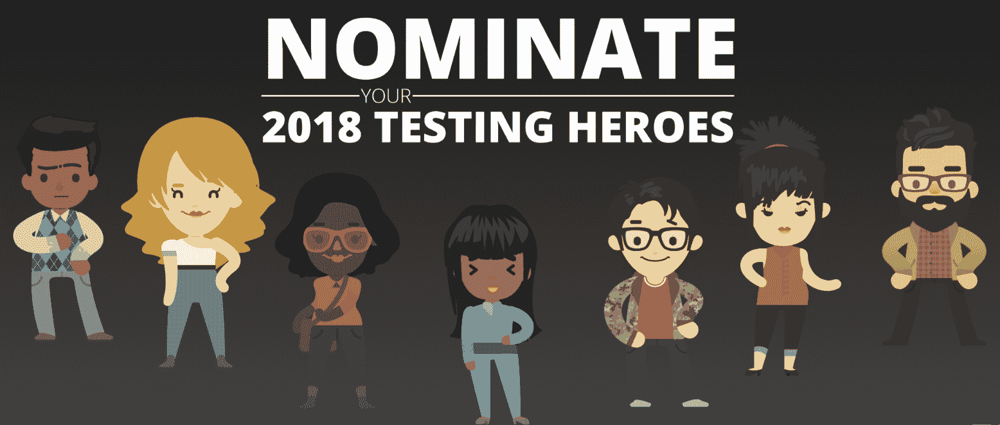

# 测试英雄，认可个人对持续质量的贡献

> 原文：<https://devops.com/testing-heroes-to-recognize-individual-contributions-to-continuous-quality/>

测试人员总是很擅长支持测试社区中的超级明星，但是测试之外还有谁在倾听呢？Tricentis 发起了一项活动，旨在确保世界其他地方知道测试人员有多么宝贵，尤其是在当今超加速的发布周期中，以及用户体验和客户满意度成为企业选择的成功指标的情况下。

[测试英雄](https://www.tricentis.com/testing-heroes/) 将是一项年度计划，软件测试人员可以获得各种奖项的提名，其中两位——年度测试人员和年度测试经理——将获得免费前往奥地利维也纳的机会，在 Tricentis 的 [Accelerate 2018 大会](https://accelerate.tricentis.com/vienna/) 上领奖。

测试英雄分为六个不同的类别:

*   年度最佳测试员
*   年度测试经理
*   探险家
*   自动机
*   表演者
*   风险指示器

## **一个独特的转折**

虽然大多数获奖者是由颁奖组织决定的，但 2018 年的测试英雄将由每个被提名者周围的组织和网络的支持程度决定。测试英雄的最后一轮将是一轮投票。提名进入这一轮的候选人将获得各种想法，以鼓励其他人支持他们的候选人，让他们获得应有的认可。有无数种方法可以在你的办公室里宣传你的同事所做的杰出工作:

*   鼓励你公司的其他人通过 Slack、电子邮件或内部通讯进行投票。
*   录制一个简短的竞选风格的视频，通过社交媒体分享。
*   在休息室、厨房或其他公共区域放置一个加载到候选人投票页面的 iPad。
*   挨家挨户的游说(对那些不介意你不请自来的人！).

我们这次活动的最初目标之一是了解更多关于软件测试社区中那些人的惊人贡献，但是我们很快意识到这里有一个更大的回报:当被提名者的同行在活动过程中展示他们自己人所做的惊人工作时，软件测试人员的努力有望得到比现在更多的观众的理解和欣赏。这才是考验英雄的*真实*目标。

我们鼓励您今天就提名并支持您自己的 [测试英雄](https://www.tricentis.com/testing-heroes/) ！

-[安娜·阿基拉](https://devops.com/author/ananda-akela/)