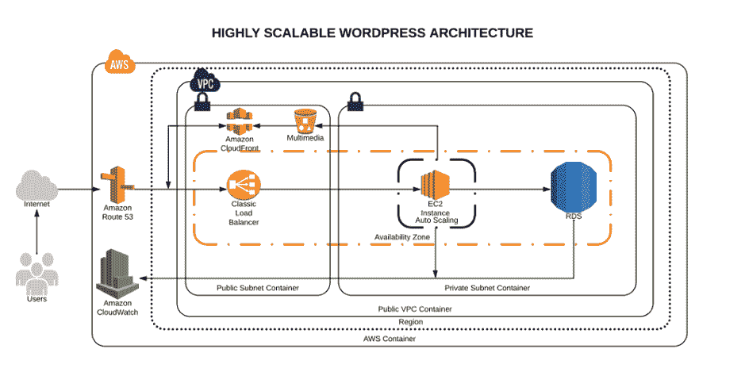
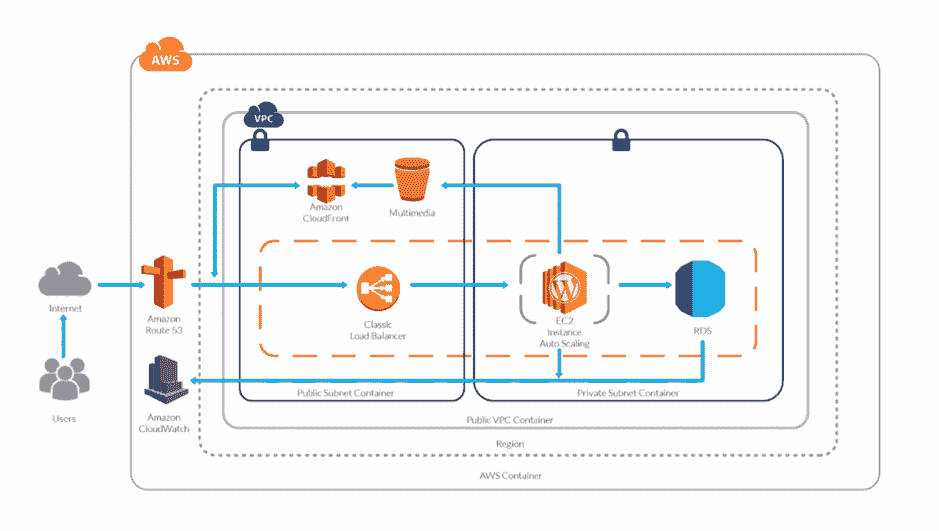
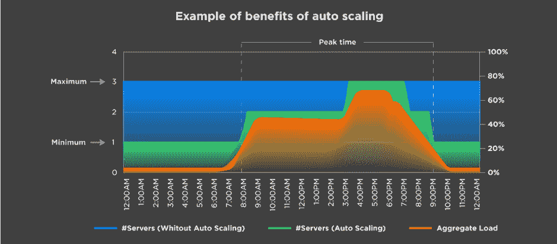
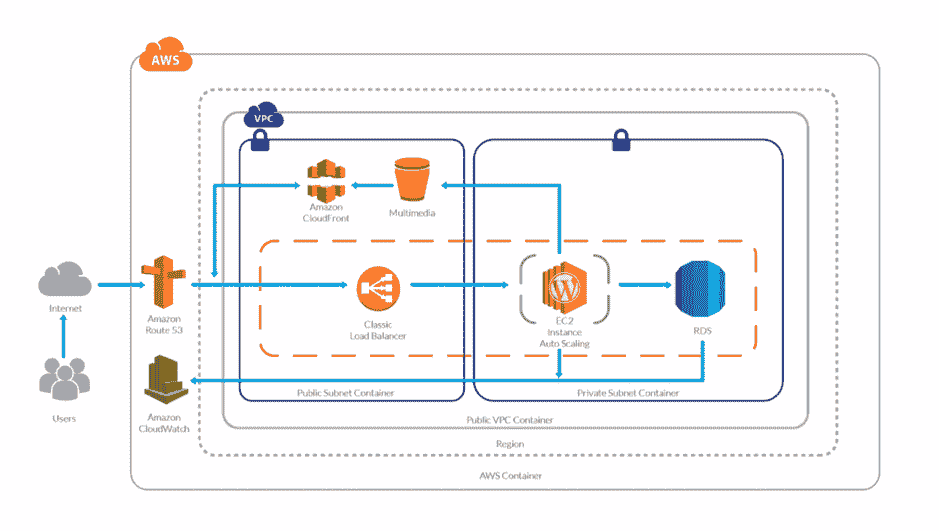
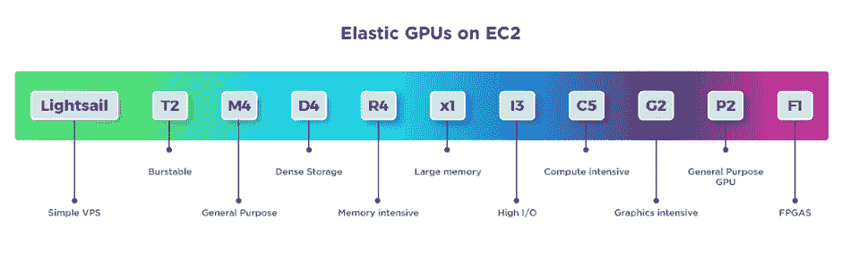

# 在 AWS 上托管可扩展的 WordPress

> 原文：<https://devops.com/hosting-scalable-wordpress-on-aws/>

你拥有或管理一个 WordPress 网站吗？它很复杂吗，交通很拥挤吗？我将向您展示在 AWS 上托管高可用性和可伸缩性的 WordPress 站点的理想架构。

这个博客旨在展示 WordPress CMS 网站在 AWS 中的分布式架构。你将能够识别运行一个高流量的 WordPress 站点所需的不同服务层。

## **高度可扩展和可用环境的概念**

让我们先来看看高度可扩展和可用的环境意味着什么，以及它包括什么:

**高可用性:**在 IT 上是指一个系统可以长时间无任何服务中断或中断地运行，以及一个有冗余组件的系统。(在我们的案例中，冗余基础设施将是我们的高可用性——感谢 AWS 让这变得更容易！)

**分布式服务——松散耦合:**在同一个网络中分布不同系统组件的技术。我们将这样做，以利用任何资源的负载，并为服务提供专用主机。

**可扩展性:**系统监控用户需求并自动增减资源的能力。这种可扩展性将由以下 AWS 资源提供:AWS ELB、AWS EC2、AWS S3、AWS RDS。

创新的一个重要部分是始终保持最新，并实施可用的最佳技术。

## **首先要做的事情**

如果你计划关注这篇博客，那是因为 [你正在寻求迁移到亚马逊网络服务](https://www.clickittech.com/aws-cloud-migration-services/) 或者你已经有一个环境或者一些资源分配在那里。

如果你已经上了 AWS，我们还整理了一份非常简洁的清单，这里有。

### **架构图**

High scalable and available WordPress environment on AWS Cloud

## **AWS 服务说明**

1.  这项服务将帮助我们管理我们域名的所有即将到来的请求(流量)。AWS Route53 也将是 DNS 管理器，因此这里我们将指定我们的域注册商作为管理器。一旦它被迁移到这里，我们就可以添加 A 记录、Cnames 或 TXT 记录等等。
2.  AWS VPC:AWS VPC 是一项服务，它允许我们拥有一个私有网络，我们将在其中分配我们的云计算资源。这意味着没有人能接触到它——只有我们自己。
3.  **AWS 私有子网:**私有子网是我们要在其中部署不想让外人访问的资源的子网。在这种情况下，我们的数据库只能被应用程序访问。
4.  **AWS 公共子网:**公共子网是我们将要在其中部署我们想要公开的资源的子网，比如我们网站的服务器。
5.  **AWS S3:** 亚马逊简单存储服务将成为我们的内容存储解决方案。在这里，我们的 WordPress 安装将有内容可用，无论它是放大还是缩小。
6.  AWS CloudFront: CloudFront 与 S3 的结合将帮助我们更快地向最终用户传播内容。通过这种方式，我们的 WordPress 多媒体内容将遍布 AWS CDN 网络(边缘位置)，这将在我们的应用程序中使用，以减少延迟。用户将由最近的可用边缘位置提供服务。所以更快的内容=更快的网站。
7.  **AWS 负载均衡器:**这里是比较棘手的部分。AWS ELB 将允许我们根据自动缩放的设置，在可用或正在使用的实例之间分配流量负载。
8.  **AWS EC2:** 实例——也称为“VMs”——AWS 上获取计算能力的服务。AWS EC2 将允许我们托管我们的 WordPress 站点和我们需要的文件。
9.  AWS 自动缩放:这将是我们高度可用和可扩展的 WordPress 站点的解决方案。AWS Autoscaling 将负责始终为公众提供最小数量的实例，如果出现问题，它会用一个健康的实例替换该实例。这样，我们的网站将始终可用。自动缩放也将有利于我们的 WordPress 基于流量需求创建实例，并帮助我们在流量较低时节省成本。
10.  **AWS RDS 和 Multi A-Z:** RDS 将是我们托管 WordPress 数据库的服务。这项服务完全免费，完全由 AWS 管理，这意味着我们不再需要担心数据库管理。同样有用的是，RDS 实例之间可以进行复制，这增加了更多的可伸缩性。此外，启用多可用性区域(多 A-Z)功能将为我们提供高可用性。不过，请注意这一点，因为 RDS 的价格会翻倍。
11.  **AWS cloud watch:**AWS cloud watch 将是我们值得信赖的监督者。Cloudwatch 将负责监控我们 AWS 账户中的所有资源。它将关注 AWS 资源预定义或默认的指标，如 CPU 使用率、内存使用率、磁盘 IO 和网络。

我忘记 EFS 了吗？没有。以我的经验来看，EFS 在分享 WordPress 文件方面并没有很大的帮助。但是，你可以尝试使用 EFS；这样，内容的复制将会更快、更容易。

如果你想了解更多关于创建这种环境的技术和方法，[看看这篇文章](https://www.clickittech.com/cloud-computing/scaling-in-the-cloud/)。

## 提供了数百万次页面浏览

以下是这个环境如何能够为数百万的页面浏览量/访问者提供服务:

### **交通流量**

一旦访问者在他们的浏览器上访问了你的域名，他们的请求就会被传送到互联网，然后被路由到你的 DNS 管理器。DNS 管理器(Route53)将解决对指定服务器的请求，然后 web 服务器将为应用程序提供服务。

WordPress High Performance

当你的流量增加时会发生什么？这里有一个例子:

Autoscaling example

假设您已经将自动缩放设置为最小实例数为 1，最大实例数为 3。基于不同的指标，您的环境将能够根据其接收的负载进行横向扩展。

在上图中，我们可以看到，根据总负载，环境会随着增长创建更多实例来继续满足需求。反之亦然。

当您计算云环境的 TCO 时，这意味着很多。这也意味着你不会耗尽内存或其他资源；相反，您将拥有一个更加可用的系统。

您可能想知道，我的 AWS 资源会发生什么情况？这是一张图片:

WordPress High Performance Scaling

答案很简单:更多的需求或流量，更多的服务器来满足它。

### **服务器缓存/WordPress 缓存**

服务器端的缓存或者 WordPress 端的缓存是通过插件或者嵌入到主机中来实现的。例如，每当有人请求主页时，请求就被传递给数据库以检索主页信息。缓存会创建一个临时文件(我说是临时的，因为您可以指定到期时间)，这样当您的请求到来时，它会检查它生成的文件，而不是处理对数据库的请求。

这样，我们可以为用户提供更快的页面/内容，并减少数据库消耗。

如果你还没有实现一个缓存系统，确保你从现在开始做，因为它会大大加快你的网站。

### **内容传递网络**

简而言之，内容交付网络(CDN)是服务器或服务的网络，您的内容将在其中托管，该网络将用于向所有访问者传输内容。使用 CDN 将有助于你在世界范围内更快地传播你的内容，而不是将其托管在你的服务器上。

### **CPU/内存性能**

根据 CPU 和内存指标，我们的堆栈将能够根据需要进行扩展。这样，我们的响应时间在所有服务器之间总是相同的，并且没有实例会由于 CPU 或内存而过载(这些是令人讨厌的 500 错误)。

### **实例类型**

在 AWS 上，我们可以根据工作负载使用不同的实例类型。选择正确的实例类型很重要。

AWS instance types

如果你不知道用哪一个，读读 [这篇博客](https://www.clickittech.com/aws/create-amazon-ec2-instance/) 。

毫无疑问，为我们的 WordPress 使用正确的实例类型会有所帮助，同时为它选择运行的资源数量。

现在你知道了——你的站点如何通过一个分布式系统支持数百万的页面浏览量。

## **备份和灾难恢复**

有一个备份策略和灾难恢复解决方案是很重要的，以防我们的 WordPress 安装或环境发生问题。幸运的是，AWS 在其所有服务之间提供了大量冗余。

我们有不同的方法来保护我们的应用和用户数据:

1.  WordPress 插件来备份网站(S3)。
2.  基础设施(物理)的灾难恢复。
3.  用户数据的备份(数据库— RDS)。
4.  应用程序代码的备份。

Amazon Web Services 已经为其所有服务提供了不同的备份解决方案，因此我们可以通过一次点击为 RDS 创建备份，并使用 EC2 执行备份配置。

## **亲提示**

1.  要提高性能，请使用数据库、查询和页面缓存插件。
2.  使用专用的 Aurora RDS 提高 RDS 性能。
3.  使用 S3 和 CloudFront 更快地交付内容。
4.  在 AWS Cloudwatch 上启用警报。
5.  启用计费警报以避免不必要的使用费用。
6.  使用保留实例——如果您打算长期保留 AWS，它可以为您节省高达 30%的成本。
7.  使用版本控制系统来跟踪您的更改并部署到实例中。

## **结论**

这篇文章概述了我认为的高性能/高流量 WordPress 站点的理想架构 [。](https://www.clickittech.com/wordpress-high-traffic-ebook/) 如你所见，亚马逊为我们提供了实现这一目标的所有工具和技术，但有时这可能具有挑战性。

一如既往，如果你认为我错过了什么，请在评论中发布！

如果你想获得更多的技术博客， [订阅我们的时事通讯](https://www.clickittech.com/blog) 。

——[吉列尔莫自行车](https://devops.com/author/guillermo-velez/)