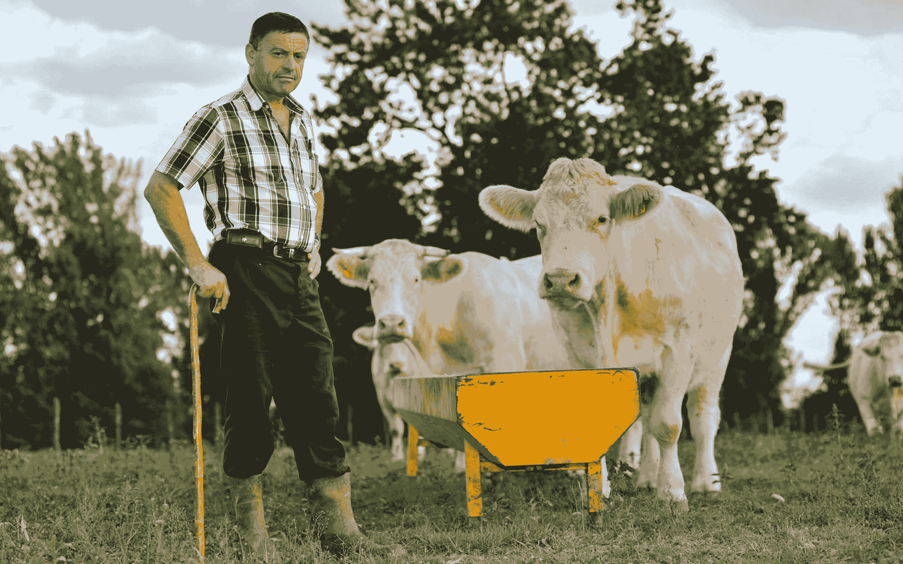

# 另一个 DevOps

> 原文：<https://devops.com/ops-the-other-devops/>

围绕 DevOps 的大部分讨论，包括在 DevOps.com 这里，都是关于帮助开发人员更容易地访问生产系统，通过缩短发布周期来提高灵活性。大多数时候，这种对开发人员的关注导致了对所谓的“第一天”任务的关注，即等式的开发方，而排除了“第二天”的操作，即运营方。

Photo via Damien Kuhn – https://unsplash.com/@producteurslocaux

devo PS 市场最近的动向强调了一个事实，即重心仍然在开发方面，而不是在运营方面。[微软收购 GitHub 是一个大新闻](https://www.bloomberg.com/news/articles/2018-06-06/github-is-microsoft-s-7-5-billion-undo-button)，不要误会我的意思，尤其是因为许多人仍然停留在非常 90 年代的微软概念上，这次收购应该有助于澄清这不是你父母的微软(完全披露:我的雇主， [Moogsoft，与微软](https://www.moogsoft.com/partners/azure)有战略合作伙伴关系)。与此同时，众议院运营部门的新闻很少获得同样的关注。

这种不平衡的原因可以在 DevOps 的起源神话中找到。这个故事讲的是开发人员对规避风险的操作过程的失望，这种失望阻止了他们以他们希望的速度和频率进行部署。就像大多数好故事一样，这里有一个真实的内核，但事实更复杂。运营人员有充分的理由规避风险:当他们搞砸了，他们没有一个安全网，他们会受到很多公众的指责。

也就是说，对风险的合理规避可能会走得太远。再加上以工作来定义自己的非常人性化的倾向，你最终会发现，人们为了哪怕是最基本的、常规的任务都要用键盘来完成，这成为了大型流程的瓶颈。

# DevOps 对 Ops 意味着什么？

从运营的角度来看，DevOps 的最大优势在于，它迫使人们不得不从手工制作的 it 基础架构转向不需要人工参与日常运营的工业级可扩展模式。这种文化转变始于著名的宠物与牛的类比，但转变远未完成。

仍有工作要做的一个重要标志是 IT 运营工具相对缺乏复杂性。有很多关于软件定义的基础设施和期望状态自动化的讨论，但实际应用相对较少，尤其是在日常操作此类框架时。这些新模式将需要从传统的运营模式进行痛苦的转变，普遍的自动化将增强人类系统管理员的能力。

这不是旧的自动化风格，有 cron jobs 和 shell 脚本，任何值得他们的 [etherkiller](https://etherkiller.org) 的 [BOfH](https://en.wikipedia.org/wiki/Bastard_Operator_From_Hell) 已经做了几十年。新的无服务器框架消除了基础设施组件与单个业务服务之间持久耦合的最后痕迹。vMotion 在 2003 年承诺的事情现在正在成为现实，工作负载不断移动、增长和收缩，以支持用户需求的变化，基础架构也相应地自上而下进行重新配置。

## 关于运营自动化要问的关键问题

在这种背景下，运营自动化再也不能按照“设置好就忘了”的旧模式运行了每一个启动的流程都需要实时了解周围发生了什么，以及如何不断变化。如果没有这种可见性，备份脚本可能会继续忠实地备份曾经是高优先级服务器，但现在是应用程序基础架构的一潭死水。同时，运行大部分应用程序逻辑的云服务并没有有意义地集成到灾难恢复(DR)计划中。

所有这些方面都需要定期审查，就**需要**、**职能**和**所有权**而言。

### 谁*N*需要这种自动化？

任何运行的东西都应该与某种业务需求相联系，不管是间接的。“这确保了我们的基础架构能够无缝扩展和灵活应对用户需求”:很好。“这使我们的操作系统保持补丁状态”:一个有效的目标，但是如果所配置的操作系统的平均生命周期比补丁周期短，我们需要在生产中这样做吗？只需修补模板，就大功告成了。“我们一直是这样做的，我不确定如果我们停下来会发生什么”:是时候释放一些[混乱猴子](https://devops.com/netflix-the-simian-army-and-the-culture-of-freedom-and-responsibility/)，看看会发生什么。

### 这个自动化的*功能*是什么？

我们正处于巨大的技术变革之中，创新的浪潮越来越近。作为一个行业，当云计算出现时，我们刚刚开始接受虚拟化，但当容器化开始时，这还远远没有解决，看起来在它完全成熟之前，它可能会被无服务器架构破坏。注意你完成任务的方式中隐藏的假设，并定期检查。Ops 类型应该向 Dev 学习，定期考虑重构他们的自动化以移除 cruft 并利用新的开发。

### 谁是这个自动化的*所有者*？

某人必须拥有自动化的每一个部分，这样他们就可以根据前面的两点随着时间的推移维护它，并且如果(或者更现实地说，*当*中断时)其他人知道该找谁。同样，开发人员已经谈论技术债务很长时间了:较老的、未维护的代码的影响。与此同时，系统管理员过去常常为单个服务器的正常运行时间而自豪。这种依赖需要从单个服务器转移到整体基础架构以及随着时间推移而发展的自动化和管理，以确保其可用性和性能。他们是牛，不是宠物，记得吗？

# Ops 是另一个 DevOps

随着运营变得越来越关注自动化管理，开发和运营之间的区别开始变得模糊。随着开发角色“[拿起寻呼机](https://www.moogsoft.com/blog/aiops/make-oncall-less-harmful/)并负责他们软件的生产操作，运营角色开发越来越多的代码来实现那些应用程序的承诺。随着传统运营任务的演变甚至消失，新的角色将会出现。自动化架构师的工作将变得比任何需要有人 ssh 到单独的服务器或路由器的工作更加重要。在这种转变中，老派的运营人员可以从我们的开发同事在过去几年中所做的事情中学到很多东西。

有一天，DevOps 这个术语将不再描述开发人员和非开发人员，而是两种不同类型的开发人员，一种专注于业务逻辑，一种专注于架构基础。

多米尼克·惠灵顿