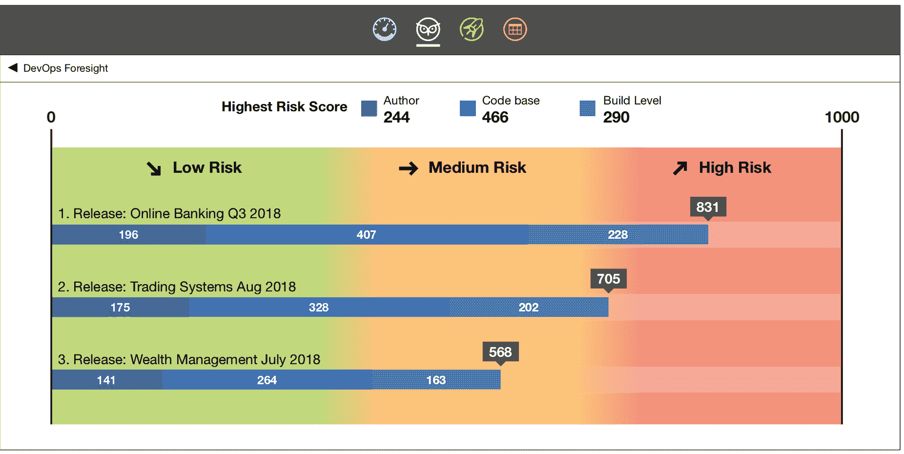

# 电云将机器学习应用于 devops

> 原文：<https://devops.com/electric-cloud-applies-machine-learning-to-devops/>

机器学习算法正被应用于通过电云提供的分析软件来推进 DevOps。

电云首席技术官 Anders Wallgren 表示[Electric flow devo PS Foresight](https://www.prnewswire.com/news-releases/electric-cloud-takes-analytics-into-the-future-with-devops-foresight-300671312.html)之所以成为可能，是因为电云能够通过提供应用发布和持续交付平台即云服务来获取大量数据。

Wallgren 说，电云对其收集的所有数据进行预测分析，以识别和对比模式，然后根据当地环境中发生的情况，使用这些模式向特定的 DevOps 团队提出建议。

ElectricFlow DevOps Foresight 能够生成一个风险评分指标，在部署到生产环境之前预测发布的可能结果。他说，基于这个分数，DevOps 团队可以决定继续进行并部署该代码，或者保留它进行进一步的测试。

Wallgren 补充说，该应用程序还将根据正在部署的代码的复杂性，就如何改进管道提出建议。

作为这项工作的一部分，Wallgren 指出，电云一直在扩展其与应用性能监控(APM)工具的集成水平，这些工具可作为预测分析应用的数据源。

他说，目标不是提供一个“老大哥”应用程序来决定谁应该被解雇，而是尽可能减少 DevOps 过程中的摩擦。

他说，能够将机器学习算法应用于大量数据正成为将 DevOps 流程转移到云的一个令人信服的理由，并补充说，大多数组织将无法收集训练在内部环境中运行的机器学习算法所需的关键数据量。他说，ElectricFlow DevOps Foresight 使 DevOps 团队能够利用对这些算法的支持已经嵌入云服务的交钥匙应用程序。

Wallgren 指出，结果应该是围绕任何应用程序发布的焦虑程度显著降低。最终，许多组织将不得不面对的问题是，他们希望在多大程度上依赖机器学习算法和其他形式的人工智能(AI)来自动化开发运维流程。就目前而言，瓦尔格伦表示，电云专注于提供建议而不是采取独立行动的预测性应用。

DevOps 团队对各种形式的人工智能的适应程度还有待观察。一方面，当同时开发的应用程序数量呈指数级增长时，DevOps 团队显然对加速应用程序部署感兴趣。另一方面，使用 AI 自动化 DevOps 过程可能会导致缺陷以前所未有的速度和规模传播。然而，从长远来看，那些未能采用人工智能来推进 DevOps 的组织更有可能发现自己处于竞争劣势。

— [迈克·维扎德](https://devops.com/author/mike-vizard/)