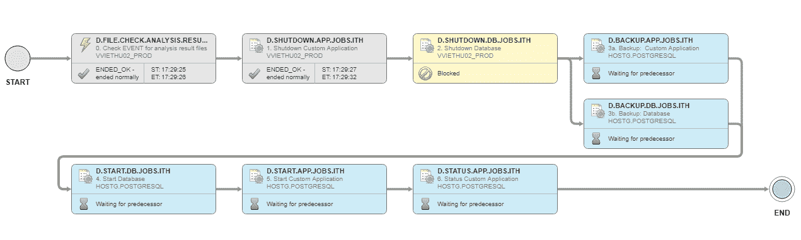

# CA Technologies 希望将自动化向左转移

> 原文：<https://devops.com/ca-technologies-looks-to-shift-automation-left/>

CA Technologies 在最近的 [CA Automation Summit](http://www.cvent.com/events/ca-automation-summit-2018/event-summary-238a4f5f22b044c6809ab17e87379656.aspx) 上，通过[对 CA Automic One Automation platform](https://www.businesswire.com/news/home/20180626005038/en/Delivering-Intelligent-Automation-Enterprise-CA-Technologies-Unveils)的更新，增加了自动化即代码功能，推进了利用自动化创建软件开发工厂的案例。

CA Technologies 自动化业务部门的产品管理副总裁葛温·克莱表示，CA Automic One make 的最新版本更容易“左移”自动化工件，使开发人员可以将这些工件嵌入应用程序代码中，而不是必须等待开发团队带外运行它们。

Clay 说，CA Automic One 的最新版本现在还包括自动化工件的版本控制和生命周期管理，使自动化对象(如作业、工作流和脚本)能够作为集成 DevOps 流程的一部分从开发提升到生产。

CA Technologies 还透露，它正在将智能嵌入 CA Automic One 支持的工作流中，该工作流支持动态运行时估计，可以预测工作流执行中某些路径内的潜在问题。

添加到自动化平台的其他新功能包括对 PostgreSQL 数据库的支持，以及与 CA Workload Automation、CA Continuous Delivery Director 和 CA Jarvis analytics 软件的新集成，这些软件作为云服务提供。

CA Technologies 多年来一直致力于在整个 DevOps 流程中嵌入自动化。随着这一最新版本的发布，这一活动正在扩展到开发人员本身。Clay 表示，数字业务转型的兴起——其中很大一部分是由利用 Docker containers、Kubernetes 编排软件和无服务器计算框架等技术构建的云原生应用程序推动的——最终迫使企业中出现自动化问题。不仅应用程序的构建速度比以往任何时候都快，而且这些应用程序的复杂性也呈指数级增长。然而，整体 IT 员工的规模一直停滞不前。她说，如果没有某种形式的自动化嵌入应用程序本身，现代软件开发实践将难以为继。

Clay 指出，大多数组织还没有将整体应用程序解构为一组微服务。但很明显，大多数新应用都将建立在微服务架构之上。她指出，除了在新应用程序中直接嵌入工件之外，CA Automic One 还提供了一个在两个遗留单片应用程序中应用自动化的机会。

尚不清楚嵌入自动化工件的能力将对未来企业 It 管理方式产生何种影响。IT 运营团队仍然需要能够设置关于开发人员能够调用的自动化级别的策略和约束。大多数开发人员不太考虑与其他应用程序共享有限的基础设施资源的需要。但是，随着将 automaton 融入几乎每个应用程序的能力变得普遍，企业 IT 组织内部的权力中心将继续向左转移。现在的挑战是确定最佳方式，在所有希望控制谁在什么时候自动化什么的竞争派别之间达成平衡。

— [迈克·维扎德](https://devops.com/author/mike-vizard/)