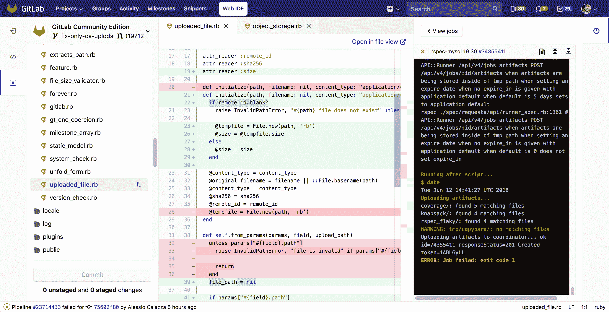

# GitLab 转向自动化开发操作

> 原文：<https://devops.com/gitlab-moves-to-automate-devops/>

GitLab 希望通过提供一个使用 GitLab 定义的规范方法端到端自动化开发运维流程的选项，消除设置和维护开发运维流程的痛苦。

GitLab 的[最新版本包括一个 Auto DevOps 选项，组织可以使用该选项来自动构建、测试、代码质量扫描、安全扫描、许可证扫描、打包、性能测试、部署和监控他们的应用程序。](https://globenewswire.com/news-release/2018/06/22/1528402/0/en/GitLab-releases-Auto-DevOps-to-accelerate-DevOps-Lifecycle-by-200.html)

GitLab 首席执行官 Sid Sijbrandij 表示，该公司现在能够提供这项服务，因为 GitLab 11.0 现在可以部署为一组更加集成的应用程序，运行在基于 Kubernetes 容器编排软件的集群之上。这种对 Kubernetes 的支持也使得根据需要在公共云或内部环境中部署 GitLab 11.0 变得更加容易。Sijbrandij 说，为了促进这一过程，GitLab 现在包括了一些模板，可以根据需要简化 Kubernetes 集群的构建。

为了进一步支持 Kubernetes，GitLab 还决定开始[在谷歌云平台](https://about.gitlab.com/2018/06/25/moving-to-gcp/)上部署其提供的云服务软件。此前，GitLab 一直致力于微软 Azure。[微软最近宣布了收购 GitHub](https://devops.com/microsoft-is-acquiring-github-for-7-5b-becomes-steward-of-leading-open-source-repository/) 的计划。

Sijbrandij 解释说，GitLab 完全支持自动化 DevOps 流程，但不认为组织应该被迫将所有东西都迁移到公共云中才能实现这一目标。组织仍然可以选择使用 GitLab 构建他们自己的 DevOps 流程。

但随着对 DevOps 的兴趣持续上升，更多的组织现在更愿意依赖一套最佳实践，这些实践被定义为使它们更容易使用，他说。

GitLab 11.0 还为使用。Net 和 Scala 编程语言，此外还支持 C、C++、Java、Python、Ruby on Rails、Go 和 PHP。

总的来说，Sijbrandij 指出，采用 DevOps 的组织通常会发现他们自己试图管理各种自动化孤岛，结果喜忧参半。Auto DevOps 旨在提供一种更全面的方法，消除那些不同的自动化孤岛之间经常存在的摩擦。Sijbrandij 承认，规范的方法可能不会吸引每个 IT 组织，但随着传统企业 IT 组织开始接受 DevOps，他们中的许多人更喜欢更以平台为中心的方法，这种方法更容易设置和维护，因为他们缺乏内部 DevOps 专业知识。

Sijbrandij 还指出，随着 DevOps 在企业中获得更多的关注，许多关于使用什么平台的决策将自上而下地进行。他说，今天，大多数 DevOps 工具和实践的收购都是自下而上的，这解释了为什么已经有这么多自动化孤岛。

Sijbrandij 说，随着时间的推移，许多组织将得出结论，Auto DevOps 所实现的固执己见的方法将使开发人员能够将更多的时间花在编写代码上，而不是管理用于创建代码的基础设施。今天，大多数传统的企业 IT 组织至少意识到他们应该采用 DevOps 实践，他们只是确切地知道这样的工作完全需要什么。

由于自动化的进步，许多 IT 领导可能永远不知道或不关心具体的 DevOps 流程是什么。毕竟，他们中的大多数人最感兴趣的是下一套应用程序代码交付的速度有多快。

— [迈克·维扎德](https://devops.com/author/mike-vizard/)