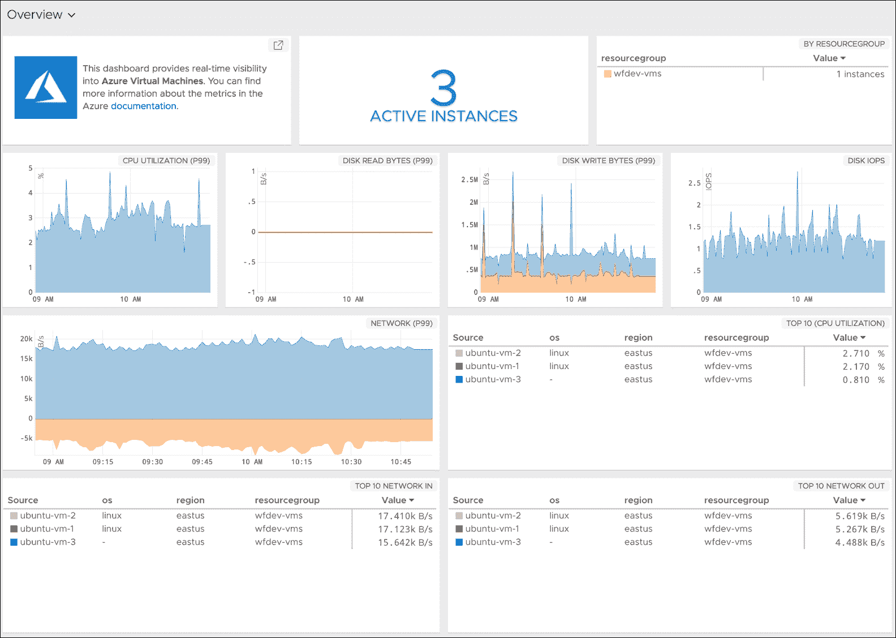

# VMware 的 Wavefront 扩展了监控范围

> 原文：<https://devops.com/wavefront-by-vmware-extends-monitoring-reach/>

基于 VMware 实现标准化的传统企业 IT 站点通常可以使用的 DevOps 工具与网络规模的公司通常采用的工具之间的差距正在继续缩小。

VMware 最新版本的 wave front analytics and monitoring tools now[附带了对运行在 Microsoft Azure 公共云上的一系列服务的预打包支持](https://www.wavefront.com/wavefront-adds-35-new-integrations/)，此外还显著扩展了对亚马逊网络服务(AWS)和谷歌提供的一系列服务的支持。

VMware 业务部门营销高级总监 Rob Markovich 表示，Wavefront 已经为软件即服务(SaaS)应用程序添加了 35 个第三方应用程序和服务的“开箱即用”集成。

Wavefront 还为 Kong、Micrometer、Github 和 Bitbucket、VMware vRealize Operations、Hadoop MapReduce、Yarn、HDFS、Ceph、FluentD、Couchbase、Lighttpd、CoreOS、PHP-FRM、Papertrail、Rollbar、Suse Linux、Fedora Linux、FreeBSD、NetBSD、OpenBSD 和 Oracle Linux 添加了预打包的仪表盘。他说，任何波前仪表板都可以使用 100 多种分析功能进行定制，包括对任何度量数据源的关联和预测功能。

过去几个月，VMware 进行了一系列投资，从[云扩展到 VMware vSphere](https://devops.com/vmware-extends-vsphere-hybrid-cloud-reach/) 到[将分析嵌入 VMware vRealize IT automation 框架](https://devops.com/vmware-automates-it-operations-at-scale-based-on-intent/)，无所不包。

Markovich 表示，Wavefront 正在以每月 10 到 20 个的速度增加集成，他说到 2018 年底总数应该会增加到 200 多个。他说，随着组织采用各种类型和类别的云原生应用程序，如微服务，对监控和分析的需求会大得多，特别是当组织开始更好地了解数千个微服务之间存在的依赖程度时。

此外，Markovich 指出，遇到这一挑战的公司数量也开始增加，因为几乎每个公司都开始意识到，它是一家软件公司，只是碰巧出售其他东西。他说，这不一定意味着每个组织都将以与网络规模公司相同的速度更新应用程序，但这确实意味着现有的 it 流程需要现代化——例如，更多的企业 IT 组织开始创建站点可靠性工程(SRE)团队。

这种转变可能不会导致每个企业应用程序都受到监控，但它肯定会增加那些受到持续监控的企业 it 环境中的应用程序工作负载的数量。

当然，DevOps 的官方定义并不统一。每个组织都将定制 DevOps 最佳实践，以适应其现有 it 文化的限制。在一些组织中，这种转变将由自下而上的驱动，而其他组织将由自上而下的计划来转变。在这一点上，采用 DevOps 的最大障碍与 IT 文化的关系比任何给定的技术都要大。但是，无论组织的 DevOps 成熟度如何，VMware 相信很快会有更多传统企业 IT 组织比以往更广泛地采用监控和分析。

— [迈克·维扎德](https://devops.com/author/mike-vizard/)