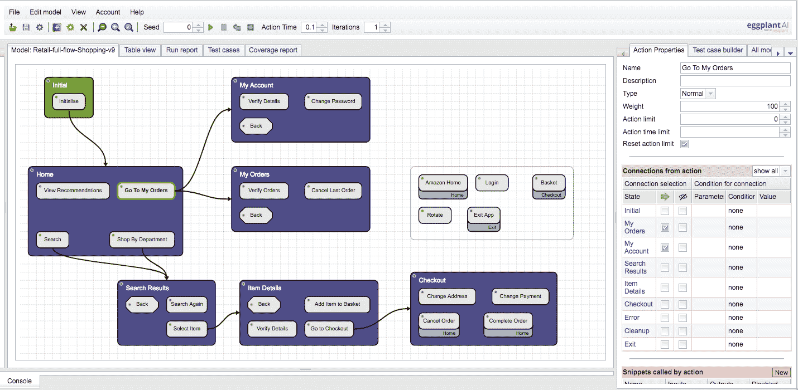

# 茄子扩大人工智能应用于应用测试的范围

> 原文：<https://devops.com/eggplant-extends-scope-of-ai-applied-to-application-testing/>

对机器学习算法和其他形式的人工智能(AI)的依赖可能会增加，不仅要大规模运行应用程序测试，还要实际构建它们。

茄子最新发布的数字自动化智能(DAI)套件[增强了测试工具中的人工智能功能，包括捕获和分析运行时性能数据，使测试过程能够“了解”潜在瓶颈隐藏在哪里。茄子的首席技术官安东尼·爱德华兹(Antony Edwards)说，DAI Suite 随后会建议进行一系列测试，旨在让开发者更容易找到问题的根源。](http://<a href="https://www.businesswire.com/news/home/20180517005243/en/Eggplant-Deepens-AI-Test-Automation-Capabilities">latest release of a Digital Automation Intelligence (DAI) Suite from Eggplant</a>)

目标是减少对人类构建公式化测试的依赖，爱德华兹说，这通常会限制应用程序部署和更新的速度。

Eggplant’s DAI Suite

DAI 套件中添加的其他新功能包括对茄子功能的增强，该功能现在利用人工智能来发现图形用户界面(GUI)的元素，以自动填充茄子人工智能应用模型中的自动化逻辑。负载和性能测试产品茄子 Performance 已经与开源性能测试框架 JMeter 集成，使开发人员和测试人员能够重用 JMeter 资产，并创建负载测试脚本。此外，可以采用新的实时关键性能指标(KPI)来缩短测试和分析之间的反馈循环。

据该公司称，茄子管理器和茄子自动化云现在都快了 10 倍，并提供了更高水平的测试可扩展性。

Edwards 指出，一般来说，应用程序测试过于公式化。最终目标应该是确定取悦最终用户的最佳方式，而不仅仅是试图检查合规性。这需要能够在不减慢整个应用程序开发生命周期的情况下测试更多的应用程序用例。事实上，他说今天 DevOps 的最大障碍是对人工测试过程的依赖，这推动了 320 亿美元的测试服务部门。

人工智能被更广泛地应用于应用测试只是时间问题。随着开发的应用程序数量的增加，测试变得越来越具有挑战性。进行这些测试花费的时间越长，开发人员就越容易忽视整个测试过程，认为任何可能出现的问题都可以使用敏捷开发方法快速解决。然而，不仅应用程序之间的依赖性比以往任何时候都多，而且最终用户也越来越不宽容。例如，他们中的许多人不会对最初让他们失望的移动应用程序多看一眼。加剧这一压力的是对数字业务流程的日益依赖，其中底层应用程序体验的质量与对企业品牌价值的感知直接相关。

开发人员可能并不总是高度重视应用程序测试。但随着它的继续发展，很有可能很快会有更多的开发者非常乐意利用他们所能获得的所有人工智能帮助。

— [迈克·维扎德](https://devops.com/author/mike-vizard/)