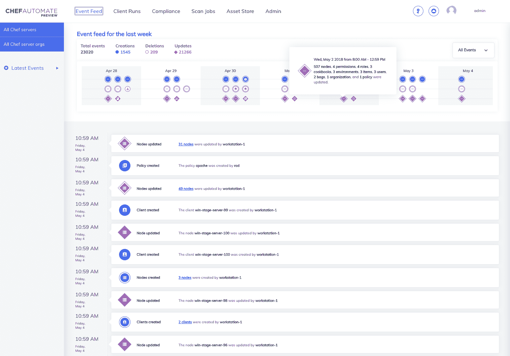

# Chef 采用微服务推进 IT 自动化

> 原文：<https://devops.com/chef-embraces-microservices-to-advance-it-automation/>

ChefConf 2018 大会上的 Chef 今天推出了一系列 DevOps 产品，包括 Chef Automate 的改进版本，该版本使用 Go 编程语言进行了重写，以提高性能和可扩展性。现在基于微服务架构，Chef Automate 2.0 是一个基于 REST 应用程序编程接口(API)的新用户界面，也用于增强集成。该平台还内置了各种可见性和调试工具，包括流式事件馈送、趋势图和查询语言。

Chef Automate

与此同时，Chef 推出了 Chef Workstation，使 DevOps 团队的成员能够利用本地 PC 上的 IT 自动化功能，而无需加载任何代理。

Chef 还更新了其 Habitat 应用程序发布管理软件，以支持 Kubernetes Operator for Habitat 和最初由 Cloud Foundry Foundation 开发的开放式服务代理，能够导出到 Azure Container Service (AKS)，这是一个用于 Kubernetes 集群的舵图导出器，并与 Splunk 的运营分析软件集成。Habitat 现在还提供内部版本和软件即服务(SaaS)应用程序。

最后，Chef 更新了公司的合规自动化工具 InSpec。最新版本现在可以验证亚马逊网络服务(AWS)和微软 Azure 政策，而对谷歌云平台的支持则处于测试阶段。InSpec 现在还内置了对 30 多种新资源的支持，包括作为无代理目标的 Cisco IOS 网络设备。

Chef 宣称 InSpec 在 Windows 系统上的性能提高了 90 %,在 Linux 系统上提高了 30%。

Chef 的产品营销总监朱利安·邓恩(Julian Dunn)表示，随着越来越多的公司转向容器和 Kubernetes 等新兴技术，对 IT 自动化框架的依赖也在增加。事实上，虽然容器的使用非常普遍，但 Dimensional Research 代表 Chef 调查的 347 名应用程序和操作专业人员中，超过一半(51%)表示，他们使用容器部署的生产应用程序不到 10%。Dunn 表示，该调查还发现，开发运维实践的采用总体上仍然有限，略超过一半的受访者(53%)表示，他们正在使用基础架构和应用程序自动化进行开发运维。

然而，46%的受访者表示，到 2020 年，他们将有超过四分之一的应用程序容器化，而 45%的受访者表示，至少四分之一的应用程序部署将基于微服务。Dunn 指出，加快的过渡速度将要求 IT 组织更多地依赖 IT 自动化框架来实施 DevOps 流程。

更复杂的是，Dunn 表示，组织正在试图将现有的应用程序提升和转移到多个公共云中，同时继续以前所未有的速度开发新的应用程序，以推动各种数字业务转型计划。

毫无疑问，IT 组织比以往任何时候都更加依赖 IT 自动化框架。问题是，他们会用哪一个？现在，IT 自动化框架的选择比以往任何时候都多。Chef 认为，基于涵盖 IT 管理和合规性的现代微服务架构的综合方法最终将会胜出。

— [迈克·维扎德](https://devops.com/author/mike-vizard/)