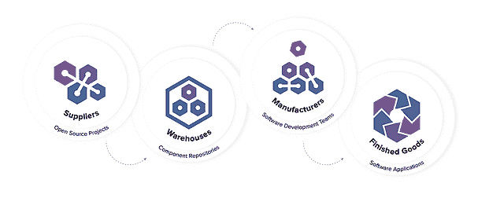
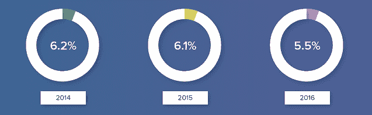
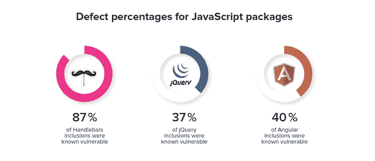

# 2000 亿次下载不会错

> 原文：<https://devops.com/200-billion-downloads-cant-be-wrong/>

首席运营官的 Laurie Voss 是 npm ( [@seldo](https://twitter.com/seldo) )的联合创始人，她最近在推特上说从他们仓库下载的 JavaScript 包已经超过了 40 亿。按年计算，下载量将超过 2000 亿次。哇哦。

正当开源软件今年 20 岁的时候，这些数字证明了当开发者社区公开分享创新时所发生的不可思议的魔力。

Laurie 估计有 1200 万开发者负责下载。这意味着，每年每个 JavaScript 开发者将下载近 17，000 个组件。想象一下，不需要从头开始编写每一个函数，只需在一毫秒内从互联网上下载一个包，就可以节省时间。

## **工作中的软件供应链**

我们在这里看到的是一个完整的软件供应链。开源项目向社区贡献打包的代码，将其放在公共仓库中，然后由全球的开发团队使用，为我们所有人创建新的前端、后端或移动应用程序。这个星球上的每个开发团队现在都在利用一个软件供应链，这个供应链以惊人的速度和巨大的吞吐量运行。

在第二条推文中，劳里写道，“由于我们有大约 1200 万用户，这意味着平均每个用户在 7 天内安装了整整 1000 个软件包。实际上，大多数人只安装了很少的软件包，而一堆 CI 构建盒每个安装了数十或数十万个软件包。”

本质上，有一大群机器人(自动化 CI 工具)从网上下载数十亿个组件。虽然这种类型的自动化是高效的，但是它本身并不能很好地服务于团队。

## **仓库来救援**

在 Sonatype，我们看到了 Maven 早期开发人员的类似行为。个人开发者可以直接从 Maven Central 下载 Java 组件。Maven 用户坐在同一个房间和同一个团队中，他们会反复下载构建所需的相同组件的相同版本。正是因为这个原因，我们的创始人发明了 Nexus repository manager。

虽然存储库管理器已经在 Java 社区中使用了相当长的时间，但是 Laurie 的文章告诉我们，在更年轻、更不成熟的打包代码生态系统中，该技术的采用仍然滞后。

寻找存储库管理员的公司可以考虑像 e-npm 这样的解决方案，这是一种专门针对 JavaScript 包的内部技术。对于拥有多语言开发团队的公司，universal repository managers 为 npm 和 12 种其他组件类型(包括 Docker 容器)提供全功能(有时)免费支持。

## **并非所有组件都是相同的**

我经常说，如果你有 100 名开发人员，你就有 100 扇大门通向你的组织。如果你有 1000 个开发者？然后是 1000 个前门。

如果您进一步剖析 Laurie 的评论，您还会意识到任何开发人员都可以在任何时候将任何包带入您的组织。虽然这确实提高了它们的效率，但也带来了安全和治理方面的问题。每一个组件都是由别人开发的，被捐赠到互联网上，被数百万人消费。但是你对许多成分的来源或起源没有真正的概念。

我前几年在 Sonatype 做的研究表明，存储库管理人员下载的组件中有 5.5%(18 分之一)存在已知的安全漏洞。虽然百分比不是很大，但是请记住，存储库管理员只会下载一个组件一次。一旦被缓存，该组件的未来下载是不必要的，并且该组件可以被该团队无限地重用。

对 40，000 多个 Nexus 存储库的 Sonatype 分析显示，平均每个存储库包含 1，600 多个组件。对存放在普通存储库管理器中的 1，600 个组件进行更深入的分析后发现，这些组件中存在 192 个安全漏洞(有些组件有不止一个安全漏洞)。

在软件供应链中，存储库管理器和私有容器注册代表了开发组织的采购入口。在组件流不受控制的地方，门可以敞开，或者它们可以代表质量和安全检查点的机会，以确保缺陷不会传递到下游。

## **您的存储库管理器中的内容正在生产中**

东北大学的研究人员使用来自超过 133，000 个网站的数据显示,“37%的网站包含至少一个存在已知漏洞的 JavaScript 库。从每个库的角度来看，至少有 36.7%的 jQuery、40.1%的 Angular、86.6%的 Handlebars 和 87.3%的 YUI inclusions 使用易受攻击的版本。

“令人担忧的是，许多网站继续依赖不再维护的 npm 包，如 YUI 和 SWFObject，”研究人员继续说道。“事实上，[NU 的]数据集中的中值网站使用的库版本比最新版本早 1177 天，这解释了为什么如此多易受攻击的库倾向于在网络上逗留。”

## **2000 亿次下载有什么问题？**

从创新的角度来看没有。太棒了，我们可以和劳里一起庆祝这个成就。

与此同时，它让我们停下来思考当今的其他问题，包括网络安全威胁、技术债务和浪费的上下文切换。

— [德里克·威克斯](https://devops.com/author/derek-e-weeks/)