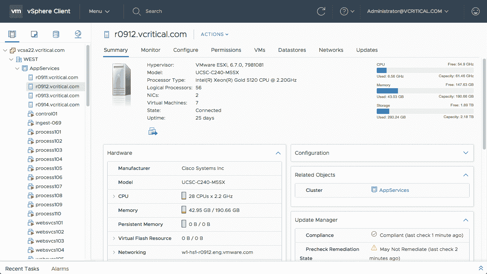

# VMware 扩展了 vSphere 混合云的覆盖范围

> 原文：<https://devops.com/vmware-extends-vsphere-hybrid-cloud-reach/>

VMware 本周扩展了其基于虚拟机管理程序实现 IT 环境自动化的活动，增加了链接功能，使 VMware vCenter 平台能够从同一控制台管理在内部和公共云中运行的 VMware vSphere 实例，如 Amazon Web Services (AWS)和 IBM Cloud。

VMware 云平台产品营销高级总监 Mike Adams 表示，添加到 VMware vSphere 的链接功能将使开发运维团队能够在任何地方部署 VMware 虚拟机管理程序，而不必为每个环境投资单独的管理框架。

与此同时，VMware 也在更新 VMware vSAN 存储软件，除其他功能外，该软件还增加了自我修复功能，旨在最大限度地减少底层硬件故障时的中断。

[6.7 版 VMware vSphere 和 VMware vSAN](https://www.vmware.com/company/news/releases/vmw-newsfeed.VMware-Elevates-the-Hybrid-Cloud-Experience-with-New-Releases-of-vSphere-and-vSAN.2204750.html) 现在还支持基于 HTML5 界面的增强型客户端软件，该软件可以管理 VMware NSX 网络虚拟化软件、vSAN 和 vSphere 以及其他第三方产品。

VMware vSphere 中的其他新功能包括 ESXi Single Reboot 和 vSphere Quick Boot，前者通过将所需的重新启动次数减半为一次来减少修补和升级时间，后者将跳过硬件初始化步骤以进一步提高重新启动效率。

VMware 还增加了对永久内存的支持，以提高 vSphere 性能，并增加了对图形处理器单元(GPU)的支持。

现在还支持可信平台模块(TPM) 2.0 支持和虚拟 TPM 2.0，虚拟 TPM 2.0 用于保护虚拟机和主机免受未授权组件加载的篡改或危害，或允许虚拟机管理程序上运行的来宾操作系统规避现有的安全控制。

最后，VMware 将提供一个在专用设备上运行的 VMware vCenter 管理软件实例。

Adams 表示，VMware 目前有 500，000 名客户运行 VMware vSphere，而只有 10，000 名客户选择运行 VMware vSAN 存储软件。该公司的目标是通过将存储软件迁移到运行 VMware vSphere 的同一台服务器上，让更多 IT 组织采用超融合基础架构。他说，这种方法极大地降低了大多数组织的总运营成本。

随着 VMware 对公共云的推进可能有些姗姗来迟，戴尔技术部门正依靠庞大的本地客户安装群来转移和扩展他们在公共云上的 VMware vSphere 的现有投资。虽然这种方法无疑会吸引 VMware 安装群中的很大一部分，但许多客户已经投资了 AWS、IBM 和 Microsoft 使用的虚拟机管理程序平台。

在将现有的传统应用程序提升并迁移到公共云中时，VMware 显然处于有利位置。但是，在开发全新的云原生应用程序时，VMware vSphere 通常不是应用程序开发人员的首选，他们中的许多人将 VMware vSphere 视为他们故意抛弃的不灵活的内部传统 it 环境的一部分。

然而，值得称赞的是，VMware 在[采用先进的自动化技术](https://devops.com/vmware-adds-vrealize-automation-cloud-platform/)方面取得了重大进展，很快有一天这些技术可能会一劳永逸地消除开发人员的担忧。

— [迈克·维扎德](https://devops.com/author/mike-vizard/)