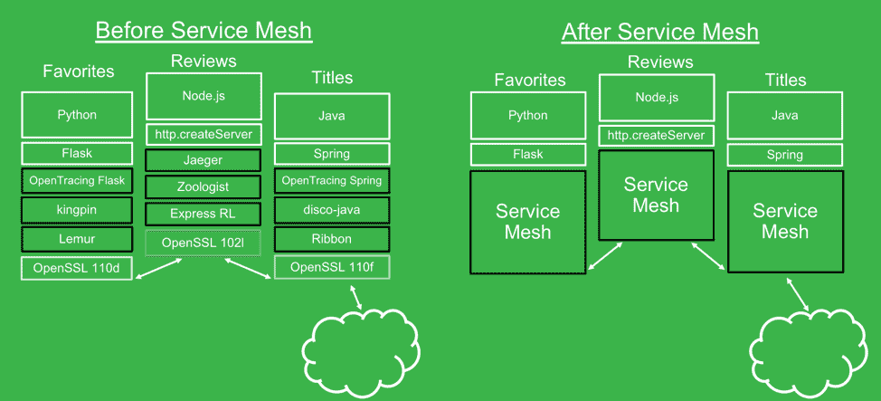

# 服务网格的未来之路

> 原文：<https://devops.com/the-road-ahead-for-service-mesh/>

随着架构的不断扩展，如果您正在努力管理微服务，那么很有可能您至少听说过服务网格。出于这篇博客的目的，我假设您熟悉服务网格的基本原则。

我相信，服务网格正在将微服务通信提升到一个新的水平，这是以前使用的一次性解决方案无法实现的。DNS 模式、配置管理和其他技术提供了一些功能，如服务发现，但它们不提供快速重试、负载平衡、跟踪和健康监控。旧的方法还要求您每次拼凑几样东西，而不是将所有东西打包成一个可重用的工具。

虽然有可能用单独的工具和过程来完成服务网格管理的大部分工作，但是这个过程非常棘手。下图很好地展示了网格如何简化微服务的管理。

## **就在眼前**

那么，在不久的将来会发生什么呢？我认为，我们将看到该技术迅速成熟，并添加更多功能作为标准功能，以响应企业实现网格带来的效率提升，并将其作为管理微服务架构的标准。对于生产部署来说，服务网格可能还不成熟，但路线图进展很快，看起来我们很快就会实现 v1。安全性是 service mesh 提供的一项功能，但对于大多数企业来说，这是一个主要考虑因素，我看到策略实施和监控选项对于企业生产部署变得更加强大。

我在近期看到的一个功能——也是一个将提供巨大价值的功能——是一个分析仪表板，用于显示服务网络中大量遥测数据的洞察力。我认为我们将看到的一个新兴价值主张是，网格允许您获取数据并对数据采取行动，这将允许您更有效地管理您的整个架构。

## **再往前走**

关于服务网格的近期前景有很多讨论，但更有趣的是考虑长期会带来什么。我的猜测是，我们最终会实现一个嵌入在平台中的增值网络。微服务显然是未来的发展方向，因此组织需要一种轻松的方式来管理它们。他们会想要一些自动化的东西，在后台运行，从来没有想过。这可能需要几年的时间，但我相信服务网格最终会成为一种无处不在的技术，一种完全受管理的即插即用配置。看到使用该技术管理基础设施、服务和应用程序的新方法将会很有趣。

我们很高兴能够成为这一旅程的一部分，并受到用户如何利用服务网格来解决微服务爆炸所带来的直接问题以及如何利用它来提高效率的启发。我期待看到社区提出的我还没有想到的东西。

——Zach jory