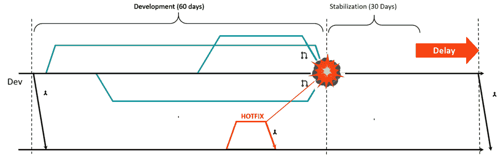

# 敏捷开发:你需要掌握的 3 种方法

> 原文：<https://devops.com/agile-development-3-methods-you-need-to-master/>

随着组织拥抱敏捷和数字化转型战略的时代，每个品牌都在寻找竞争优势。为了取得成功，组织需要以用户为中心，根据用户的条件、设备和方便程度为用户提供服务。更重要的是，用户希望这些产品在视觉上更吸引人，速度更快。要记录的东西太多了！

选择数字化转型战略时，组织需要了解两个关键的权衡因素。首先，将功能更快地推向市场并增加在用户设备上的存在，其次，保持高应用质量。加速可以以采用敏捷过程的形式出现，即高度独立的开发团队负责代码中的一个特性，从设计到生产交付增量功能。一个合适的质量方法同样有效，确保在每个 sprint 结束时的高质量应用程序。这实际上可以帮助团队加速。

持续集成(CI)、持续交付(CD)和持续测试(CT)是许多开发团队采用敏捷策略的三大方法。虽然每一个都服务于稍微不同的目标，但是当结合起来时，它们可以显著地帮助团队实现速度和质量，这是任何开发团队最重要的两个目标。让我们更深入地了解这三个不同的组件，以了解它们各自扮演的重要角色。

## **方法一:持续集成**

CI 是组成高效敏捷开发团队的最重要的组成部分。为了帮助理解 CI 扮演的重要角色，下图描绘了一个没有安装 CI 流程的团队。您会注意到，这个团队直到 60 天的开发期结束后才与开发团队的其他成员共享他们的代码。结果，通过等待共享关键性能组件，比如代码，这个团队不必要地延长了后 sprint 稳定阶段，在这个阶段开发人员测试和重做集成点。在应用程序开发这样的情况下，速度是一个非常敏感的 KPI，延长这个阶段会对项目的成功产生重大影响。更重要的是，它会在整个软件开发生命周期(SDLC)中引起开发人员和测试人员的沮丧。

作为比较，下图描绘了一个已经实施了 CI 流程的团队。使用 CI，团队不断地从主树中集成增量。此外，通过使用测试自动化，他们能够确保集成实际工作。通过实施 CI 方法，每个 sprint 都按时结束，并且在定义的质量期望内，从而减少稳定阶段。在某些情况下，有可能完全摆脱这个阶段。理想的 CI 过程在每个 sprint 和每天结束时产生一个工作产品。

## **方法二:连续交货**

CD 是一种实践，即简化和自动化部署前的所有流程。在 CD 中有很多步骤，比如在先前的环境中验证构建的质量。当手动完成时，这些步骤会花费大量的精力和时间；但是，可以使用云技术和适当的编排来实现自动化。

团队应该确保他们的生产环境有一个监控仪表板，以消除性能瓶颈并快速响应问题。这将完成有效的 CD 过程。

## **方法三:连续测试**

CT，也可以称为持续质量，是将测试活动嵌入并自动化到每个“提交”中的实践当开发人员试图修复多年前编写的代码的错误时，CT 可以帮助他们更有效地利用时间。要修复这个 bug，开发人员应该首先提醒自己是哪个代码，撤销任何写在原始代码之上的代码，然后重新测试新代码——这不是一个短暂的过程。每次提交、每隔几个小时、每晚和每周进行的测试不仅增加了对应用程序质量的信心，而且还提高了团队的效率。

下面列出了团队实现 CT 应采取的各种步骤:

*   确认一个 24×7 的稳定测试实验室。
*   用一套支持高生产率的测试和开发工具武装测试团队。
*   仅对高价值和稳定的测试利用自动化。
*   正确确定平台的规模，并测试所有项目的覆盖率。
*   通过频繁的报告和分析实现快速反馈。 ****

## **总结**

关于适应今天的数字化转型和实施敏捷开发过程的一个最流行的误解是，它阻碍了速度和质量。除了敏捷开发方法之外，整合 CI/CD/CT trifecta 还能实现在当今快速变革的行业中取得成功所需的速度和质量。

阿米尔·罗森博格