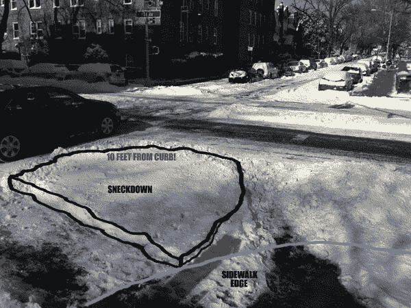
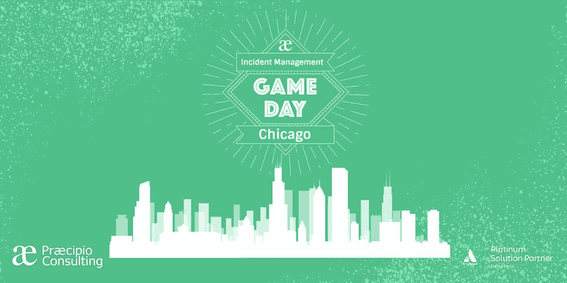

# IT 运营中的 Sneckdowns

> 原文：<https://devops.com/sneckdowns-in-it-operations/>

IT 运营专业人员可以从人们使用工具和流程的实际途径以及与预期使用模式的差异中学到什么。

欧洲大部分地区经历了一个多雪的冬天，尽管大部分地方的雪已经开始融化，但我们的城市仍会看到大量降雪。

如果你不熟悉术语“ [sneckdown](https://www.citylab.com/environment/2017/03/sneckdowns-snow-street-safety-design/519990/) ”，它描述的是那些实际上没有被使用的街道区域，正如落在它们上面的无标记的雪所显示的那样。

众所周知，交通规划者甚至成功地将 sneckdowns 用作规划辅助工具。

IT 界应该从这个例子中吸取教训。我们可能没有像雪一样异想天开的东西来帮助我们，但另一方面，我们确实有大量的数据。让我们研究一些例子，从 IT 运营开始。

## 重申我的假设

IT 运营有一系列的假设，但就像街道布局一样，其中一些可能已经过时，是上一代技术的遗留物。我自己的家乡可以追溯到罗马时代，准确地说是公元前 218 年，但是罗马殖民者为了方便战车和牛车交通而做出的各种设计选择不得不进行重大更新，首先是为了适应机动车辆，然后是为了确保机动车辆不会挤掉自行车等其他交通工具。

类似地，许多 IT 操作都基于票证的概念，它描述并包含了一个原子问题。该票证在任何时候都只有一个所有者，并通过一系列步骤按顺序处理。这是[相当于开发](https://devops.com/waterfall-incident-management-collaborative-operations/)的瀑布模型的操作。

在以前的 IT 技术时代，这些假设曾经是合理的，当时一台设备的简单故障就足以引发事故。该事故单可以很容易地与受影响的特定设备配对，并且从那里简单的查找将返回负责的组，然后该组可以被分配到该事故单的所有权。

如今，这种模式已经基本过时了。硬件，尤其是虚拟硬件，非常便宜，足以实现多重冗余。负载平衡等自动化功能确保单一故障很少足以导致实际事故。相反，多次失败必须以正确的顺序发生，或者以错误的顺序发生，这取决于你的观点。与此同时，操作人员淹没在红色警报的海洋中，无法找到并专注于少数可操作的警报，因为流程要求他们对一切做出响应。最后，当一张真正的票穿过噪音时，它会在团队之间来回传递，因为焦头烂额的操作员试图找出这是他们的问题还是其他人的问题。

毕竟，操作员也是人，随着时间的推移，他们会在这个僵化的过程中形成自己的道路，就像人们在雪地里行走和驾驶自己的道路一样。

## IT 运营巡查示例

### 一起工作的用户

协作是 IT 运营的一大难题。运营商没有使用票务系统及其僵化的假设，而是采用替代方法来共同工作并相互共享信息。目标是为团队支持的整个复杂业务服务交付[全栈操作](https://devops.com/now-time-full-stack-operations/)。

sneckdowns 的问题是，如果没有城市规划者的观察和测量，最终积雪会融化，不会留下人们在城市中走过的路的可见痕迹。同样，更广泛的组织面临的风险是，当人们在替代的非官方工具(无论是 IRC 还是 Slack)中工作和协作时，信息会停留在那里，无法返回到官方知识库中，而随着时间的推移，这些信息可以被查阅和重用。

**Sneckdown 建议:**认识到现代 IT 和网络架构的本质意味着问题可能不仅仅是一个人的问题。快速的变化也使得几乎可以肯定的是，任何所有者都不会被记录在某个静态数据库中。相反，修改流程以识别这种多所有者方法，并使用户能够轻松地相互协作，而不必打乒乓。

### 适合这项工作的工具

这与另一个 sneckdown 重叠:非官方的工具采用。同样，操作员可能会开始使用非正式的协作工具来绕过正式服务台流程中的限制，他们可能会查看看板来共享任务状态，或者开始构建自动化诊断和补救措施库。问题是，僵化的官方政策往往不适应这些扩展，而且确实没有这样做的机制。

**Sneckdown 建议:**现代运营工具需要提供灵活的接口，以便安全地完成集成和扩展。这样，如果某个特定的集成不工作或需要升级，可以在不中断更广泛的流程和任何其他工作良好的集成的情况下完成。

## 往阴影里看

至少对这场暴风雪来说，最后的检查是“影子 IT”。同样，理论上我们的宇宙大部分是由暗物质组成的，我们目前的工具看不到，越来越多的 IT 支出发生在“官方”IT 预算之外。这也意味着，用该预算购买的任何东西都不属于正式的 IT 运营和支持流程。理论上这一切都很好，但如果销售或营销人员赖以开展工作的工具出现故障，不知何故，IT 运营部门仍会接到修复它的电话。

**Sneckdown 推荐:**这个问题没有简单的短期解决办法——没有办法让它消失。相反，IT 运营专业人员需要从两个角度解决这个问题。首先是解决影子 IT 的原因，即那些使人们寻求外部解决方案而不是与内部 IT 部门合作的僵化和摩擦。当一切都适当地协调一致时，IT 部门在理解组织内部的工作方式方面可以提供很多东西。另一个角度是——是的——让最初作为影子 it 采购的解决方案更容易适应。找出如何参与人们自己采用的 SaaS 解决方案的支持流程；如果它对他们有用，那就由你来保持它的有效性！好处是，这种一致性将减少系统管理员和操作员不断注入能量以保持事物运行的需要:[IT 运营第二定律](https://devops.com/aiops-second-law-ops/)。

## 结论

与城市规划者和交通活动家相比，我们 IT 专业人士实际上过得很轻松。我们的数据并不依赖于特定的天气条件，相反，我们随时都有大量的数据。这取决于我们以开放的心态看待数据，并阅读已经存在的结论。当然，困难的部分是将这些结论付诸行动，特别是当这需要对广泛接受的流程进行更改时，但这也是一个重新审视这些流程的机会，并确保它们仍然像最初采用时一样适合目的。

如果你对这个过程感兴趣，有一个有趣的系列活动:**比赛日 ITSM &事故管理研讨会**。[下一个比赛日是 3 月 21 日](https://www.eventbrite.com/e/game-day-itsm-incident-management-workshop-chicago-tickets-42752378515)，但是有一个完整的系列赛在进行，所以很可能很快就会有一场比赛在你附近举行。这是一个有趣的时间，也是一个很好的机会来重新思考一些假设，看看哪些地方可以纳入你的计划。

多米尼克·惠灵顿