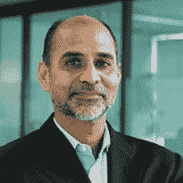

# DevOps 聊天:Tricentis 首席执行官 Sandeep Johri 的持续测试

> 原文：<https://devops.com/devops-chat-continuous-testing-w-sandeep-johri-ceo-tricentis/>

在本次 DevOps 聊天中，我们将深入了解持续测试市场，这是 DevOps 领域最具活力的市场之一。我们的嘉宾是该领域的领导者 Tricentis 的首席执行官 Sandeep Johri。

Sandeep 向我们介绍了他的个人背景，以及 Tricentis 的历史。该公司在持续测试领域并不是一夜成名的。事实上，它多年来一直在完善其产品。Tricentis 帮助开创了持续测试时代，使持续测试成为 CI/CD 管道的一部分。

这个聊天是了解持续测试的一些要点的好方法。听一听。像往常一样，下面是流媒体音频，然后是我们的谈话记录。享受吧。

# 音频

[https://w.soundcloud.com/player/?url=https%3A//api.soundcloud.com/tracks/399051597&color=%23838f8e&auto_play=false&hide_related=false&show_comments=true&show_user=true&show_reposts=false&show_teaser=true](https://w.soundcloud.com/player/?url=https%3A//api.soundcloud.com/tracks/399051597&color=%23838f8e&auto_play=false&hide_related=false&show_comments=true&show_user=true&show_reposts=false&show_teaser=true)

抄本

*[Sandeep-Johri-new](https://devops.com/devops-chat-continuous-testing-w-sandeep-johri-ceo-tricentis/sandeep-johri-new/ "Sandeep-Johri-new")****Sandeep Johri**
作为 Tricentis 的首席执行官，Sandeep 拥有超过 25 年的企业软件经验。他管理所有与业务相关的职能，包括业务战略、产品、服务、销售、营销和运营，以实现业务利润和销售目标。Sandeep 最近担任了领先的开源移动应用程序开发平台 Appcelerator 的首席运营官。他曾是惠普战略和行业解决方案副总裁，同时也是公司发展副总裁。在那里，他在开发和实施增长战略方面发挥了重要作用，使软件业务在过去四年中增长了两倍。Sandeep 在两家初创公司 determini(VMware)和 Bluelane (VMware)的形成中发挥了重要作用。他还是 Oblix(甲骨文)的首席执行官和创始人，并联合创立了 eBoodle (EW Scripps)，这是最早的电子商务比较购物服务之一。Sandeep 拥有斯坦福大学 MBA 学位，底特律韦恩州立大学工业工程硕士学位，印度浦那大学机械工程学士学位。Sandeep 作为顾问和投资者参与了硅谷和印度的各种初创企业。***艾伦·希梅尔:**大家好，我是艾伦·希梅尔，DevOps.com，您正在收听的是另一个 DevOps 聊天。今天为大家准备了一个非常棒的聊天。我想向你介绍桑迪普·乔里。他是 Tricentis 的首席执行官。桑迪普，欢迎。

谢谢你，艾伦。

首先，Sandeep，我只是想确认一下你的——我们把你的名字念对了。

是的，实际上是你做的。你完全正确。

**Shimel:** 好。好吧。总是一个好的开始。所以，Sandeep，让我们从这里开始。我认为 Tricentis 是一家在 EMEA 有着非常、非常强的影响力的公司，最近开始在北美市场发力。但是我们的一些听众可能对特里森蒂斯一点都不熟悉。那么，我们为什么不从这开始呢，如果你能给我们一点——不是电梯推销，而是 Tricentis 的一点背景？

当然可以。Tricentis 大约在八、九年前成立。它是由 Wolfgang Platz 创建的，他实际上是一名测试人员，从事复杂的企业应用程序测试工作，并对现有的所有工具感到沮丧。因此，像任何优秀的企业家一样，他决定编写自己的工具。该工具最初主要关注自动化。沃尔夫冈总部设在奥地利的维也纳，他们在当地销售给德语市场，比如奥地利、德国和瑞士。

**Shimel:** Mm-hmm.

Johri: 他们有一个不错的小生意，他们有很棒的产品。大约 4 年前，也就是 2013 年，我遇到了他们。我找到了他们，觉得这可能是一个非常有趣的产品，因为市场需要的是自动化，尤其是当人们转向敏捷的时候。鉴于我在惠普使用 Mercury 的背景，我知道没有多少自动化，但是，如果你走敏捷之路，你必须有自动化。它成为一个关键的组成部分——测试方面的自动化变得至关重要——这就是我加入该公司的原因。你说得对；他们最初主要集中在欧洲。请记住，这是术语“DevOps”的预造，但是自动化的需求一直存在，特别是当您在开发方面转向敏捷时。

所以现在，你知道，向前循环四年，我们现在是一家全球性公司。我们在美国的业务和在欧洲一样多，所以我们现在真的非常平衡。在过去的几年里，我们还在亚太地区、澳洲、纽西兰和新加波建立了业务，所以我们确实有点全球化，美国和 EMEA 之间的典型平衡，还有另外一个 APAC 的组成部分。而且，很明显，一旦 DevOps 成为行业中的咒语，我们真的很适合，人们开始谈论持续测试。嗯，有了自动化，你真正得到的是连续测试，所以这就是为什么我们都是关于连续测试的。但是核心引擎是自动化——是一个测试自动化引擎，对企业来说也是如此。

绝对的。所以我想进入整个自动化和测试市场，但是你提到了一些事情，如果你不介意，我想深入了解一下。我不想让你尴尬，Sandeep，但是，当你到了我这个年龄——你是当代人——你知道，我们喜欢回忆。所以你提到了水星和你在那里的经历。我的意思是，对于那些没有在 Tricentis 网站上查看你的简历或管理团队细节的人，你为什么不给我们的观众介绍一下你自己的背景，让他们感受一下呢？

当然可以。当然，艾伦。我会尽量长话短说。我在硅谷呆了将近 30 年，一直是企业家。我开了几家公司。一个是 Oblix，它是身份空间的领导者。然后是其他两家公司，Blue Lane 和 Determina，它们后来被 VMware 收购。在那之后，我加入了惠普，因为他们希望建立他们的 IT 管理组合，在 2005 年到 2008 年的三四年时间里，我们收购了大约 13，14 家公司，包括最大的 Mercury Interactive，但我们也收购了 Opsware 的数据中心自动化；我们收购了 Peregrine 进行资产和服务管理。整个产品组合变成了惠普 ALM，业务从大约 6 亿美元增长到大约 35 亿美元。

**Shimel:** 哇。

**Johri:** 然后每个人都知道惠普遇到了一些挑战，越来越不关注软件业务，他们最终在去年出售了软件业务。但是我觉得有必要——我觉得有机会开发更适合敏捷自动化环境的下一代工具或下一代测试平台，我们现在称之为更多的“DevOps ”,因为它需要整个周期，如果可以的话，它会创建一个连续的交付链。

绝对的。所以，Sandeep，这是典型的硅谷企业家的故事，你做了从初创公司到一些非常成功的退出的所有事情。正如我提到的线下，我记得 Oblix 和我记得蓝巷几乎就像是在昨天。然后，当然，你的简历上有这家大公司，惠普的经历，我可以想象，以我对 Insight Venture 团队的了解，我相信他是 Tricentis 的投资者，我可以想象你会是一个非常非常有吸引力的候选人，当时他们正在寻找一位——该团队正在寻找一位首席执行官，将 Tricentis 带到一个新的水平，所以是在正确的时间出现的正确的人。奇妙的故事。

是的，我在 Insight 进来之前就加入了。是的，我是四年前加入的——Insight 是去年加入的——因为我认为他们真的很有前途，我们花了前几年的时间来构建产品，以更加——你知道，充实产品。我们增加了服务虚拟化。我们在其中添加了测试数据。你知道，我们增加了一大堆功能，我们开始被 Gartner 等认可为领导者，我们在美国也开始拥有一些真正的大型企业客户。那时 Insight 也有类似的论点，“嘿，惠普似乎正在离开这个市场，但这里有需求，有机会，”他们找到了我们。这就是为什么他们去年年底投资了 1.65 亿美元。

**Shimel:** 哇。这是一笔不小的投资。所以我有点本末倒置了，但是恭喜你。对吗？对于这样的投资来说，这并不是一件容易的事情，但当有这样的机会时，也是如此。如果可以的话，现在让我们转向 Sandeep，稍微谈一谈测试市场。你知道，测试——在 DevOps 和敏捷之前，整个 QA 测试真的非常非常令人讨厌，我不知道人们对它有多感兴趣。回想我在 StillSecure 的时候，测试中最困难的事情就是建立一个能够处理我们想要测试的规模的实验室。对吗？

**Johri:** 对。没错。没错。

**Shimel:** 测试软件等等相对来说是一堆开源工具，开发团队在旧瀑布中作为发布周期的一部分。但是，你知道，有了敏捷和自动化，看，有了自动化就有了敏捷，还有自动化本身，贯穿软件生命周期。

**Johri:** 嗯嗯。

Shimel: 这变得势在必行，对吗？突然间，现在——

**Johri:** 对。

**Shimel:**–是的–测试已经扮演了一个超级角色，对吗？我的意思是，它真的变得有点——你知道，当我们看持续集成、持续交付管道时，对，测试，伙计，它很突出。就像淹没了其他一切，如果你愿意，对吗？它在吞它。

**Johri:** 对。

Shimel: 如此巨大的机会。我们已经看到许多公司试图进入这一领域，他们中的许多人都基于开源，无论他们是在做 Selenium 还是类似的东西，但测试有不同的方面。Sandeep，你能和我们的观众分享一下 Tricentis 正在做什么类型的测试吗？

**Johri:** 对。艾伦，我认为你涵盖了很多历史，也许我可以对此进行评论，因为这真的很有趣。所以，你知道，对于一个企业来说，测试一直是至关重要的，但你是对的。这是一种“哦，上帝，我必须做测试，这是一个很大的手动过程，”所以人们大多外包测试。而且，当你处于瀑布模式时，这是没问题的，因为你做了一堆开发，然后你把它扔到了墙上。在大多数情况下，在企业中，it 外包出去，人们手动完成。但这一直是一笔巨大的支出。即使在今天，在测试服务上仍有 300 亿美元的支出。

现在的挑战是，现有的工具，包括开源和商业工具，主要是基于脚本的工具，所以很难实现自动化。而且，因为你已经外包，你有点得到劳动力套利，人们继续做手工。甚至在今天，80%的测试，企业测试，都是手工完成的，这有点疯狂，对吗？因为我们一方面在为自动驾驶汽车做准备，但另一方面，我们正在进行软件测试——软件对每个企业来说都是非常重要的——我们正在手动进行所有的测试。嗯，现在——这在瀑布环境中是没问题的。

当你在开发端转向敏捷时，你开始频繁地构建。而且，当您开始频繁地构建时，如果您的测试周期仍然是 6 到 12 周，您将会退回到瀑布模式，即使您的开发可能是敏捷的。因此，测试变得——自动化测试的需求变得至关重要，因为，否则，它将成为交付链中的瓶颈。我们所做的或者我们对测试的看法是，测试应该和开发保持同样的节奏，所以，如果你在做每日构建，你应该每天都进行测试。

现在你提到了开发商。开发人员进行单元测试——他们在构建时进行子系统级测试——但是，对于一个拥有混合技术的复杂环境的大型企业来说，仅仅进行子系统级测试是行不通的。这是必要的，但还不够。因此，你需要能够做的是真正更快地交付或者真正得到——要进入连续交付模式，你需要能够连续地构建，而且还要在连续的基础上进行端到端的测试。这是我们通过自动化从根本上实现的。我们可以达到 90%的自动化程度；我们把手工测试仅仅留给可用性和探索性。然后，你知道，你真正拥有了处于连续模式的 DevOps 工具链，你可以进行连续的构建，然后*–*

**Shimel:** Mm-hmm.

**Johri:** 一方面你在做持续的构建，你在以同样的步调做持续的测试，然后你可以把它推进到运营中，所以你是对的。它变得绝对重要，手动测试正在迅速减少，人们现在更多地转向自动化。

绝对的。不仅仅是移位。你知道，这是一个全球性的大规模自动化转变，尤其是在测试方面。坦率地说，这就是为什么你会得到我们现在看到的这种估值。这就是为什么你会看到我们所看到的大公司的收购。你知道，我看不出如果没有自动化，你如何进行测试，所以这是一个正在进行的方式的根本变化。你知道，你看一些公司从旧的方式做它，谁可能卖测试设备等等。对吗？在某种程度上，他们有点像行尸走肉。对吗？我——

乔里:是的。

天啊，我不知道该怎么跟你说。

但是，你知道，艾伦，还有一点。我认为，当你想到一个大型企业——银行、保险公司或类似企业——他们的业务流程跨越技术，这意味着他们有现代化的前端，但他们也有许多遗留系统。大多数早期 DevOps 工作只在前端系统上完成，在那里你可以进行开发，只要你完成了一些单元测试，你就可以进入生产。当您考虑拥有大型端到端系统的企业时，这些系统跨越了已经发明的每一项技术，您必须进入持续测试模式；否则，您无法为大型企业进行开发运维。因此，企业开发运维与硅谷的小型开发运维初创企业略有不同，后者拥有相对现代的技术体系和相对单一的应用。

**Shimel:** 坦白地说，我总是喜欢说，Sandeep，那些公司——首先，是 DevOps，对吗？我不在乎你们是大是小——你们都喜欢做 DevOps——但他们做 devo PS 是因为他们没有资源以任何其他方式做这件事，坦率地说，对吗？每个人都身兼数职，他们不得不这样做，这是别无选择。如果你愿意，这是他们的基因。对于大型企业来说，在当今竞争激烈的市场中，从某种程度上来说，要么发展，要么消亡。当我说“DevOps”时，我指的是持续——持续测试、持续交付、持续集成。你知道，自动化无处不在，我的意思是，你知道，我们现在已经认识到的所有事情都是 DevOps。所以–

**Johri:** 嗯嗯。

Sandeep，我想我们看到了这些大趋势。我们看到了市场的走向。我们听说过你的背景和公司的历史。我的意思是，这是一个八岁或九岁的创业公司，对不对？

**Johri:** 嗯嗯。没错。

未来会怎样？专门针对特里森蒂斯。

**Johri:** 嗯，你知道，我们认为我们自己——在我提到的那些地区——美国、EMEA 大部分地区，然后是澳大利亚、新西兰和新加坡——我们有大约 600 家大型企业，我们主要关注大型企业，全球 2000 强或全球 5000 强。在竞争方面，我们将最终取代旧的惠普，现在称为“微焦点”大多数企业都在寻找一个现代化的工具集，就像他们使用 AppDynamics 或 New Relic 来取代旧的应用程序监控解决方案，他们正在用吉拉等更新的东西来取代旧的缺陷管理系统。因此，我们看到了很多替代，但真正令人兴奋的是，我刚才谈到的 300 亿美元的测试服务支出，就像我说的，大部分是手动的，而且，随着你开始自动化，我们真正做的是扰乱那个 300 亿美元的手动测试市场。所以全球的机会对我们来说是不可思议的。就像我们这样的平台可以在那里销售的东西而言，这是一个数十亿美元的机会。

**Shimel:** Mm-hmm.

**Johri:** Mercury 是一家价值 10 亿美元的公司——10 年前，也就是 2007 年，它几乎是一家价值 10 亿美元的公司，所以我们不仅将它视为一个替代产品和替代机会，而且因为我们正在破坏服务，因为你破坏了手工劳动，你知道，它的很大一部分流向了自动化工具，这就是我们所看到的。所以，就未来而言，我们看到了一个非常非常光明的未来。我们希望成为测试工具领域的市场份额领导者，因此我们已经拥有非常全面的端到端测试解决方案，包括性能和负载测试，我们将继续增强它，以便成为创新领导者，就像我们现在这样。我们将保持这一优势，继续保持领先地位。

桑迪普，只要你还在掌舵，我就不会怀疑这一点。根据你的过往记录，这听起来像是——我不得不同意你对市场所说的几乎每一句话。这就是我们现在的处境，未来几年应该会很有趣。机会当然是有的，对吗？有人会主宰这一切。

太棒了。是的。

**Shimel:** Yep.

**Johri:** 嗯嗯。嗯嗯。

**Shimel:** Sandeep，正如我在开始时告诉你的，15 分钟过得很快，所以我们已经进行了 20 分钟。所以我们需要总结一下这一点，但是，在我们做之前，对于可能的人——我们正在与 Tricentis 进行一系列活动，我相信我们会有一些网络研讨会和一些关于 DevOps.com 的内容，但是，除此之外，人们可能会在哪里看到你们在会议上或演讲？或者，很明显，他们可以去 tricentis.com——T-R-I-C-E-N-T-I-S.com——获取信息，但是如果你碰巧知道人们可以从哪里获得更多信息或者一点实践经验—

Johri: 是的，我们有——是的，绝对有。嗯，就像你说的，Alan，我们确实参加了大多数大型会议，无论是关于开发运维还是测试的会议。你知道，我们参加一些以测试为中心的会议。我们还参加大型供应商会议，如阿巴拉契亚峰会和 SAP 的 SAPPHIRE。但最让我兴奋的是，今年，我们正在组织我们的第一次美国用户会议，这将是一次真正专注于持续测试的会议。我们计划在四月份，是的，就在这里——实际上，不，不，等一下。它被安排在-

**Shimel:** 不知道。

哦，天啊。

你知道吗？

是的，我应该——

Shimel: 我自己在帮你查。在这里等一下。Tricentis 加速？会是这样吗？

对，是——对，是在 8 号或 9 号。

**Shimel:** 旧金山，5 月 7 日到 5 月 8 日。

乔里:是的。是的。是的。5 月 7 日和 8 日。很抱歉。

**Shimel:** 没事的。

Johri: 但是这次会议将完全集中在持续测试上。显然，我们将展示我们所有的产品功能等，但更有趣和令人兴奋的是，我们将有一大群大型企业客户谈论他们如何应对持续测试，因为他们正在进行开发运维，所以这应该非常令人兴奋。我真的很欢迎大家来参加 5 月 7 日和 8 日在旧金山举行的会议。

是的。你也在做，看起来像是，10 月 9 日和 10 日在奥地利的维也纳。因为——你知道吗？–像 DevOps 本身一样，我们的受众中约有 36%、37%来自美国，世界其他地区占大多数。不过，对于任何感兴趣的人来说，你可以去 accelerate.tricentis.com——也就是特里森蒂斯的 accelerate，A-C-C-E-L-E-R-A-T-E——或者 accelerate.tricentis.com，了解这两个地方的信息。我们可能也会在 DevOps.com 报道他们。这是对 Tricentis 的精彩介绍，也是对测试、敏捷、DevOps 市场的精彩讨论。桑迪普，非常感谢你加入我们。

约翰:太棒了，艾伦。非常感谢你的时间。我有一个特别的提议给你。对于您的听众，我们将制作一些会议门票，您可以将其分发给您最喜爱的听众，因此我们将跟进并为您提供一大堆会议门票，您可以分发给您的读者。你的读者群正是我们的目标，也是我们的目标——这是我们的领域。这正是我们的领域，所以我们希望有尽可能多的读者，或者听众和读者

**Shimel:** 作为两者，对。

Johri: 尽可能参加会议。是啊。太棒了。

Shimel: 你真好。我会把它放在展示笔记和关于 DevOps.com 的文章里，给感兴趣的人看。我们会抽奖，看我们这里有多少。自动化测试巨头 Tricentis 首席执行官 Sandeep Johri。感谢你成为本期 DevOps Chat 的嘉宾，继续成功。

谢谢你。

**Shimel:** 谢谢。我是 DevOps.com 的艾伦·希梅尔。感谢大家的收听，我们将在下一次 DevOps 聊天中再见。

— [Alan Shimel](https://devops.com/author/ashimmy/)