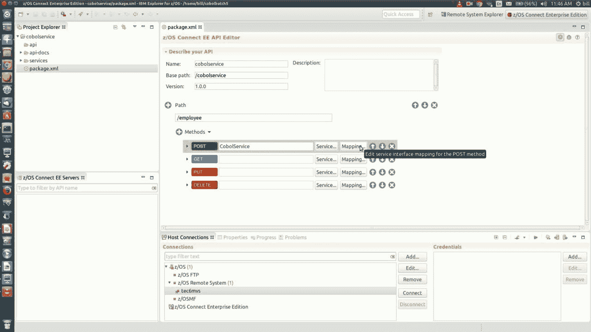
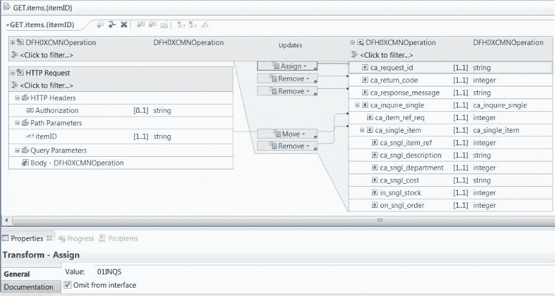
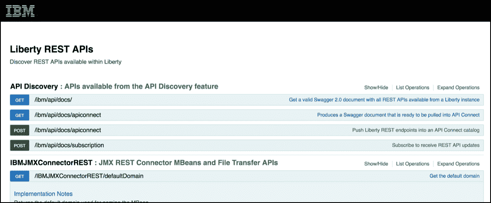

# 大型机计算和 API 经济

> 原文：<https://devops.com/mainframe-computing-api-economy/>

自从 2007 年我在一家非常著名的汽车网站工作以来，API 经济已经走过了漫长的道路。当时，API 是应用程序员在非常低的层次上使用的东西。使用基于网络的 API 编程是罕见的。在那些日子里，我们将库下载到本地代码库中，并针对这些二进制文件进行编程。我当时是用 Java 编程的，所以一般的做法是使用一个应用管理框架比如 [Maven](https://maven.apache.org/) 来获取。jar 文件并合并这些文件。违背了我的准则。

是的，有像 [RPC](https://en.wikipedia.org/wiki/Remote_procedure_call) 这样的技术允许我们直接访问运行在其他机器上的功能，也有商店广泛使用该技术，但是在我的世界的小角落，我们通过内存中的二进制文件直接访问服务。此外，我们——汽车网站——将我们的数据以 HTML 格式发布在网页上。

然后 2010 年左右发生了一件事。事实证明，公司以外的其他开发人员希望使用我们的汽车数据。事实上，许多开发人员想要这些数据。我的雇主看到了不祥之兆。不到一年，我们就发布了一个 API，提供了在美国销售的几乎每辆汽车的所有信息。我们正处于 API 经济的大时代！

这是一项变革性的事业。这也令人难以置信地费力。该公司不得不改变许多开发流程来满足 API 发布的需求。我们不仅需要支持在 XML 和 JSON 下发布数据，我们还必须加入一个安全层，以确保只有那些有权使用 API 的开发人员才能访问。而且，我们必须提供全面的文档来提供必要的支持，以便开发人员可以充分有效地使用 API。在 API 的表面之下，保持数据流动和最新的工作更加艰巨。而且，这只适用于 V1。我们还没有开发出任何描述未来版本的路线图。

工作辛苦吗？是的。值得吗？是的。我们处于 API 经济的最前沿。将我们的数据从 HTML 转移到机器可读的格式，如 XML 和 JSON，为公司和其他开发者提供了大量的商业价值。这是一个游戏规则的改变。现在改变了游戏规则。

好消息是，与早期相比，已经出现了使 API 发布更容易的技术。今天，技术领域的大多数主要参与者都意识到，为了保持商业上的可行性，他们需要以一种易于发布和易于在网络范围内使用的方式将他们的服务表示为健壮的 API。在大型机计算领域尤其如此。

# IBM Z Systems:API 经济中的重要角色

当今世界上有很多大型机技术。大量的银行、金融服务、政府和大型运输实体都安装了大型主机。这些安装中有许多是 IBM Z 系统。IBM 是这一领域的主要力量——过去是，将来也是。30 多万人的劳动力，怎么可能不是这样？

IBM 非常擅长的事情之一是设计技术，允许驻留在 Z 系统安装中的服务作为 API 公开。他们这样做的方式是使用一种叫做 z/OS Connect EE 的技术。z/OS Connect 允许开发人员将 Z 系统应用程序公开为通过 HTTP 访问的 API(参见图 1。)

****

**图 1: z/OS Connect EE 充当基于 HTTP 的 API 和 IBM Z 大型机之间的中介**

开发人员使用 [z/OS Connect EE API 编辑器](https://www.ibm.com/support/knowledgecenter/en/SS4SVW_2.0.0/com.ibm.zosconnect.doc/installing/install_explorer.html)创建 API。API 编辑器是一个基于 Eclipse 的 IDE，它允许开发人员为 API 定义端点 URL。(参见下面的图 2。)

**图 2:z/Connect EE API 编辑器允许开发人员定义组成 API 的 HTTP 方法和相关端点**

然后，一旦端点被定义并且 HTTP 方法(例如，GET、PUT、POST 和 DELETE)被绑定到驻留在 Z 系统安装中的服务。(参见图 3。).每个服务映射到一个应用程序，比如 CICS、IMS、DB2 等中的一个事务。

**图 3: z/OS Connect EE 提供了一种将 HTTP 请求直接绑定到大型机资源的方法**

z/Connect 不仅允许开发人员将 Z 系统中的服务表示为全功能的 API，而且它还有一个特性，可以将 API 定义导出为完全兼容的开放 API 规范。

这是一件大事。

[Open API](https://swagger.io/specification/) 是当今使用的三种最重要的 API 规范格式之一。(另外两个是 [RAML](https://raml.org/developers/test-your-api) 和 [API 蓝图](https://apiblueprint.org/)。)开发人员可以使用 z/OS Connect 生成的 Swagger 规范来创建供第三方开发人员使用的交互式文档。(参见图 4。)

**图 4: z/OS Connect EE 能够生成开放 API 格式的 API 规范，可用于自动创建交互式在线文档**

同样，这也是一件大事。发布成功的 API 的关键因素之一是提供全面的文档。一个缺乏文档记录的 API 很少会成为 API 经济中的热门。一个 API 的文档越全面，它的应用就越广泛。

| **z/OS Connector EE + Eclipse = A marriage made in heaven**我非常支持使用工具来减少使用复杂技术的劳动，特别是像大型机计算这样广泛和多方面的东西。z/OS Connect EE API 编辑器符合这个要求。它嵌入在 Eclipse IDE 中。如果您知道如何使用 Eclipse 来制作 Java 程序，您会发现使用 z/OS Connect EE API 编辑器来创建 Z System API 是一种很有吸引力的体验。是的，你可能需要花一些时间来熟悉大型机技术，比如 CICS 和 T2 COBOL。但是，好消息是你不必学习一个新的编程环境。可以把 API 编辑器想象成包装了 z/OS Connect EE 和 IBM Z System 计算环境的 Eclipse。这个 10 分钟的[视频](https://www.youtube.com/watch?v=HjE8wdvX3I0)很好地展示了如何使用基于 Eclipse 的 z/OS Connect EE API 编辑器来创建一个完整的 REST API，该 API 使用了 IBM Z System 大型机提供的服务。真是太神奇了。 |

一旦一个 API 从 z/OS 系统中发布，它就可以在内部使用或者公开给公众使用。将 Z 系统服务表示为 API——是使大型机技术成为 API 经济的一流贡献者的重要一步。在 API 经济中，消费者很少关心底层技术。重要的是服务。这在某种程度上是惊人的:表面上看起来像基于云的 API，实际上是幕后的 IBM Z 系统。

# API 经济向前发展

自从大约 10 年前我们在汽车网站上写下第一个 GET /make/mode/year 请求以来，API 经济已经走过了漫长的道路。硬编码路线和手工创建文档的时代已经结束。很好的解脱。老实说，这种类型的开发不仅浪费劳动力，而且编程也有问题。

如今，z/OS Connect EE API Editor 等现代工具允许开发人员专注于设计有所作为的 API 的挑战。对设计的关注至关重要，尤其是当我们进入物联网(IoT)时代的时候。在不太遥远的将来，大多数 API 活动将在机器之间进行——小型设备，许多正在推动小型化的边界，在它们之间以及与其他更大的系统进行对话。这些设备产生的数据量将远远超出今天的标准。有趣的是，大型机技术适合于处理这种海量数据。

大型机技术将在物联网生态系统和 API 经济中发挥重要作用。如果我是一个赌徒，随着 API 经济的发展，我希望自己在正确的时间处于正确的位置，我会下很大的赌注参与 Z 系统的开发。z/OS Connect EE 及其 API 编辑器等技术为许多有利可图的机会打开了大门。由我们来决定是否穿过它们。

鲍勃·雷瑟曼