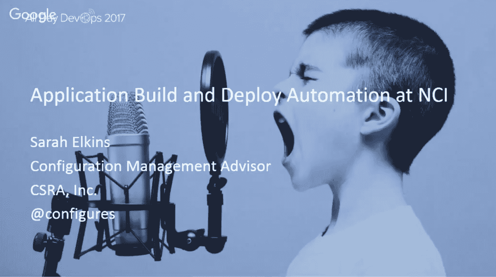

# 国立卫生研究院的 devopsheal

> 原文：<https://devops.com/devops-heals-at-nih/>

癌症糟透了。但是对于像莎拉这样的人来说，DevOps 有助于在治愈疾病的竞赛中发挥作用。

Sarah Elkins 自己并没有治愈癌症，但是她通过 DevOps 的实践来帮助那些治愈癌症的人。Sarah 支持美国国立卫生研究院(NIH)为那些试图治愈癌症的人提供技术基础设施。

莎拉·埃尔金斯([@配置](https://twitter.com/configures?lang=en))在国家癌症研究所(NCI)配置技术解决方案，她已经在那里工作了九年。NCI 是一个联邦机构，隶属于美国国立卫生研究院。它支持 700 多个网站，从基本的 HTML 到内容管理系统，再到拥有多层和数千台服务器的复杂生物信息学系统。它使用多种操作系统、容器以及物理和虚拟机(包括内部部署和一些 AWS)。开发人员从单独的科学家到大型团队都有。

莎拉和我已经在 Twitter 上关注彼此好几年了，但我最近在 DevOps 全天收听了她在“DevOps in Government”轨道上发表的演讲。Sarah 主持了一场关于国家癌症研究所如何自动化其构建和部署的讨论，表明即使在大型官僚机构中也是可能的。

她的演讲涵盖了使软件能够从源代码库一直移动到位于[nci.nih.gov](https://www.cancer.gov/)的生产服务器的流程和技术，包括 GitHub、Jenkins、Nexus 和其他技术的使用，涉及多个团队。

## **我们需要谈谈**

莎拉的治疗始于参与:发展、基础设施和安全共同努力，就像专家团队帮助患者战胜癌症一样。

为了帮助加快开发和审批速度(如果管理不善，这是一种不可避免的弊端，可能会使开发陷入停顿)，他们同意批准利用现有技术目录的应用程序，因为运营和安全团队就运营授权(ATO)的要求为开发提供指导。换句话说，他们试图尽可能多地预先批准，并在流程的早期进行沟通。

## **DevOps 实践日趋成熟**

**源代码**主要保存在 GitHub 上，包括一个非专有源代码的公共存储库，NCI 主要使用 Maven 或 Apache Ant 为**构建脚本**。基础设施团队提供 XML 模板来提供一致性。

大多数 NCI 软件依赖于**建立对开源软件组件的依赖**。该组织在构建期间使用工件，并利用 Sonatype 的 Nexus 作为其存储库管理器。

所有这些都支持 NCI 的**自动化构建和部署**。对于构建来说，大多数活动的项目要么在 Jenkins 上，要么正在迁移到 Jenkins 上。构建工件可能是。zip，。战争/。耳朵或 Docker 图像。

对于**应用部署**，NCI 采用开发、质量保证、试运行和生产阶段。大多数团队使用某种形式的自动化，从简单的(复制内容，停止/启动容器)到更复杂的脚本。开发人员可以为健壮的应用程序执行部署，但需要一些手动编排，例如，数据库计时或相关应用程序。

作为一个组织，NCI 正朝着持续集成(CI)的方向发展，各个团队的进展各不相同。

## **楼宇安全**

NCI 现在也包括了早期的、经常的和自动的安全措施。该组织已经部署了自助式/按需 Nessus 扫描，一旦应用程序稳定下来，开发人员就可以自己查看他们的工作情况。在 Jenkins 构建期间，安全团队运行 AppScan 和 Twistlock 进行 Docker 映像扫描，就在部署之前，并经常扫描中间的存储库。对于发现的问题，开发和基础架构团队将共同努力解决安全问题。

在她的演讲结束时，莎拉提出了三个要点:

1.  NCI 的 DevOps 是一项正在进行的工作(不是到处都是吗？)
2.  NCI 的广泛需求需要灵活性、沟通和团队合作
3.  不缺少工作

既然这是一项正在进行中的工作，那么在 NCI 有什么机会呢？

*   Jenkins 为个人应用带来更多自动化
    *   开发人员可以在较低层执行容器重启
    *   数据库更新(一些项目已经在使用 Liquibase)
    *   一些应用程序仍然是手动/批量脚本化的
*   更多 Docker 和改进的 Jenkins/Docker 实例
*   更多的编排自动化和傀儡/傀儡集成
*   通过以下方式改善安全
    *   在构建之前扫描依赖项工件
    *   更多的集成和自动化

莎拉在她的演讲中深入探讨了更多细节，你可以点击这里观看。如果你错过了[全天开发计划](https://www.alldaydevops.com/?__hstc=31049440.e9fd034d652f4ba995fdbbc43f7ead80.1490111084079.1516369017083.1516972001150.53&__hssc=31049440.1.1516972001150&__hsfp=3618093011)的其他 30 分钟长的演示，在这里很容易找到并免费获得[。政府中的 DevOps 是五个轨道之一。](https://www.alldaydevops.com/all-day-devops-2017-recordings?__hstc=31049440.e9fd034d652f4ba995fdbbc43f7ead80.1490111084079.1516369017083.1516972001150.53&__hssc=31049440.1.1516972001150&__hsfp=3618093011)

— [德里克·威克斯](https://devops.com/author/derek-e-weeks/)