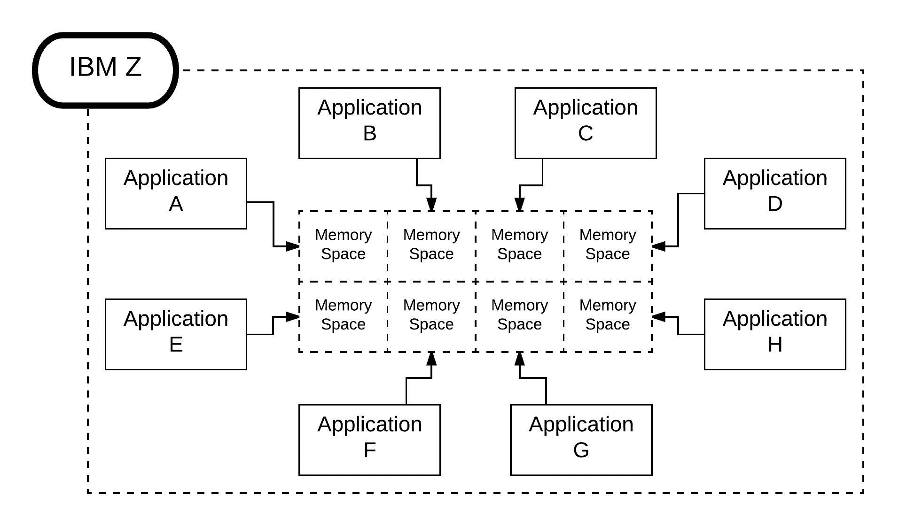

# IBM Z:适合现代计算的架构

> 原文：<https://devops.com/ibm-z-architecture-scales-modern-computing/>

我最喜欢的架构是那些按比例构建的架构。我无法告诉你有多少次，当请求数量从数百个并发用户增加到数千个并发用户时，应用程序碰壁了。接下来你知道的事情是，CPU 开始卡住，内存达到最大，或者整体可用性神奇地消失了。剩下的就是可怕的状态代码:500 内部服务器错误。

我们这些将分布式计算作为一种生活方式的人花了很多时间来确保我们的应用程序能够扩展。我们发现追捕成本很高。因此，我们中的一些人将整个问题交给了托管服务提供商。在月底支付账单以确保 24/7 的可用性比在凌晨 3 点打电话询问为什么托莱多的库存系统出现故障要好得多。无论我们选择保护我们自己的金属还是使用 MSP，我们都明白不能扩展的架构没有什么价值。

令人惊讶的是，全球 90%的大型航空公司、70%的大型零售商、全球大多数银行和所有最大的保险公司都在使用最好的架构之一。这种建筑在哪里可以找到？在大型机计算中。是的，你猜对了:大铁。

# 大铁:持续给予的礼物

一般来说，大型机计算，特别是 IBM Z 有一个计算架构，它被构建来支持成千上万(如果不是数百万的话)客户机的使用。从一开始，这些系统就被设计为以经济高效的方式提供高可用性、大规模、多处理器计算。一个典型的装满商用硬件机架的数据中心每月会消耗数千美元的电力，而一个每天处理 25 亿次交易的 IBM z 系统消耗的电力大约相当于你洗衣房里的干衣机。(每天 25 亿的交易额相当于一年中每天 100 个网络星期一！)

就高可用性而言，大型机正常运行时间是以年来衡量的。有些系统已经连续运行了 10 年，今天仍然在运行。这是一项不小的成就。想想看:想象一下，无论任何应用程序变得多么奇怪，在一个架构中建立足够的冗余以使其永远不需要重启需要付出什么代价。从一开始，内存和应用程序隔离就内置于该技术中。在某种程度上，我们是在谈论云之前的云。

 **内存隔离和应用程序冗余从一开始就是大型机技术的关键特征**

这是一项令人惊叹的技术，是更多开发人员，尤其是我们这些工作在应用程序开发前沿的人应该利用的技术。现在的问题是如何从其功能中获益，并利用其数据宝库推动这一资产的商业价值。第一步是理解交互系统和业务关键系统之间的区别。

## 理解交互系统和业务关键系统

在现代分布式计算世界中，应用程序逻辑可以用多种方式表示。例如，通过使用移动应用程序、访问航空公司的网站或拨打运营商的免费电话，很有可能查看航班信息的状态。查找和传递航班信息所需的逻辑位于一个中心位置；访问该信息的手段是分布式的。有两个系统在起作用——一个叫做交互系统，另一个是业务关键系统。交互系统是与最终用户交互的系统，收集数据作为输出发送。业务关键型系统是充当通用应用程序智能存储库的系统。这个概念类似于客户机-服务器体系结构背后的思想，但更多的是基于系统。把电话系统、有线电视系统或在线游戏想象成一个交互系统。将服务器机架、云或大型机视为业务关键型系统。整体数字体验是其组成部分的集合。

这似乎是一个明显的分离，但是还有更多的内容，特别是在考虑大型硬件如 IBM Z 等时。成为业务关键型系统不仅仅是简单的数据存储。业务关键型系统可以包含对提交给它的特定数据集执行复杂的机器学习活动所需的所有数据，例如天气预测或医疗诊断。当然，业务关键型系统有数据，但该系统还具有算法和并行处理能力，远远超过了独立的 PC 或手机，这些组件是交互系统中的典型组件。

业务关键系统，尤其是那些已经服务了几十年的系统，在支持数字交互的通用标准时变得非常强大——例如，基于 [REST](https://en.wikipedia.org/wiki/Representational_state_transfer) 的 API。当分布式计算仅限于一小部分人时，系统交互的专有方法是可以接受的。但是，互联网的兴起改变了这一切。今天，我们有数十亿人在线，在全球网络的某个部分。因此，像 HTTP 和 REST 这样的通用标准的出现使得与世界范围内的软件系统的交互变得更加容易。像 IBM 这样的公司明白支持互联网方式的重要性。因此，像 [z/OS Connect EE](https://youtu.be/LVcv3xi7Owo) 这样的产品允许开发者连接到 Z 系统安装，并围绕该安装中的代码设计 API。使用 z/OS，开发人员可以将 REST API 封装在一些 COBOL 代码中。拥有这种能力开启了一个充满可能性的世界。

## 进入下一阶段

随着大型机世界受到那些制造移动应用程序和将服务聚合到云中的人的更多关注，软件开发出现了一个全新的水平。使用像 z/OS Connect EE 这样的产品来创建 REST APIs 结合了大金属和大数据的世界。我们 DevOps 的人明白，打破孤岛和促进协作是我们的工作。汇集所有致力于开发高质量软件的人的技能和经验，从 COBOL 程序员到将基础设施视为代码的工程师，在现代计算世界中是至关重要的。我们一起有效工作的人和系统越多，我们的软件和我们创造的世界就越好。

鲍勃·雷瑟曼