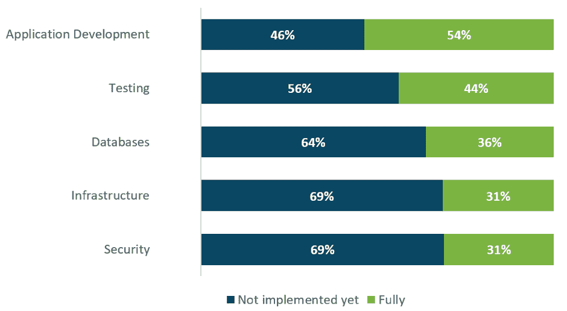
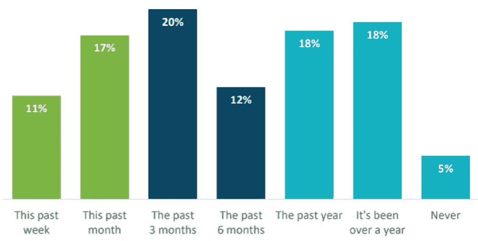
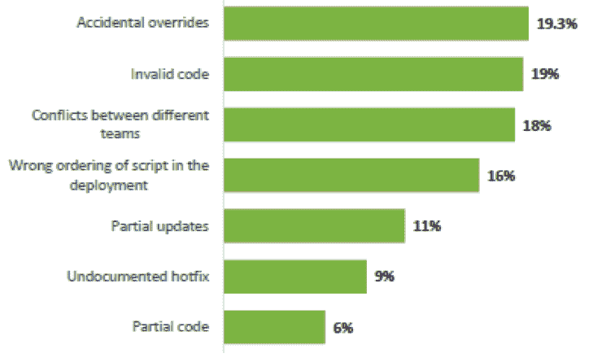

# 2018 年数据库 DevOps 调查:危机仍然普遍存在，大部分是可以避免的

> 原文：<https://devops.com/2018-database-devops-survey-reveals-database-crises-still-prevalent-mostly-avoidable/>

DevOps 不再只是一个时髦词，而是一个现实。随着自动化和持续交付的发展，DevOps 实践已经成为行业标准。从成本和生产的角度来看，采用快速部署技术对于希望保持其在行业中的重要地位的公司来说已经变得至关重要。

但是，尽管 DevOps 是跨多个行业的 IT 难题中的一个重要部分，但许多人还没有为他们的数据库采用这些关键的连续交付实践。

2017 年 10 月，DBmaestro 进行了一项[在线调查](https://www3.dbmaestro.com/devops-for-database-survey-2018-results?utm_campaign=2018%20Database%20DevOps%20Survey%20Report&utm_source=DevOps_com&utm_medium=article)，强调了使用或寻求实施 DevOps 的公司的挑战和最佳实践，重点是数据库。本次调查的受访者是来自全球各地的 244 名 IT 专业人员，他们代表着各种行业。“ [2018 年数据库开发运维报告](https://www3.dbmaestro.com/devops-for-database-survey-2018-results?utm_campaign=2018%20Database%20DevOps%20Survey%20Report&utm_source=DevOps_com&utm_medium=article)”揭示了开发运维实践在多个行业层面的广泛采用。

## 开发运维采用率不断提高，数据库仍然落后

超过一半的被调查公司(54%)在他们 50%或更多的 IT 项目中积极使用持续交付实践和工具进行应用程序开发。然而，对于数据库来说，情况就不一样了；迄今为止，只有 37%的受访者采用了数据库连续交付。

**连续交付采用率**

有趣的是，尽管数据库的连续交付采用率明显落后于应用开发，但它仍然是 2018 年公司非常感兴趣的领域。事实上，17%的调查受访者表示计划为此采用连续交付。

## 数据库管理员面临着巨大的责任和风险

数据库连续交付实践的缓慢采用使公司面临代价高昂的错误。该报告深入分析了企业在数据库变化方面面临的最大挑战。

在许多情况下，流程中的瓶颈在于责任的划分:59%的受访者报告说，DBA 是公司中唯一被允许对数据库进行更改的人。

据调查对象称，起草数据库变更是数据库管理员的一项常见任务，大约消耗他们 22%的时间。然而，部署这些变化伴随着巨大的风险；如果部署不当，可能会导致长时间停机，影响数据库性能，甚至导致数据丢失。令人不安的是，数据库崩溃仍然很常见，这也于事无补——仅在过去的一个月里，就有近三分之一(28%)的受访者遇到了重大问题。

**数据库中最后一个重大问题**

好消息是，数据库变更时可能出现的许多问题都可以通过使用数据库发布自动化工具来解决，类似于 DevOps 多年来在代码开发中使用的工具。

数据库连续交付不仅有助于防止错误；通过同时加速发布管理过程并使其更具弹性，结果是更快的数据库变更部署和更少的数据库错误。

## 数据库开发运维仍然是解决方案

为什么在部署数据库更改时会出现错误？根据调查受访者的说法，19.3%的人认为错误的最大原因是意外覆盖，紧随其后的是 19%的人认为使用了无效代码。排在前三位的错误原因是发生在不同团队之间的冲突，占 18%。

**数据库更改错误**

这些问题听起来耳熟吗？他们应该:这些问题在过去都是应用程序代码开发领域的一个挑战。就应用程序代码开发而言，版本控制管理和应用程序发布过程的自动化解决了这些问题。因此，消除变更错误的关键在于对数据库环境采用相同的方法和技术，这并不奇怪。

6%的受访者表示，他们的公司没有采用数据库开发运维实践的计划。数据库宕机的成本估计为每分钟 8，851 美元，你的公司真的能承受 T2 而不是 T3 的损失吗？

亚尼夫·耶胡达