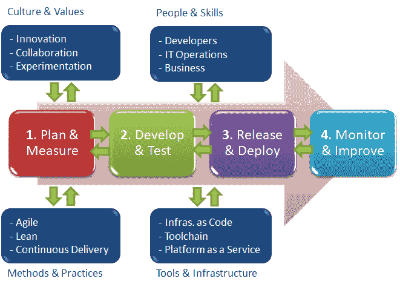
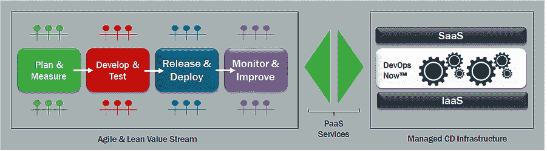
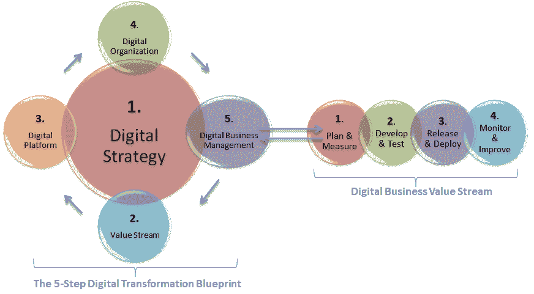
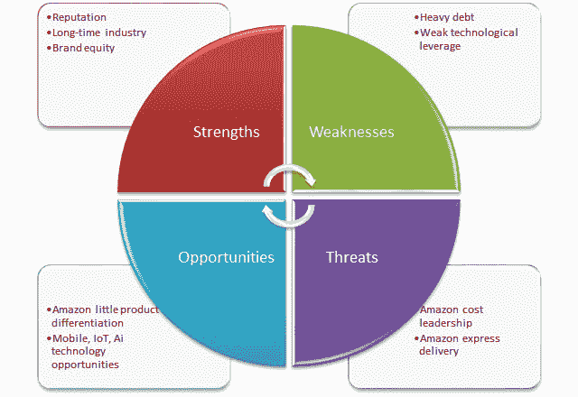
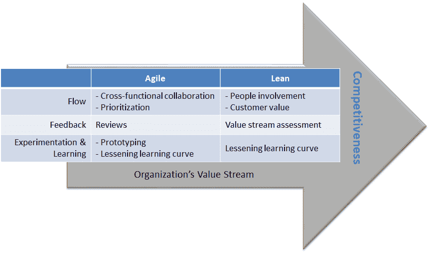
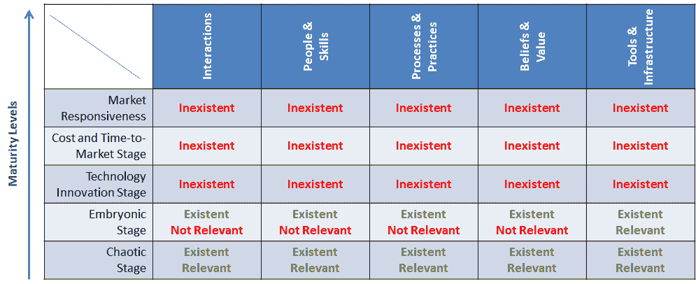
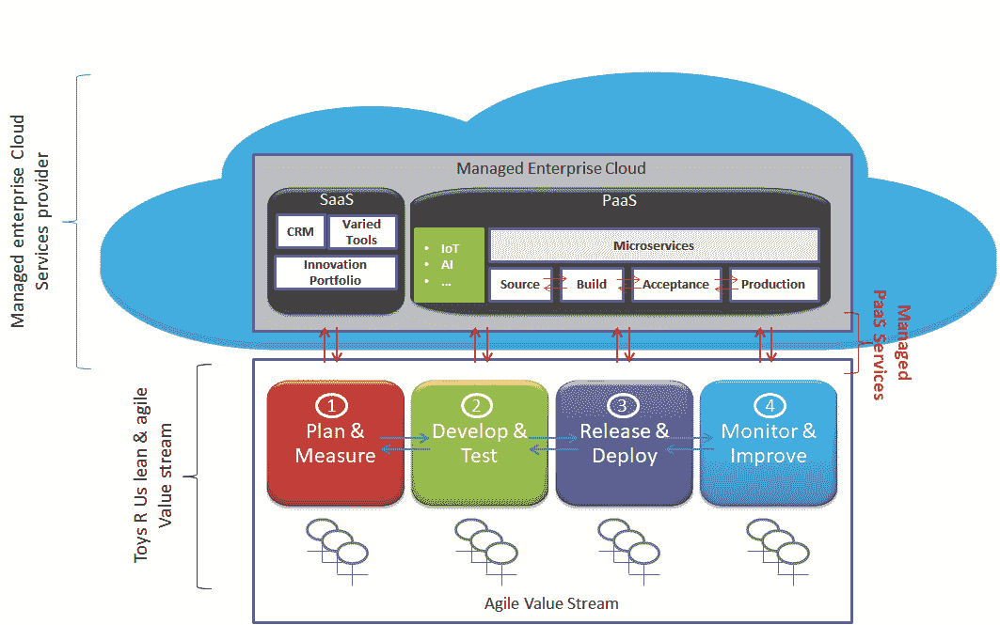

# 数字化转型:DevOps 如何改造玩具反斗城

> 原文：<https://devops.com/digital-transformation-devops-revamped-toys-r-us/>

你将要读到的故事及其推荐是真实的；它们与您到目前为止听到的关于数字化转型和 DevOps 实施的内容形成了对比。它的目标是让你相信数字化的时代已经到来；这是关于转变您的业务，而不仅仅是 IT；要做到这一点，你必须完全实现 DevOps。

9 月，世界最大的玩具连锁店之一玩具反斗城申请破产保护。更好地理解零售业的混乱如何影响该公司，将有助于防止其垮台并重塑其商业模式。例如，提供玩具 2.0(泛指建立在云，移动，物联网和人工智能技术基础上的新一代玩具)游戏服务可能有助于该公司生存。

向玩具 2.0 转变需要思维、愿景、实践和价值的革命，而商业领袖、首席信息官和 IT 供应商还没有做到这一点。他们必须忘记技术和速度决定商业成功的陈旧观念。采用强调创新和解决竞争约束的模式是获得快速和持久收入的最安全途径。

玩具反斗城面临的最大问题是，咨询公司和 IT 供应商要么不理解这一挑战是一个行业颠覆性问题，要么即使理解，也没有正确解决。

让我们澄清一下:为了解决你所在行业的混乱，你必须调整你的商业模式，包括互动、员工和技能、流程和实践、信念和价值观以及公司用来创收的基础设施和工具。行业颠覆是挑战，而 DevOps 通过其众多资产是公司快速转型并赢得数字化战争所需的独特业务能力。

正如艾伦·希梅尔,[DevOps.com](https://devops.com/)的创始人、首席执行官兼主编所说，问题在于:

> "*尽管如此多的公司已经开始使用 DevOps 或计划很快使用 DevOps 和相关方法，但只有一小部分公司是端到端 DevOps。这意味着将 DevOps 推向市场仍有巨大的机会*。

玩具反斗城应该如何利用 DevOps 来解决其行业的混乱？为什么对全球数字电子商务平台的投资不够？他们的商业模式转变得如何？实施 DevOps 100 有助于战胜亚马逊和沃尔玛的竞争吗？

本文中的原则、想法、实践和解决方案是我们在 [ITaaSNow](https://www.itaasnow.com/) 开发的案例研究的一部分，旨在了解如何帮助面临类似挑战的公司。

# DevOps 是什么？

DevOps 的主要贡献者 Alan 是对的:只有一小部分公司完全采用了它。DevOps 不仅仅是顾问和供应商谈论的自动化工具链。如果首席信息官们想帮助业务线生存下来并保住他们的工作，他们必须掌握 DevOps 的业务层面。

那么，DevOps 是什么？为什么我认为，它会把玩具反斗城从数码业的衰落中拯救出来？

## 超越运营自动化的开发

根据我的实施经验，DevOps 是一种寻求优化业务运营的业务能力(相对于单一的 it 运营)。它为企业提供了应对数字业务竞争挑战所需的四大竞争优势:

1.  企业协作
2.  业务敏捷性
3.  快速实现价值
4.  创新文化

Figure 1 – DevOps Overview

如图所示，DevOps 是一组围绕价值流概念聚合的概念，以形成数字业务管理能力。它围绕四个阶段构建，将公司的交互和工作流格式化为强大的数字业务管理功能。这些阶段包括:

*   **计划&措施**–通过创新组合管理实践和基础设施解决战略观察、服务优先化和创收问题。
*   **开发&测试**–利用敏捷和精益的实践和基础设施来确保创新设计、开发和测试。
*   **发布&部署**–利用持续交付实践和基础设施，及时向正确的市场交付正确的创新。
*   **监控&改进**——强调持续改进，不仅保证优质的客户体验，也保证客户价值。

四种商业价值催化剂被用来创造收入:

*   文化和价值观
*   人员和技能
*   方法和实践
*   工具和基础设施

如你所见，DevOps 超越了应用程序开发问题；它涵盖了整个业务生命周期。

## DevOps 框架作为 DevOps 实施的促进者

那么，什么是 DevOps 实现框架呢？

具体来说，它是一个捆绑的 DevOps 平台，结合了托管的 PaaS 基础设施和优化的价值流，以帮助公司推动其数字业务:

Figure 2 – DevOps Implementation Framework

该平台旨在帮助企业端到端地实施 DevOps，并基于三个原则来保证数字利润:

1.  **创新是收入的驱动力**-这是一种信念，即企业可以抵御苹果、谷歌、亚马逊和脸书等科技公司施加的竞争，他们利用创新来保持客户忠诚度，吸引新客户并创造收入。
2.  **价值流敏捷性是市场响应能力的基础**-这是一个已被证明的概念，即当公司依赖敏捷和精益的价值流时，它们就能对市场做出响应。
3.  **托管云是业务绩效的催化剂**–这是一个经过验证的想法，即当公司专注于其核心业务时，他们会创新并提供卓越的客户体验。

## 五步数字化转型蓝图

五步数字化转型蓝图使 DevOps 的实施变得快速而简单。如图所示，这是我开发的一个全面的业务转型框架，旨在帮助客户实施数字化转型计划:

Figure 3 – The 5-Step Digital Transformation Blueprint

这是一种整合和包容的业务转型方法，涉及公司的相关贡献者。它将转型工作分为五个阶段:

*   **数字战略:**在这一步中，转型团队使用 SWOT 分析矩阵等工具来帮助业务和 IT 高管了解颠覆性行业的变化以及对公司业务模式的影响。
*   **价值流:**在这一步中，转型团队使用价值流映射等工具来确定所需的变革，并让业务和 IT 主管就公司未来的价值流达成一致。互动、员工、技能、流程、实践和工具是讨论的核心。
*   **数字平台:**在这一步中，企业和解决方案架构师共同确定和实施所选择的技术和工具，以支持价值流中的活动。
*   **数字组织:**在这一步中，一个由业务和 IT 用户组成的小组在实际的业务条件下对新的数字业务模式进行实验。经过测试的数字业务模型随后被部署为新的数字组织。
*   **数字业务管理:**在这个运营阶段，价值流和数字基础设施被广泛用于业务运营。

## 首席数字官如何建立顶级数字企业

不推荐在线数字转型课程将是我的失职，该课程将为 DevOps 从业者(来自业务和 It 部门的高管和运营人员)提供关于实施 DevOps 作为数字业务基础的见解。

“[首席数字产品如何建立顶级数字业务:建立 DevOps 作为您数字业务的基础](https://www.udemy.com/how-to-set-up-top-digital-business/learn/v4/overview)”是一门 15 个模块的课程，提供简明、实用和强大的提示，帮助从业者学习和应用战略和战术，以有效地计划、监控、促进和领导业务转型，包括 IT 到数字的转型。

## 分析亚马逊和沃尔玛的破坏性影响，找出重塑公司的指导方针

许多破产的发生是因为商业领袖没有花时间去理解他们行业的混乱和对他们整体业务的影响。

实际情况是，行业分析和竞争战略要么被忽视，要么被完全忽略。理解玩具业的破坏性影响将有助于确定玩具反斗城的转型是避免破产的最安全的解决方案。

DevOps 实施框架与众不同，它将 DevOps 视为数字业务成功的基础。它认为行业和竞争分析是 DevOps 转型计划的基本步骤。图 4 概述了我们行业分析的结果:

Figure 4 – Toy Sector’s SWOT Analysis

如图所示，这表明玩具反斗城应该利用亚马逊的漏洞，并利用技术机会，重塑自己作为一个玩具 2.0 游戏服务提供商。这些弱点包括产品差异很小，而技术机会指的是基于云、移动、物联网和人工智能技术的新一代玩具。

该公司的优势——声誉、长期的行业存在、品牌资产——与托管云的采用所带来的成本节约相结合，不仅会简化其转型，还会在成本上挑战亚马逊。

## 改变价值流以建立创新并发明公司的数字商业模式

企业领导人没有做出正确的转型决策，因为他们缺乏对不断变化的竞争环境的洞察力。支持短期财务收益的积极营销和销售活动。玩具反斗城之所以失败，是因为它以牺牲商业模式再造为代价，押注于债务偿还。

DevOps 实施提供了一个价值流映射框架，不仅有助于创新文化的实施，还能加快数字商业模式的开发。

Figure 5 – Value Stream Mapping, Agile, and Lean

我绘制价值流图的目的是概述利用 [DevOps 三种方式](https://itrevolution.com/the-three-ways-principles-underpinning-devops/)的工作环境的特征，使公司具备对抗亚马逊和沃尔玛所需的竞争优势。下面几行总结了结果。

**实施 DevOps 流程原则，在创新上击败亚马逊和沃尔玛:**价值流图建议利用敏捷和精益原则，正确实施流程原则，并在产品差异化上击败亚马逊。要强调的敏捷的特征包括协作和优先化，而对人员参与和客户价值的关注是要强调的精益的好处。它们的结合可能不仅会培养创新文化，还会加快上市时间和价值实现时间。

**实施 DevOps 反馈原则，确保卓越的客户体验:**关于反馈原则，价值流图建议使用精益的价值流评估和敏捷的审查机制。目标是将持续改进实践制度化，作为确保卓越客户体验的一种手段。

**实施 DevOps 实验和学习作为创新能力的基础:**关于实验和学习原则，建议利用敏捷的原型和学习曲线减少特性，将创新和冒险文化制度化。他们可能不仅会帮助公司在创新方面挑战竞争对手，还会确保持久的收入和客户忠诚度。

## 通过托管 PaaS 服务实现价值流

巧妙地使用技术来促进商业活动显然是在数字商业中取得成功的关键之一。如今，只专注于加快 IT 运营速度的开发人员谨小慎微的方法不仅效率低下，而且毫无意义。需要优化的是整个价值流，而不仅仅是 It。

如图所示，我进行的数字平台评估的结果显示，全球电子商务平台不足以与亚马逊和沃尔玛竞争。该公司正处于数字化转型成熟实践的萌芽阶段:

Figure 6 – Toys R Us Possibly at the Embryonic Stage of Digital Transformation Maturity

调查结果表明，利用技术创新或创造运营条件以降低成本、加快上市时间和响应市场机遇的做法要么被忽视，要么没有得到适当解决。

使用数字平台工程框架使我能够在创纪录的时间内设计出以下架构:

Figure 7 – Possible PaaS Platform for Toys R Us

数字平台将建立在支持价值流的两种云服务之上:托管软件即服务(SaaS)和平台即服务(PaaS)。我们来讨论一下。

## 托管 SaaS 服务如何帮助解决成本领先和业务灵活性问题

SaaS 服务将支持计划和测量阶段。除了支持各种管理活动之外，它还提供了两个基本工具，这两个工具可能会实现玩具 2.0 战略:客户关系管理(CRM)和创新管理组合。CRM 跟踪、衡量和改善客户体验，保持客户忠诚度并保证收入。创新组合管理识别创新理念，支持其在数字服务中的实施，并监控所产生的价值。这给了该公司扰乱和控制其行业的机会。

SaaS 服务的按需和计量计费功能可以让玩具反斗城在创纪录的时间内获得所需的软件，同时实现上市时间、价值实现时间和响应能力的竞争优势。

## 托管的 PaaS 平台如何帮助解决快递问题

PaaS 服务将支持涵盖开发和测试、发布和部署以及监控和改进阶段的活动。除了提供实现玩具 2.0 游戏服务所需的技术，它还将基于[微服务](https://devops.com/executives-guide-microservices-chapter-1/)建立自动化工具链，并加速创新开发和交付。

# 包扎

最近的 IT 创新正在颠覆几个行业，扩展数字经济。为了避免麻烦，企业必须紧急启动数字化转型。玩具反斗城、西尔斯和许多其他公司都是吃了苦头才知道的。

迫切需要理解的是，企业的数字化转型不仅仅是将 It 迁移到云、实施自动化工具链或在整个公司部署人工智能工具。这主要是关于从根本上用战略思维转变你公司的商业模式。

数字化转型是一个涉及整个公司的复杂过程，需要特定的方法、实践和工具。我再次推荐您参加在线课程“[首席数字官课程如何打造顶级数字业务](https://www.udemy.com/how-to-set-up-top-digital-business/learn/v4/overview)”—您将从中获得实用的愿景、方法、流程、实践和工具，帮助您利用 DevOps 为成功的数字业务创造条件。

——[菲利普·阿卜杜拉耶](https://devops.com/author/pabdoulaye/)