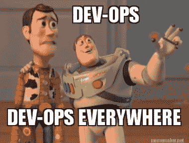

# CA World 2017:眼睛所能看到的 DevOps

> 原文：<https://devops.com/ca-world-2017-devops-far-eye-can-see/>

CA World 2017 的秀场有一个不可避免的、非常明显的特点:一眼望不到头都是 DevOps。不开玩笑。这是一个惊人的提醒，这家收入数十亿美元的公司已经在 DevOps 和相关技术上孤注一掷。虽然我们知道 CA 在去年花费了近 15 亿美元收购 DevOps 相关的公司，但今年对 CA 世界的影响是巨大的。

# 那些 DevOps 是什么？

CA World 的组织方式使得除了主题演讲之外的大部分会议都在展览大厅进行。地板被分成不同的区域。每个地区都有自己的剧院，在那里进行关于该地区主题的会议。这实际上是组织这样一个会议的一个很好的方式，可以让你不用一个房间接一个房间，一层楼接一层楼。

##  CA World 2017 的主赛场段分别是:

*   **自动化**–基本上是 CA Automic 及其所有相关合作伙伴、集成和产品。主要是 DevOps 地区。
*   devo PS:API 和微服务——这已经是 CA World 几年来的主要内容了。API 同样与 DevOps、自动化和微服务相关。
*   **大型机**-该领域专注于使客户能够[将 DevOps 实践扩展到遗留应用](https://www.youtube.com/watch?v=RKf2zrtYu9s)，其中最重要的包括面向企业开发人员的[现代大型机体验](https://www.youtube.com/watch?v=amLwsPaaZ7Q)
*   DevSecOps–有一整块区域是专门为 DevSecOps 准备的。主要是 Veracode 团队——他们有自己的剧院，在地板中间有很多空间和注意力。使用传统的 CA 安全工具，DevSecOps 部分变成了一个更小的安全部分。
*   敏捷管理(Agile Management)——所有敏捷的东西，主要基于 CA 几年前收购的 Rally business。
*   **DevOps 敏捷运营**–APM 和类似的东西。
*   **devo PS CD**–该领域还包括持续测试和新的 CD Director。
*   **高级分析**
*   **MSP 区域**
*   **CA 敏捷区**
*   **CA 加速区**

如你所见，那里有很多 DevOps。

# 你所有的债务都属于我们

但不仅仅是展厅的实际情况，甚至来自 CA 的信息也是“所有开发人员，所有时间。”高管团队的主题演讲侧重于开发运维及相关主题。每个剧院的会议都有家喻户晓的客户与合作伙伴和 CA 人员一起讨论 DevOps 相关主题。

我觉得有趣的一个演示来自 DevOps 连续交付业务的总经理 Jeff Schaeffer。这是 CA 推出的一款名为 devo PS Continuous Delivery Director 的新产品的演示，这是一款 SaaS 产品，其用户界面包含了 CA 和领先合作伙伴提供的大量 CD 相关解决方案。所有类型的测试，包括来自 Sauce Labs 的测试和来自 Veracode 的安全测试，都可以在界面内进行。

我主持了一个关于持续测试:向左移动的很好的小组，参加人数很多。大型金融机构 Cigna、Groupon 和其他公司的客户代表也加入了我的讨论。这也是在 DevOps 光盘区。

大型机剧场阶段的特色是 DevOps 小组会议，以展示跨业务部门的观点。小组成员包括来自自动化的 Aline Gerew、来自持续交付的 Steve Feloney、来自 API 和微服务的斯科特·莫里森以及来自大型机的 Jean Louis Vignaud。视频记录还不可用，但我能够捕捉到一条宣传推文中的一个片段—[API 在大型机上启用 IAM](https://twitter.com/MaoMarvin/status/931309867758841857)

# 还需要什么？

尽管 CA 展示的 DevOps 令人印象深刻，但缺少的是 DevOps 解决方案之间更紧密的集成。虽然一些初步的集成正在进行中，但真正实现 1 + 1 = 3 等式将为客户提供增强的价值，这是如此广泛的 DevOps 解决方案所承诺的。我与几乎所有与 DevOps 相关的业务部门的高管进行了交谈，其中一人提到这正在进行中。但令人惊喜的是，不强制进行更紧密的集成，这将阻碍每个 DevOps 公司在被 CA 收购时带来的创新。

当然，我们将会看到这种情况是否仍然存在。但是，我确实与每个单位的员工交谈过，他们都对 CA 到目前为止处理收购的方式感到满意。

# 结论

当一家像 CA Technologies 这样规模的软件公司对 DevOps 做出如此大胆的声明时，这是很难争辩的。该公司显然将自己的未来押在 DevOps 上，希望它成为现代软件工厂的支柱。

— [Alan Shimel](https://devops.com/author/ashimmy/)