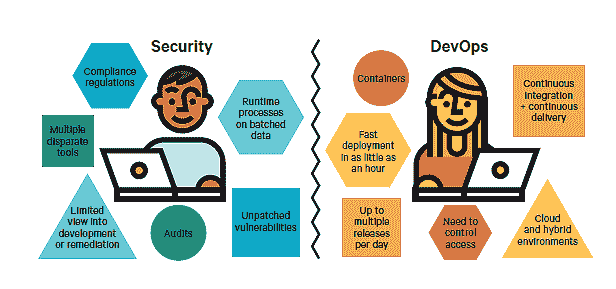

# 平衡开发与安全之间的力量

> 原文：<https://devops.com/bringing-balance-to-the-force-between-devops-and-security/>

我们不要自欺欺人了，我不确定开发、运营和安全之间是否有过平衡。但是随着 DevOps、自动化和云的出现，DevOps 和安全性之间的平衡似乎已经失去。DevSecOps，或 DevOps Security，已经试图恢复 DevOps 和安全性之间的平衡。然而，在一天结束的时候，看起来他们仍然在争吵不休。请参见下图:

 你如何给这个等式带来平衡？也许是一种新的方法？Puppet 和 CloudPassage 合作编写了一份白皮书，该白皮书很好地概述了这里的问题，并提出了一些解决方案。事实上，上面的图表摘自那篇论文。这篇文章的标题是“[云中安全开发环境的新方法](https://webinars.devops.com/a-new-approach-for-securing-devops-environments-in-the-cloud)”你可以从我们的下载库中下载。

虽然没有灵丹妙药可以让开发人员、运营人员和安全人员走到沙滩上唱“Kumbaya”，但您可以做一些事情来建立真正的合作伙伴关系。这包括将安全性向左转移，并使用 DevOps 工具，如 Puppet、Jenkins 等。但是最重要的是让每个团队的成员感觉他们都是同一个团队的一部分。世界上所有的工具和 API 都不能代替良好的文化和培养“我们都在一起”的心态。所有这些都在这份白皮书中，请下载它——同时，请查看我们的库中提供的其他几项出色的 DevSecOps 资产。

我们的[下载库](https://devops.com/library/)储存了大量有用的内容。如果你想了解 DevOps 和相关的主题，这是一个很好的起点。

— [Alan Shimel](https://devops.com/author/ashimmy/)