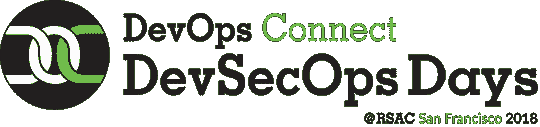

# devo PS Connect:DevSecOps Days @ RSAC 公开征集演讲人

> 原文：<https://devops.com/devops-connect-devsecops-days-rsac-call-for-speakers-is-open/>

第四年[DevOps.com](https://devops.com)自豪地制作[devo PS Connect:DevSecOps Days @ RSA Conference](http://www.devopsconnect.com/event/devops-connect-devsecops-days-rsac-2018/)。活动将于 2018 年 4 月 16 日星期一举行。RSAC 是世界上最大的安全会议，因此是举办我们认为的最棒的安全会议的最佳地点。你可以在 DevOpsConnect.com 的[网站获得全部细节。](http://www.devopsconnect.com/event/devops-connect-devsecops-days-rsac-2018/)[征集发言人](https://www.papercall.io/devsecops-rsac-2018)从现在开始到 12 月 15 日截止。

# 为什么要在 DevOps Connect 上发言:DevSecOps Days @ RSAC

如果您有一个很棒的 DevSecOps 故事要讲，这是一个很好的会议。去年，我们有近 1000 人在一整天的会议期间停下来，聆听一些业界顶尖的演讲人，以及许多崭露头角的思想领袖，让我们对开发运维与安全领域的最新趋势有了新的认识。今年，我们预计将有 1200 多人参加会议。会议还被录像，然后放在 DevOpsTV 上供以后观看。

这是一个大舞台，为我们的演讲者提供了一个伟大的讲坛来分享他们的专业知识和经验。事实上，它发生在世界上最大的安全秀的背景下，这意味着聚光灯更加明亮。

更重要的是，这是你领导的机会。当我们朝着更好、更快、更安全的应用前进时，这是您回馈社区的机会。与其他一些会议不同，这里的演讲者更倾向于成为该领域的从业者，而不是向其销售产品的供应商(尽管并非所有的供应商都不好，但他们与更多的从业者交谈，确实增加了知识)。因此，有一个严格的，没有供应商摊位的政策。

## 我们在找什么？

事实上，这里有一些我们正在寻找的指导方针:

我们正在寻找从业者来讨论在 DevOps 管道中采用安全性的独特挑战、安全性成为 DevOps 中有贡献和有价值的合作伙伴的障碍以及克服这些障碍的方法。我们寻找的具体主题包括但不限于:

*   你是如何得到高级管理层的认同的？你做了什么？你是如何量化商业价值的？
*   整合到 CI/CD 或 DevOps 流程中的安全团队示例
*   你是如何克服组织内部的异议的？
*   您如何设计和实施有效的控制来降低安全风险？
*   你从哪个业务领域(和应用)开始，为什么，你做了什么？
*   最大的挑战是什么，你是如何克服的？
*   你最大的错误是什么，你会给出什么建议？
*   正在进行的故事(甚至是噩梦)是受欢迎的！

此外，除了从业者的偏好，我们还在寻找一组与现实世界紧密匹配的多元化演讲者。今年将有近 50，000 人参加 RSA 大会。我们希望 DevSecOps Days 能够反映这种多样性。

所有发言者都将获得 DevSecOps 通行证和 RSAC 本身的世博会通行证。

# 如何参加 devo PS Connect:DevSecOps Days @ RSAC

如果你还没有准备好与世界分享你的 DevSecOps 故事，你仍然可以参加 DevSecOps Days @RSAC。你只需要一张去 RSAC 的通行证。如果您没有发言，也没有购买门票，或者想要我们的免费展馆通行证，请使用这些代码。

*   18UDEVOPSFD 会议通票可享受 100 美元的折扣
*   免费世博会通行证–18 udevopsxp

免费的世博会通行证足以让你进入 DevSecOps Days 和整个一周的世博会展厅，以及主题演讲。100 美元的折扣是对所有会议都有效的会议通票的折扣。您可以使用上述代码在:[https://www.rsaconference.com/events/us18/register](https://www.rsaconference.com/events/us18/register)注册

## 等等，还有呢

在白天的会议之后，第五届年度**无酒发展局鸡尾酒会**将于下午 4:30 至 6:00 在圣弗朗西斯科的吉利恩斯举行，就在离侯爵家不远的街区。[需要注册](https://www.eventbrite.com/e/no-wine-ing-devsecops-cocktail-party-2018-tickets-39450750256)参加无酒活动，免费参加。[在这里注册](https://www.eventbrite.com/e/no-wine-ing-devsecops-cocktail-party-2018-tickets-39450750256)。

由 DevSecOps 专家组成的全明星阵容将于 4 月 17 日(星期二)上午 11:45 在@ Jillians 举行**Security @ the Speed devo PS 小组讨论会和午餐会**。该小组将基于乔治·休姆的第二次年度安全@开发速度报告。入场和午餐再次免费，但需要在[登记](https://www.eventbrite.com/e/devops-the-speed-of-security-lunch-n-learn-tickets-39452333993)。与会者将获得报告的印刷本。

因此，如果你想向全世界讲述你的 DevSecOps 故事，请申请在 DevOps Connect 上发言:DevSecOps Days @ RSAC。但是，无论您是否愿意，如果您将于 4 月 16 日来到旧金山，请参加我们的 RSA 大会，这将是 DevSecOps 学习、交流和发展的又一个重要日子。

也非常感谢我们的赞助商，Sonatype，白帽安全，Aqua 安全，CA Veracode，Checkmarx。如果你有兴趣赞助，写[【电子邮件保护】](/cdn-cgi/l/email-protection)

— [Alan Shimel](https://devops.com/author/ashimmy/)