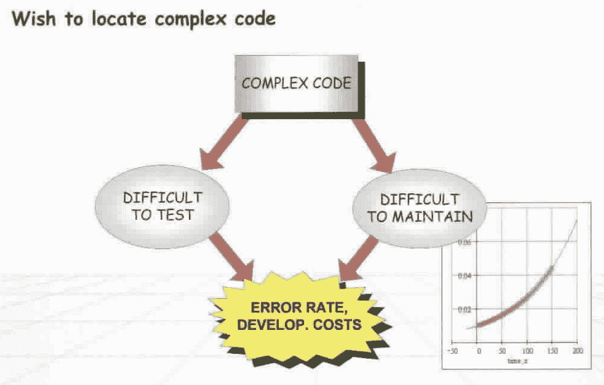

# 衡量什么是重要的:DevFinOps

> 原文：<https://devops.com/measure-whats-important-devfinops/>

最近似乎出现了相当多的 DevSomethingOps 术语。然而，我确实认为我们还需要一个。

## 开发什么业务？

其中最大的问题之一是计算出 IT 的成本。如果不加控制，它将会膨胀以满足任何预算。这可能意味着永远涉及业务连续性和冗余，重新发明永远精致的轮子，[非理性与购买决策](http://blairreeves.me/2017/09/06/build-versus-buy/)等等。

事实上，IT 项目成本估算的整个想法已经变成了一个笑话。大多数 IT 项目都被认为超出了预算。

有一个完整的#NoEstimates 运动，反对甚至可能为软件开发项目交付一个合理的评估。通常情况下，[的基本想法](https://ronjeffries.com/xprog/articles/the-noestimates-movement/)是合理的:

> 增量地做小块工作是可能的，尽可能快地导致期望的可发布的产品，并且当你这样做时，没有必要在估计故事或项目的方式上做很多事情。

然而，推特上流传的最简单的解释是，因为没有对整个项目的估计*，所以*根本没有估计*。那是**而不是**的主意！它只是简单地分解总体估计(这可能是错误的),而不是为更小的工作块做预算，这些工作块大概可以被更精确地估计。*

## 那么我们能做什么呢？

也许需要的是将财务问题直接整合到 IT 开发运营的结构中。我们可以称之为 DevFinOps，与 DevOps 的其他扩展如 DevSecOps 或 DevNetOps 一致。

这不是一个飞跃；毕竟，我们已经整合了 SLA 计算、估算工具的 TCO 或提议购买的 ROI 等方面的成本。然而，这些通常是事后做出的计算，甚至可能被[重新调整](https://en.wikipedia.org/wiki/Retroactive_continuity)以适应外部假设。

但是，我所建议的是将这些信息构建到 IT 元数据和流程中，使我们能够做出更好的决策。

这不是 [IT 资产管理](https://en.wikipedia.org/wiki/IT_asset_management)，尽管它将建立在这些数据的基础上，并扩展其覆盖范围。特定设备或硬件的购买价格和当前摊销价值记录在 ITAM 数据库中，但其在任何给定时间的实际*价值*可能会因其当前支持的业务功能而异。这种计算应该随着时间的推移而变化，以反映它在任何给定时间交付给组织的实际当前价值。

除了硬件、后端支持(占地面积、网络、冷却等)的内在价值之外，闲置的服务器没有任何特殊价值。)，或许还有任何相关的许可软件。但是，当同一台服务器作为支持主要业务关键型应用程序的基础架构的一部分进行配置时，它将为组织带来更高的价值。

因此，在这些系统上执行操作会产生不同的潜在影响，并且应被视为从有限的预算中扣除的成本。对关键业务服务器进行实时修补是一项昂贵的操作，不能掉以轻心。这样做的费用应该从业务预算中扣除。

这种计算的好处是可以更容易地在 it 部门之外传达各种提议的行动过程的不同影响。在云和内部部署选项之间，或者在不同风格的云之间做出决定，可能是一个令人担忧的过程。技术选项和定价模式很难简单比较，此外还有其他成本，如合规性(是的，还有 GDPR)或供应商风险。量化和标准化这些不同的因素将使预先比较选项和事后计算收益变得更加容易。

## 这可能吗？

谷歌已经在它的网站可靠性工程(SRE)项目中做了类似的事情，有一个[错误预算](https://landing.google.com/sre/interview/ben-treynor.html)的概念:

> 业务或产品必须建立系统的可用性目标。一旦你这样做了，一减去可用性目标就是我们所说的误差预算；如果它是 99.99%可用，这意味着它是 0.01%不可用。现在我们允许有 0.01%的不可用性，这是一个预算。我们可以把它花在任何我们想要的东西上，只要我们不超支。

试图使编程项目具有可比性并使它们的估计更可靠，这是一个漫长而肮脏的历史。根据古老的管理三段论:“我们需要度量一些东西；这种测量很容易收集；我们来量一下这个！”当然还有[神话人月](https://archive.org/details/mythicalmanmonth00fred)。

幸运的是，有一种方法可以计算一段代码的复杂性，以及潜在的成本影响:Halstead volume。这是对代码复杂性的一种度量，用不同运算符的数量、不同操作数的数量以及运算符和操作数的总数来描述。虽然不能保证在每种情况下都完全准确，但至少足够准确，具有可比性，因此可以根据要更改的代码和要应用的补丁的相对 Halstead 量来估计更改的风险。

## 但是那些黏糊糊的肉包呢？

连接人力成本还可以收集其他指标。历史上很难区分什么是紧急的，什么是重要的，以及如何区分它们的优先次序。如果我们将工资数据(包括加班时间)与变化联系起来，当在一个问题上浪费了足够多的时间，并且成本效益高的解决方案是从头开始时，就更容易做出决定。

收集所有这些信息听起来工作量很大，但是这些数据已经存在；它们只是没有在一个地方连接起来。当企业想要推出一项新服务时，在这个决定的背后(通常)有相当严格的计算。我们的期望是获得或保留一定数量的客户，这些客户具有一定的平均终身价值，盈亏平衡点和其他标准都提前制定好了。不管出于什么原因，这些信息孤岛很少被连接起来。

顺便提一下，这只是值得与有信誉和经验的供应商合作的一个原因。我在之前已经写了[这个过程是什么样子的。优秀的供应商销售团队会帮助发掘这类信息——但即使在最积极的销售过程中，和服也很少是完全敞开的。组织内部有更多的信息，如果能在正确的时间、正确的地点获得，这些信息会非常有用。](http://findthethread.postach.io/link/advice-from-an-old-fart)

从长远来看，这将意味着商业案例和投资回报计算最终将是具体和真实的，而不是电子表格中的扩展性能片段。关于这一点，有一本很棒的小书，名为“[如何用统计数据撒谎](https://en.wikipedia.org/wiki/How_to_Lie_with_Statistics)”，它甚至可以作为[的免费 PDF 文件](http://www.horace.org/blog/wp-content/uploads/2012/05/How-to-Lie-With-Statistics-1954-Huff.pdf)获得。这是那种读起来很有趣的书，因为你开始发现它所谈论的事情到处都是*。*

*如果你想最大限度地符合时代精神，你可能会与区块链验证这一切，尽管我担心交易成本(包括热成本！)会令人望而却步。不过，好消息是，您也可以使用这个 DevFinOps 方法来解决这个问题…*

## *所有的努力，为了什么？*

*底线是，目标是能够计算(至少在合理的范围内)目前的成本，以及任何提议的更改将会产生什么影响——最重要的是，要实时计算*。**

**目标是*敏捷*成本估算。我选择 DevFinOps 这个新词是有原因的。我们今天进行成本估算的方式非常“[瀑布](https://devops.com/waterfall-incident-management-collaborative-operations/)”:大型团队在电子表格上展开争论，这个过程是如此痛苦和昂贵(在人-小时和中断方面)，以至于它只在最大的变化中进行。**

**敏捷更快的发布周期与这个过程完全不一致，这就是#NoEstimates 的来源。然而，如果我们开始实时收集和处理所有的成本数据，并通过简单的 API 调用使其可用，就有可能计算提议的更改的两端成本:代码本身的复杂性，因此它包含 bug 的可能性，以及部署将产生的基础结构影响。然后，可以将该成本与团队当前的 SRE 误差预算进行比较，以确定变更是否可以自动进行，或者是否需要作为例外情况进行签署。**

**结果看起来很像 ITIL 的“标准变革”的概念，但是没有 ITIL 的集权和 SRE 的分权之间固有的冲突。关键是一个公认的标准变更实际上是什么的衡量标准，否则就需要 ITIL 变更经理提前做出决定。**

## **这在行动中看起来像什么？**

**我们也别忘了行动组。如上所述的适当的成本估计将使 Ops 能够正确地确定警报的优先级并准确地估计影响。两次技术严重程度相同的停机可能会产生非常不同的业务影响。今天，这种和解依赖于部落知识和系统，而这些知识和系统往往不准确或过时。给定一个描述已部署系统价值的中央共享数据存储库，就有可能更准确地计算这些影响。**

**当我们努力实现完整的开发操作时，您可能想要考虑 [AIOps](https://devops.com/first-fixed-dev-lets-not-forget-ops/) ，这有助于收集*在其中实际进行的*的上下文视图。Gartner 刚刚发布了针对这一新兴领域的市场调查。通常这些文件的价格是 1295 美元，但是你可以在这里免费得到一份[，这是由](https://www.moogsoft.com/resources/aiops/guide/gartner-2017-aiops-market-guide/) [Moogsoft](http://www.moogsoft.com) 提供的。**

###### **多米尼克·威灵顿是 Moogsoft 的首席布道者。他参与 IT 运营已经有多年了，在 SecOps、云计算和数据中心自动化等不同领域工作。**

**多米尼克·惠灵顿**