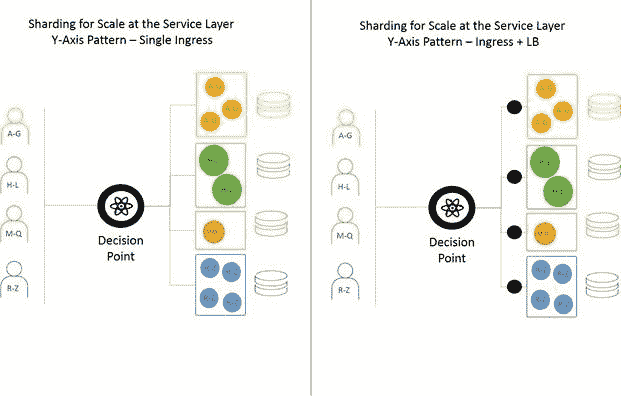

# 为规模而分片:架构很重要

> 原文：<https://devops.com/sharding-scale-architecture-matters/>

在单片应用的时代，规模很简单。因为应用程序的每个实例都是一样的，所以哪个实例处理请求并不重要，只要请求被处理了就行。在后端，一个单一的、巨大的数据存储容纳了一切。随着应用程序迁移到网络，API 引入了更多的用户，这种模式遇到了严重的问题。数据库在不影响性能的情况下高效扩展的能力成为一个严重的问题。

另一方面，基于微服务的架构远非简单。不仅有更多的移动部分需要跟踪，而且在过去十年应用程序和 API 使用增加的惊人压力下，我们对可伸缩性的理解已经成熟和变形。其中一些移动部分与数据的去中心化密切相关，这也不再是单一的，因此负责与数据交互的微服务受到这些新数据模型的影响。

分片是在微服务出现之前引入的。前提很简单，部分基于负载平衡的基础:分配负载。数据存储被分割开来，只负责一部分数据。这使他们更有效率和更快，从而使每个人受益。

随着微服务在提高开发速度和敏捷性方面变得越来越普遍，它们也向分片等式中引入了新的变量。这不再仅仅是数据分片的问题；现在的问题是如何在整个架构中分配分片的责任。

您设计微服务的方式——也可以说是分解策略——会对您最终如何扩展服务产生重大影响。这不再仅仅是在前面扔一个负载均衡器，祈祷最好的结果。

**分片决策**

[规模立方体](http://microservices.io/articles/scalecube.html)由最优秀的书《[《可伸缩性的艺术》，](http://theartofscalability.com/)》定义，提供了一些关于规模架构的指导。特别值得注意的是 Y 轴和 Z 轴缩放。

在 Y 轴扩展中，应用程序被分解为单独的服务，每个服务负责一个或密切相关的功能集。这允许每一个独立扩展。显然，它非常适合微服务。

对于 Z 轴缩放，重点是通过克隆进行缩放。也就是说，同一服务的多个副本被水平扩展以增加容量。有趣的是，这些副本中的每一个都只负责请求或数据的一个子集。它最常用于扩展数据库(分片),但也有利于基于位置或其他可识别的基于用户的属性的扩展。基于 Z 轴的架构的两个最紧迫的挑战是碎片定义的粒度——太细，会浪费很多资源。太宽泛了，如果你成功和成长了，你就有遇到性能和规模问题的风险。

今天的最佳实践是采用某种数据分片。所以，问题不在于你是否会共享你的数据；它是，你的架构的哪个部分将负责管理它？

主要有两种选择:微服务层或数据层的 shard。

**服务层分片**

微服务层的分片利用了 Y 轴比例模式。它假设有指定用于处理请求子集的服务。这个模式需要一个上游决策点，能够检查请求并决定如何路由它们。这意味着数据必须在 HTTP 头(最好)或有效载荷(数据)本身携带的可识别变量上分片。

在架构上，有许多方法可以扩展这种模式。最简单的方法是使用单个智能入口“路由器”同时进行路由和扩展。更复杂的方法是使用入口路由器将请求路由到负载平衡器，负载平衡器单独扩展每项服务。

值得注意的是，容器化环境——部署微服务的流行方式——主要在更复杂的模式上运行。单个入口控制器充当决策点，本地或插入式负载平衡器在构成服务的节点之间分发请求。

**数据层的分片**

数据层的分片在整体架构上更容易，但是将微服务代码与你的分片策略结合得更紧密。这是因为服务承担路由的责任，并且必须实现分片策略。任何微服务都可以接受任何请求。给定相关变量，微服务然后确定哪个数据存储是合适的。

这种模式减轻了入口的复杂性，因为除了在可用的微服务之间分配负载之外，实际上不需要做任何事情。但是，它确实增加了服务层和数据层之间后端的网络复杂性，因为每个服务都必须能够与每个数据存储进行通信。

根据您的实施情况，这可能需要更多的网络协助，以确保最佳性能和路由。

这种模式也给数据存储带来了更大的压力，因为它们需要与微服务的每个实例进行通信。根据您选择的语言，这可能会对容量和性能产生意想不到的后果，因为数据库连接池成为扩展的主要瓶颈。

**夏德潇洒地**

在采用微服务架构时，对于应该如何分割数据，没有单一的“最佳”答案。两者都有利弊，每种方法都有后果。了解影响—不仅仅是对微服务架构的影响，还包括对整体架构的影响，包括规模。由于可伸缩性已经成为一项必备功能，而不是一项必须具备的功能，因此了解应用程序架构选择对该功能的影响非常重要。

碎片打开。智能扩展。

洛丽·麦克维蒂