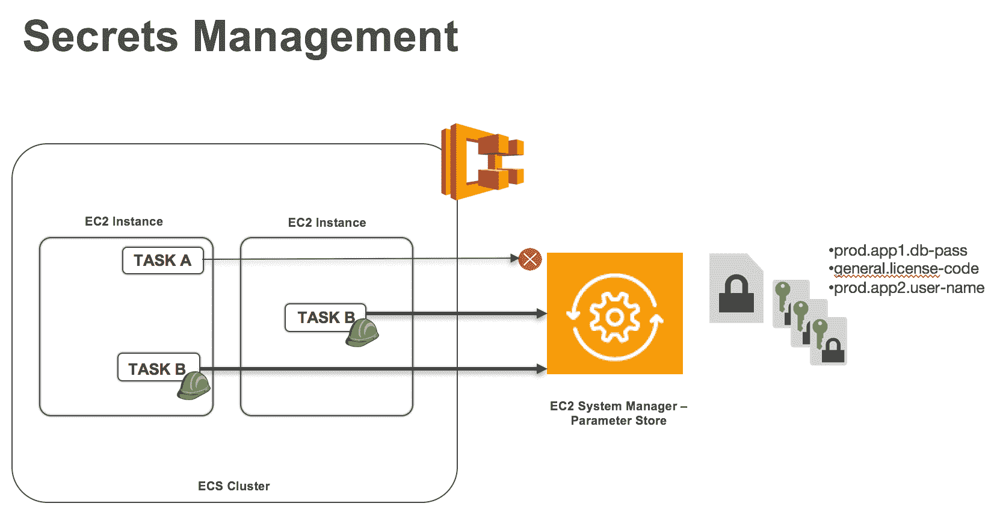
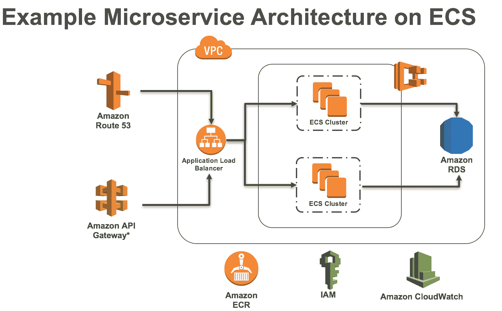
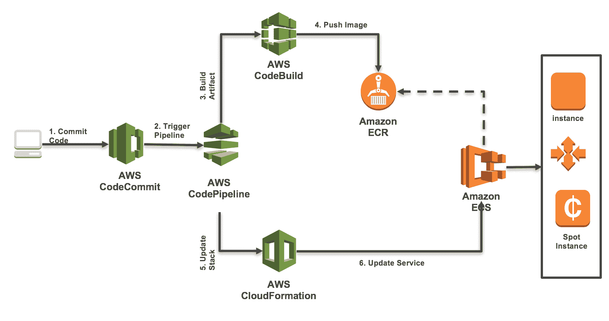
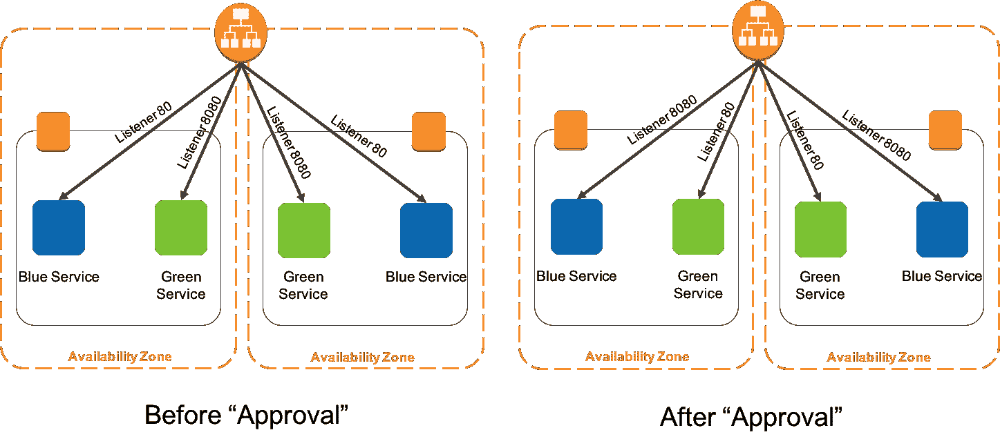

# 如何使用容器在 AWS 上构建 12 因素微服务应用

> 原文：<https://devops.com/build-12-factor-microservices-applications-aws-containers/>

如果你在 2017 年开发软件，你可能会考虑基于微服务的架构。微服务是一种应用程序开发方法，其中大型应用程序被构建为一套模块化服务。容器是一个自然的选择，因为它们提供了隔离和包装。容器进一步提高了速度、资源密度、灵活性和可移植性。

要获得容器和微服务的优势，请参考一种被称为 [12 因素应用程序的方法，](https://12factor.net/)这是一种用于构建“软件即服务应用程序”的流行方法，该应用程序:

*   为安装自动化使用声明性格式；
*   与底层操作系统有一个清晰的契约，在执行环境之间提供最大的可移植性；
*   适合部署在现代云平台上；
*   最大限度地减少开发和生产之间的差异，实现最大灵活性的连续部署；
*   并且可以在不对工具、架构或开发实践进行重大更改的情况下进行扩展。"

在本文中，我们将重点介绍使用 AWS 原语实现在容器中部署应用程序的范例。

**开发微服务**

在系统中实现干净契约的有效方法是定义特定于应用程序设计的服务边界。微服务在应用层定义了一个清晰的契约。可以在版本控制系统中跟踪微服务，如 Git 或 [AWS CodeCommit，](https://aws.amazon.com/codecommit/)这是一种完全托管的源代码控制服务，使公司可以轻松托管安全且高度可扩展的私有 Git 存储库，作为 GitHub 的替代方案。

崩溃隔离、安全隔离和独立扩展都需要考虑。容器将应用程序代码包装在一个部署单元中，该部署单元捕获代码及其依赖项的快照，从而扩展了可移植性。微服务架构本质上允许，如果服务的一个微部分崩溃，只有那部分服务会关闭。

Docker 提供操作系统、应用程序和依赖项的打包，从而实现可移植性。大规模运行多个 Docker 容器是一个 O(n ² 量级的难题。[亚马逊 EC2 容器服务(ECS)](https://aws.amazon.com/ecs/) 是一个高度可伸缩、高性能的[容器](https://aws.amazon.com/containers/)管理服务，支持 [Docker](https://aws.amazon.com/docker/) 容器，并在亚马逊 EC2 实例的托管集群上启用基于 Docker 的应用。Amazon ECS 消除了安装、操作和扩展集群管理基础设施的需求，实现了高度并发的环境。

有多个容器编排平台在大规模运行容器方面做得很好，但是在平台本身上管理它们是一个挑战。这需要用户花费大量时间来操作平台，而不是关注应用程序。

虽然 Docker 支持软件的干净打包，但是应用程序应该在不同的环境中保持一致；应该从代码中删除环境依赖性，以增强可处置性。

[参数存储，](https://aws.amazon.com/ec2/systems-manager/parameter-store)[亚马逊 EC2 系统管理器](https://aws.amazon.com/ec2/systems-manager/)的一个特性，为机密和配置等敏感信息提供了一个集中的加密存储。该服务是完全管理的、高度可用的和高度安全的。使用 Systems Manager API、AWS CLI 和 AWS SDKs 可以访问参数存储。秘密可以很容易地轮换和撤销。参数存储与 AWS KMS 集成，因此可以使用默认或自定义 KMS 密钥对特定参数进行静态加密。通过导入 KMS 密钥，您可以使用自己的密钥来加密敏感数据。

图 1:在参数存储中存储容器机密

对参数存储的访问可以由 IAM 策略控制，并支持资源级别的访问权限。授予特定参数或命名空间权限的 IAM 策略可用于限制对这些参数的访问。如果为服务启用了 CloudTrail 日志，它会记录任何访问参数的尝试。部署在 Amazon EC2 容器服务(ECS)上的容器可以从参数存储中访问这些秘密。

Amazon EC2 容器服务通过为每个服务赋予自己的 IAM 角色，允许您锁定对 AWS 资源的访问。

**可扩展性**

一个 [ECS 服务](https://docs.aws.amazon.com/AmazonECS/latest/developerguide/ecs_services.html)可以被配置为使用服务自动伸缩来上下调整其期望的计数，以响应 CloudWatch 警报。自动缩放有效地利用了计算资源。亚马逊 ECS 发布了 CloudWatch 指标，其中包含该服务的平均 CPU 和内存使用量。这些服务利用率指标可用于扩大服务规模以应对高峰时期的高需求，以及缩小服务规模以降低低利用率时期的成本。

随着服务扩展并在 ECS 集群上运行多个应用程序，动态端口映射变得至关重要。应用程序负载平衡器提供了一个高性能的负载平衡选项，它在应用程序层运行，并允许根据内容定义路由规则。使用[应用程序负载平衡器](https://aws.amazon.com/elasticloadbalancing/details/)，您可以指定一个动态主机端口，以便在 EC2 实例上调度容器时为其提供一个未使用的端口。ECS 调度程序将使用此端口自动将任务添加到应用程序负载平衡器。

使用 AWS CloudFormation 为开发人员和系统管理员提供了一种创建和管理相关 AWS 资源集合的简单方法，例如应用程序负载平衡器、ECS 集群、 [VPC](https://aws.amazon.com/vpc/) 、服务定义和任务定义。

如上所述，使用诸如参数存储之类的秘密管理存储允许应用作为一个或多个进程在执行环境中执行。这些服务是无状态的，不共享任何东西，并且依赖于有状态的支持服务来保存数据。

这些服务可以依赖于后台服务，如数据存储([亚马逊 RDS](https://aws.amazon.com/rds/) 、 [DynamoDB](https://aws.amazon.com/dynamodb/) 、 [S3](https://aws.amazon.com/s3/) 、 [EFS](https://aws.amazon.com/efs/) 和[红移](https://aws.amazon.com/redshift/))、消息/排队系统( [SNS](https://aws.amazon.com/sns/) / [SQS](https://aws.amazon.com/sqs/) 、 [Kinesis](https://aws.amazon.com/kinesis/) )、SMTP 服务( [SES](https://aws.amazon.com/ses/) )和缓存系统([elastic cache](https://aws.amazon.com/elasticache/))。12 因素应用程序的代码没有区分本地和第三方服务。

图 AWS 上的微服务部署示例。

**连续部署**

在当今的商业环境中，以高速度交付新的软件迭代是一种竞争优势。组织向客户交付创新和适应不断变化的市场的速度越来越成为决定成败的关键因素。

持续部署使开发人员能够通过完全自动化的软件发布过程发布特性和修复。开发人员无需在几周或几个月的时间内批量发布大型版本并手动进行部署，而是可以在新的软件版本为用户准备就绪时，每天多次使用自动化来交付他们的应用程序版本。与云计算缩短资源交付时间的方式一样，持续部署将向用户发布新软件的周期从几周或几个月缩短到几分钟。滚动更新、蓝绿色和金丝雀部署等各种技术可用于实现连续交付渠道。

在 Amazon ECS 中更新服务是在调度程序级别实现的。可以更新正在运行的服务，以更改服务维护的任务数量或任务使用的任务定义。当服务调度程序在更新期间替换任务时，如果服务使用了负载平衡器，则服务会首先从负载平衡器中删除该任务，并等待连接耗尽。AWS 提供 AWS CodeCommit、 [CodePipeline](https://aws.amazon.com/codepipeline/) 和 [CodeBuild](https://aws.amazon.com/codebuild/) 来实现高效的连续交付管道。下面的参考架构说明了这样的流水线。

图 3:持续交付和部署

在上述参考架构中，开发人员将代码提交到 CodeCommit 中，这将触发代码管道。代码管道分支使用 [AWS CloudFormation](https://aws.amazon.com/cloudformation/) 提供基础设施，并使用 CodeBuild 构建 Docker 映像。CodeBuild 构建 Docker 映像并将其推送到 [ECR](https://aws.amazon.com/ecr/) ，而 CloudFormation 已经部署了 ECS 集群。ECS 服务处于自动缩放模式，它挑选映像并进行部署。同样的工作流程也适用于更新，只是增加了一个更新堆栈的步骤。有了更新堆栈，CloudFormation 可以理解增量更改，更新服务会用新映像替换容器。

**蓝色/绿色**部署是一种不可变的部署，可以帮助您以更低的风险部署软件更新。通过为当前运行的或“蓝色”版本的应用程序和新的或“绿色”版本的应用程序创建单独的环境，可以降低风险。这种类型的部署使您有机会在绿色环境中测试功能，而不会影响应用程序的当前运行版本。当您对绿色版本工作正常感到满意时，您可以通过修改 DNS 逐渐将流量从旧的蓝色环境重新路由到新的绿色环境。通过使用这种方法，您可以在几乎没有停机时间的情况下更新和回滚功能。

图 4。用 ECS 实现蓝绿色

如上述参考架构所示，应用负载平衡器处的[目标组](https://docs.aws.amazon.com/elasticloadbalancing/latest/application/load-balancer-target-groups.html)和基于路径的路由可用于将流量从 ALB 定向到蓝色(实时)服务和绿色(测试)服务。一旦测试完成，目标组可以被切换，以将所有实时流量重定向到绿色(实时)服务，并将所有内部流量重定向到蓝色(不推荐)服务。

Canary release 是一种降低在生产中引入新软件版本风险的技术，它通过在向整个基础设施推广并向所有人提供之前，缓慢地向一小部分用户推广更改来实现。

图五。在 AWS 上实现容器的 Canary 部署

在上面的参考架构中，容器可以发出 [CloudWatch](https://aws.amazon.com/cloudwatch/) 事件，这些事件可以用来确定是否增加流量。当容器指定它可以接受更多流量时， [Amazon R53](https://aws.amazon.com/route53/) 加权路由可以增加应用负载平衡器的流量，从而增加容器的流量。随着金丝雀的增多，维护每只金丝雀的状态对于回滚和部署非常重要。DynamoDB 和 lambda 过滤器允许基于 CloudWatch 事件将状态存储在管道中。 [AWS 步骤功能](https://aws.amazon.com/step-functions/)使用可视化工作流程帮助协调管道组件。

另一个考虑是，开发、筹备和生产系统应该尽可能相似。通过建立有效的部署渠道，这是可以实现的。从运营和开发的角度来看，环境应该在操作系统、Docker 版本、共享库和部署的微服务方面保持一致。

开发人员还可以将一次性管理流程作为一项任务来运行，运行环境与应用程序的常规[长期运行流程](https://12factor.net/processes)相同。它们运行在一个[版本](https://12factor.net/build-release-run)上，使用与任何运行在那个版本上的流程相同的[代码库](https://12factor.net/codebase)和配置。管理代码可以与应用程序代码一起提供，以避免同步问题。

**监测和治理**

应用程序日志非常有用，原因有很多。它们是故障排除信息的主要来源。在安全领域，它们对于取证是必不可少的。Web 服务器日志通常用于分析(大规模)以深入了解使用情况、受众和趋势。一个 12 因素的应用程序从不关心其输出流的路由或存储。从所有正在运行的进程和后台服务的输出流中收集的流日志，用于集中日志记录，如 AWS CloudWatch。Amazon ECS 在任务定义上提供了一个日志驱动程序，将流日志发送到 CloudWatch。

集中式日志记录有几个好处:Amazon EC2 实例的磁盘空间没有被日志消耗，日志服务通常包括对操作有用的附加功能。例如，CloudWatch Logs 包括[创建指标过滤器](https://docs.aws.amazon.com/AmazonCloudWatch/latest/logs/CountOccurrencesExample.html)的能力，当有太多错误时会发出警报，并与 Amazon Elasticsearch 服务和 Kibana 集成，使您能够执行强大的查询和分析。

调试问题时，跟踪和故障排除是一个重要的方面。 [AWS X 射线](https://aws.amazon.com/xray/)守护程序是一个软件应用程序，它收集原始分段数据并将其转发给 AWS X 射线 API。该守护程序与 AWS X-Ray SDK 协同工作，并且必须运行，以便 SDK 发送的数据可以到达 X-Ray 服务。您可以轻松地在 ECS 集群上将 AWS X-Ray 作为守护进程运行，以实现对容器的跟踪。

治理是软件设计和开发的一个关键方面。维护一致的风格和标准以及操作 SLA 对于企业部署至关重要。必须考虑有关安全性、恢复时间目标和恢复点目标的 SLA。 [AWS 服务目录](https://aws.amazon.com/servicecatalog/)可用于在目录中列出微服务堆栈，并带有访问控制和通知机制。

**结论**

借助 AWS 原语，您可以利用 12 因素 app 模式，通过持续部署来实现可扩展、容错和高度可用的微服务。您可以在以下网址找到更多资源:[https://aws.amazon.com/ecs/getting-started/](https://aws.amazon.com/ecs/getting-started/)和[https://aws.amazon.com/ecs/resources/](https://aws.amazon.com/ecs/resources/)

Arun Gupta 是亚马逊网络服务公司的首席开源技术专家。他在 Sun、Oracle、Red Hat 和 Couchbase 建立和领导开发人员社区超过 12 年。他在领导跨职能团队制定和执行战略、规划和执行内容、营销活动和计划方面拥有深厚的专业知识。在此之前，他领导 Sun 的工程团队，并且是 Java EE 团队的创始成员之一。他在 40 多个国家拥有丰富的演讲经验，演讲主题丰富，连续四年成为 JavaOne 摇滚明星。Gupta 还在美国成立了 Devoxx4Kids 分会，并继续在儿童中推广技术教育。一个多产的博客作者，几本书的作者，一个狂热的跑步者，一个环球旅行者，一个码头队长，一个 Java 冠军，一个 JUG 领导者，NetBeans 梦之队成员。

阿西夫·汗是亚马逊网络服务的技术领导者。他为全球一些最大、最成功的 AWS 客户和合作伙伴提供技术指导、设计建议和思想领导。他在应用架构、容器、devops、安全性、机器学习和 SaaS 商业应用方面的专业知识最为丰富。在过去的 12 年中，他将强烈的客户关注带到了多个行业中具有挑战性和高度技术性的角色。他拥有多项专利，并成功领导了产品开发、架构和客户互动。

— [阿西夫·汗](https://devops.com/author/asif-khan/)