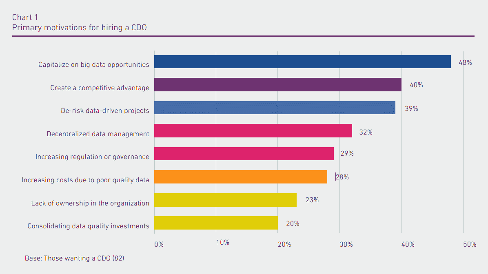

# 研究:首席信息官需要一位首席数据官

> 原文：<https://devops.com/study-cios-want-chief-data-officer/>

快说，CDO 代表什么？在你说 c [hief 数码官](https://devops.com/survey-cios-driving-digital-transformation/)之前，再想一想。一项新的研究指出，首席数据官是这两个头衔中更重要的一个，研究发现，82%的首席信息官认为，在大多数组织中，聘请 CDO 是一个令人信服的案例。该调查由益百利数据质量公司委托，由 200 名首席信息官和 50 名首席数据官于 6 月完成，并于 8 月发布。

尽管该报告强调了 CDO 对希望成为数据驱动型企业的重要性，但它也揭示了一些 CDO 面临的严峻挑战，包括期望过高、资源不足，以及尽管获得了 C 级头衔，但缺乏完成工作的权力。

调查表明，CDO 的核心职责是“定义数据管理战略，并将其转化为业务的战术性[可实现的]步骤。”为了使数据具有可操作性，它需要是可访问的、准确的和标准化的。这里有一个简单的例子来说明为什么这很重要:假设一个数据分析师需要创建一个报告来隔离纽约市的客户。如果他们中的一些人被列为总部位于纽约州纽约市，而其他人被列为总部位于纽约州纽约市，还有一些人在数据库中被列为纽约州纽约市，这是不标准的。数据分析师需要意识到数据是分散的，需要拼接在一起才能得到准确的结果。

让您的业务由数据驱动是数字化转型的潜在承诺的一部分。CDO 及其同类面临着一项艰巨的任务。将数据转化为商业智能是这个时代的炼金术。

Chart courtesy of [Experian Data Quality](https://www.experian.com/innovation/thought-leadership/chief-data-officer-report.jsp)

该研究确定了雇用 CDO 的三个主要驱动因素:利用大数据机会、创造竞争优势以及降低数据驱动项目的风险。这些角色远远超越了数据管理和数据治理，致力于推动业务创新。接受调查的 CDO 预测，未来几年，他们面临的最大业务挑战将是数据安全性、跟上技术进步的步伐以及管理不断增长的用户期望。

也许一些 CDO 面临的最大挑战之一是，他们在组织中的角色和地位在公司间不一致。一句话:他们可能没有成功所需的权力。例如，调查显示，CDO 的平均任期只有两年。许多 CDO 报告称，尽管他们拥有 C 级头衔，但他们并不被视为 C 级高管的一部分。尽管 37%的人直接向首席执行官报告，但更大比例的人向首席信息官、首席技术官或其他 IT 部门报告。这可能会产生一些摩擦，因为 CDO 能够弥合 it 和业务线之间的差距并增强业务能力非常重要。

## **构建 CDO 角色的技巧**

在创建新的 CDO 职位时，应告知最高管理层调查发现的 CDO 面临的这些共同挑战:

*   保持在预算内
*   跟上不断发展的技术
*   知道如何解读信息
*   寻找/雇佣具有数据专业知识的人
*   管理不断增长的用户期望
*   平衡业务用户和 IT 的需求
*   责任重大，容不得半点差错
*   被拖进了杂草中
*   维护数据安全

您应该考虑将这些职责扩展到您的 CDO:

*   对公司数据的管理和使用有很强的控制力
*   在数字化转型中发挥积极作用
*   将信息作为资产进行企业范围的治理和利用的责任
*   经验丰富的数据员工团队的经理
*   实施不同方法将数据作为资产进行管理的权限
*   产生商业智能的权限，开启并支持商业创新
*   整个公司认可的权威是监督数据策略和流程的人
*   推荐:至少给 CEO 一个虚线汇报。

苏格兰人芬尼