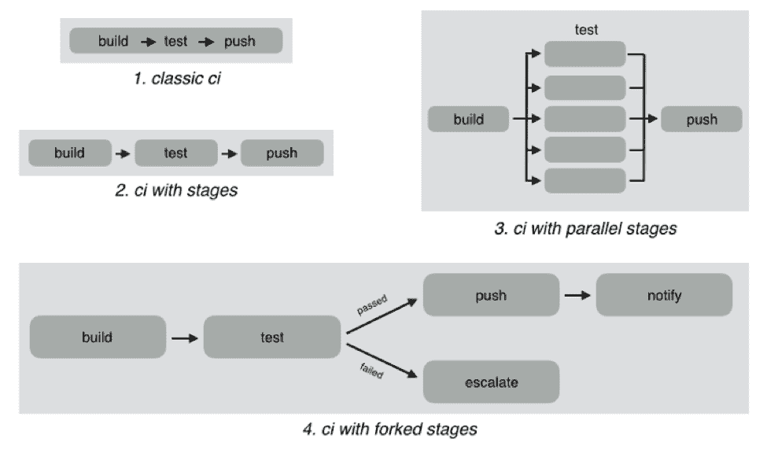
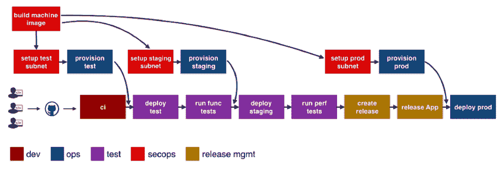

# 区分 CI 管道和 DevOps 装配线

> 原文：<https://devops.com/differentiating-ci-pipelines-devops-assembly-lines/>

“名字里有什么？”写出了有史以来最伟大的诗人。

我只能说，他生活在更简单的时代，那时 DevOps 和持续集成(CI)、持续部署(CD)、CI/CD、其他 CD、应用发布自动化(ARA)、流水线、装配线等令人困惑的世界。，并不存在。

今天最大的挑战是供应商使用重载的术语来描述完全不同的用例。CI 供应商声称支持 CI/CD，尽管这里的“D”只是对开发环境的部署，而不是准备或生产。ARA 供应商声称能够实现连续交付，尽管他们不包括基础设施供应、安全补丁或配置管理等关键步骤。

术语“管道”和“装配线”相对较新。多家供应商最近宣布了管道和装配线，乍一看差异并不明显。所以让我们来一次深潜。

## **什么是 CI 管道？**

持续集成在过去几年中有了巨大的发展。对于每一个代码变更，自动化构建和单元测试的简单过程已经发展成为一个非常复杂的工作流程。

例如，下面显示了不同的配置项工作流:

在经典的 CI 中，所有的构建和测试指令都包含在一个 blob 中，并且指令是串行执行的。如果所有指令都成功执行，则 CI 是成功的，如果有任何指令失败，则它被标记为失败。直到最近，几乎所有的 CI 提供商都只提供经典 CI。

然而，随着 CI 成为主流，开发人员希望用决策树和并行性来定义更复杂的工作流。CI 管道支持这种复杂性，例如:

*   分阶段定义 CI 工作流，这样您可以更快地从一个阶段获得结果，而不必等待整个工作流完成。这也支持这样的场景，比如运行一个基本的测试组，并且只有在基本测试通过的情况下才运行扩展的测试套件。
*   并行运行阶段，因此您可以根据不同的环境或语言版本来拆分测试或测试您的代码，并获得更快的反馈。
*   根据一个阶段的结果划分您的 CI 逻辑。

虽然 CI 管道是对传统 CI 的巨大改进，但它们仍然局限于以开发人员为中心的工作流。Jenkins、Teamcity、Shippable、Gitlab 和 CircleCI 都支持某种形式的 CI 管道。

## **什么是 DevOps 流水线？**

DevOps 装配线专注于自动化和连接由几个团队执行的活动，例如面向开发人员的 CI、面向运营人员的基础设施供应和配置管理、面向测试的测试自动化、面向 SecOps 的安全修补、面向发布经理的语义版本化和审批关口、面向多个环境的部署等等。

今天，大多数组织使用各种工具来自动化特定的开发运维活动。然而，DevOps 工具链是分散的，将它粘合在一起以实现连续交付是一项具有挑战性的任务。

大多数团队采用以下方法之一:

*   利用文化合作作为筒仓之间的粘合剂。例如，当一个新的应用程序版本可用时，测试团队创建一个 JIRA 票证并分配给运营部门。然后，Ops 将应用程序版本信息复制到他们的部署脚本中并运行它们。
*   编写临时脚本以从一个活动触发另一个活动，包括通过中间存储(如 S3)传递状态信息。在这种情况下，DevOps 工程师可能会编写一个运行自动化测试的 Jenkins 作业，然后将应用程序版本信息推送到 S3。另一个 Jenkins 作业轮询 S3 存储桶，当检测到变化时，运行部署脚本。

第一种方法引入了低效率和不必要的人为依赖的步骤。第二种方法更好，但是只适用于开发单个应用程序的小团队。当您有许多应用程序，甚至是一个具有微服务的应用程序时，它会创建一个意大利面自动化的弗兰肯斯坦。

DevOps 装配线通过专注于将这些不同的 DevOps 活动粘合到简化的、事件驱动的工作流中来解决这一问题，该工作流能够轻松地跨活动共享状态和其他信息。

下图显示了单个应用程序或服务的典型装配线:

看出区别了吗？CI 管道只是装配线上的一项活动。上图中的每个盒子都是一个管道，只是针对不同的活动！每一个都有关于工具集成、运行时、配置、通知等的特定需求。此外，每个管道归不同的团队所有，但需要与其他管道交互并交换信息。例如，如果运营团队更改了试运行环境的配置脚本，测试团队需要重新部署应用程序并运行性能测试。

因此，DevOps 装配线是“管道中的管道”

DevOps 装配线需要支持以下内容:

*   能够轻松定义跨多个管道的工作流。
*   版本化和可重用的工作流，支持多个应用和/或微服务的快速变更和扩展。
*   与所有流行的源代码控制系统、云、工件库、DevOps 工具、语言、服务等集成。
*   运行时来执行每个管道，包括预安装的工具和 CLI，以及根据管道类型使用正确运行时的能力。
*   通用管道和工具的加速器/行动手册。
*   触发依赖管道时传递状态和其他信息的能力。
*   每个管道之间的自动触发器或手动批准门。
*   每个管道每个阶段的可配置通知。
*   发布自动化特性，比如包的语义版本化。
*   每个管道的审计跟踪，能够返回或前进到特定状态。
*   所有敏感信息的抽象，如密码、令牌、密钥等。出于安全考虑。
*   限制装配线和管道操作的角色和权限。
*   管理开发运维基础架构，包括根据需要上下旋转虚拟机和容器。
*   每个管道和阶段的可见性，包括日志、状态和版本数据。
*   跨管道的指标和分析有助于识别瓶颈。

简而言之，DevOps 装配线有助于自动化和扩展所有团队和工具的端到端工作流，实现连续交付。

## 关于作者/ Manisha Sahasrabudh

*** *** 玛尼莎·萨哈斯拉德赫是[shippible](https://www.shippable.com/)的联合创始人兼产品管理副总裁。在发布之前，Sahasrabudhe 是微软的高级项目经理。你可以在 Linkedin 上找到她。