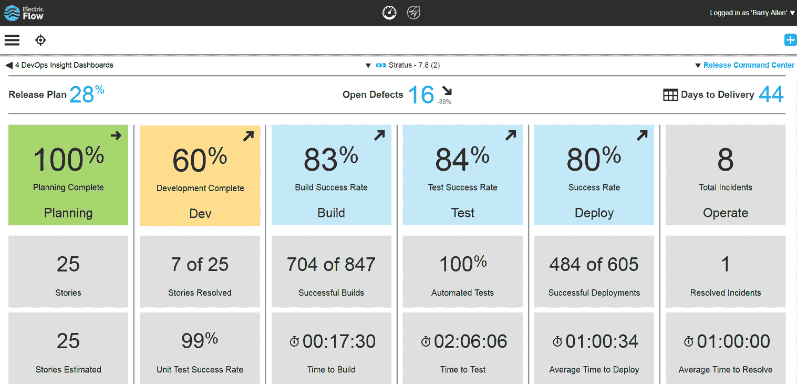

# 电子云和部署仪表板

> 原文：<https://devops.com/electric-cloud-deployment-dashboard/>

正如我的老读者所知，我开始了一个关于公司的系列，我发现这些公司很有意思，他们去詹金斯世界的时间很晚(在活动开始前几周)，也很特别。这意味着我经常与之交谈的公司浮现在脑海中，因为我知道他们在做什么，以及他们是否会进入詹金斯的世界。

这是几篇受读者和客户欢迎的博客文章，但我只能在足够晚的情况下插入三篇，以防发表更多内容无法实现系列的目标:告诉你所有有趣的内容。

但是随着这些事情的发展，我越是关注，我就发现越多有趣的东西。因此，我将发表几篇“你在詹金斯的世界里可能没见过的东西”的帖子，以便有机会谈谈其他令人感兴趣的想法。

今天，我将关注一个我一直关注但从未真正使用过的供应商。那对我来说很难得；一般来说，如果我写的是产品，我就用过它。毫无疑问，我会获得一个免费的许可证，并通过测试，或者让我的一个同事这样做。但是现在，我正在报道他们，因为我发现他们正在做的事情很有趣。

厂商是[电云](http://electric-cloud.com/)。对于那些不知道的人来说，它的 [ElectricFlow](http://electric-cloud.com/products/electricflow/) 工具与 XebiaLabs(我在 Jenkins World 的文章中也提到了 XebiaLabs)XL Deploy 处于同一个应用发布自动化/连续交付(ARA/CD)市场空间。但是这个博客的重点不是比较；因为我用过 XebiaLabs 的两种主流产品，而没有用过 Electric Cloud 的，所以比较是不公平的。我提到 XebiaLabs 只是为了帮助那些刚刚开始研究的人理解电子云适合哪里。

Electric Cloud’s new dashboard

“电云”在詹金斯的世界中吸引我的一点是它对 ElectricFlow 的更新，以允许更好的报告。我们都知道当构建中断时，我们在 AppDev 端有很好的系统来通知中断的来源和问题的项目管理。但是，就像 IT 部门的传统做法一样，将这些信息提供给对该应用程序感兴趣的业务领导充其量也只是断断续续的。再加上项目与项目之间报告的内容和方式会有所不同，业务部门对项目的状态总会有些困惑。这种混乱转化为向 IT 管理层询问状态，然后，当 IT 管理层出错，错过了最后期限，或者在最后一刻为了满足最后期限而放弃了发布的功能时，AppDev/IT 和业务之间就会产生嫌隙。由于组织中的每个人都应该是一个团队，朝着企业的成功努力，这种不和对任何人都没有好处。

看起来，从它的发布(我真希望我在詹金斯的世界戳这个角落)，电子云已经开始了弥合这一差距的过程。工具链数量和复杂性的增加意味着输入来自几个向量，这些向量可以给出项目状态的指示。Electric Cloud 已经开始了自动化状态收集/聚合的过程，而不是让 IT 管理(或某些组织的业务管理)到处跑，试图收集这些不同的数据集并确定项目的跟踪。

上图中的仪表板是这个解决方案的关键部分。想象一下，让业务领导访问一个仪表板，它不仅涵盖项目的当前步骤，还试图汇总 DevOps 生命周期中所有步骤的状态。将这些信息建立在发布的基础上意味着，随着时间的推移，将会建立一个库，业务领导可以参考这个库来衡量这个项目相对于其他项目的状态，并根据标准化的输入做出他们的业务决策。

这种数据已经存在于整个 it 部门，但这是我所见过的第一个可靠的尝试，即供应商将所有这些数据结合在一起，并以一种 IT 和业务可以讨论的方式呈现，着眼于交付。商业领袖在这个过程中参与得越多，产生的摩擦就越少，这种努力似乎让他们更多地参与进来。虽然还有很多工作要做——注意上面的屏幕截图中显示了单元测试成功率，但是单元测试覆盖率却没有——这是一个很好的开始，可以建立一个易于参考的仪表板，向业务部门显示项目的进展情况。

还有一个 API 可用于设置尚不直接支持的仪表板输入。虽然 DevOps 团队有很多事情要做——并不真的需要为那些应该在减少工作量的同时提高质量的工具开发插件——插入任何你需要的东西的能力对于那些优先考虑它的商店来说是有用的。

如果您正在寻找一个工具集，可以提供关于您的工具链中正在发生的事情的更多信息，那么检查一下 Electric Cloud 已经实现的更改是值得的，并且我将在接下来的几周内尝试抽出时间来运行该工具，看看它的效果如何。虽然我认为其他 ARA 供应商也将继续增加他们的产品是不可避免的，但有时还是值得一试。

唐·麦克维蒂