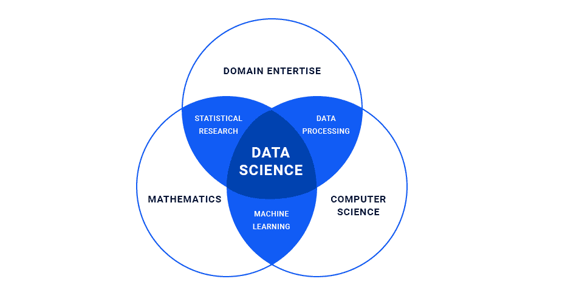
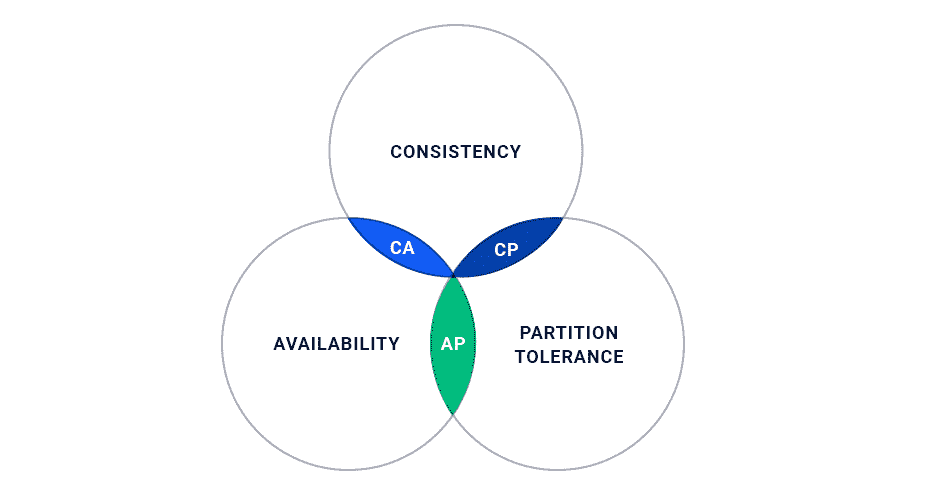
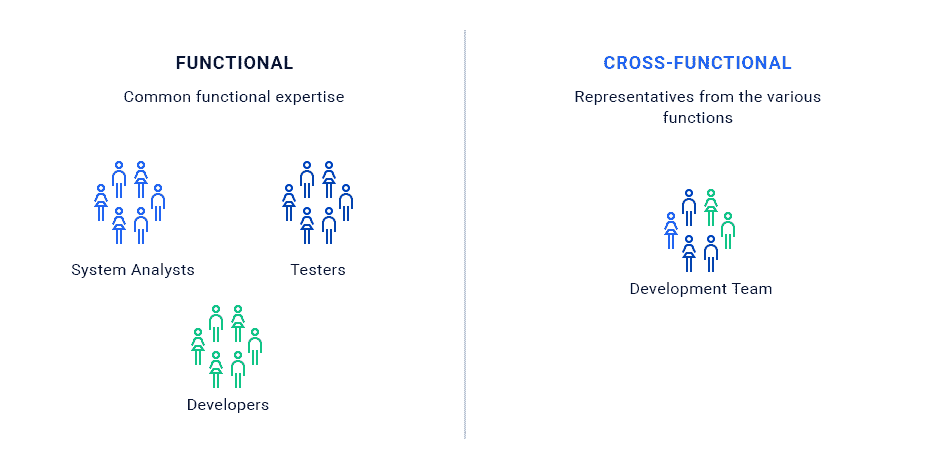

# 了解数据科学家在跨职能团队中的角色

> 原文：<https://devops.com/understanding-data-scientists-role-cross-functional-teams/>

在我们之前的文章“云中的数据科学行业观点”中，我们讨论了如果您计划发展业务，演进是关键。您可以从现成的解决方案开始，然后，随着时间的推移，您可以切换到在一组数据科学家的帮助下创建的内部解决方案。

这一次，我们将讨论机器学习即服务(MLasaS)不起作用的情况和解决方案。你的公司的第一步棋不是走出去雇佣一个数据科学家来解决你的紧急业务需求；相反，你的公司应该投资定制解决方案。只有当你有一个可行的解决方案时，你才能更深入地研究，并创建一个合适的团队来创建内部数据科学解决方案。

## **从定制端到端解决方案开始**

传统意义上的数据科学涉及解决紧迫问题的数据、目标和模型。启动数据科学流程的最佳方式是将各种现成的服务整合到一个可行的产品中，以便在短时间内向您的客户展示清晰的结果。这不需要任何复杂或全面的研究就可以完成，您可以轻松地制定规范，同时考虑到来自客户的所有反馈，以便稍后创建更高级别的数据科学产品。

任何数据科学项目的最大问题之一是为其制定规范。通常的要求是，“使用数据科学为我的公司创造一些东西。给我分析数据。”这种工作有很多尝试和错误。从一开始就拥有定制的端到端解决方案，使您能够根据需要添加额外的服务，并对特定的业务工作流程进行更深入的了解和预测。

我认为公司应该从端到端解决方案的角度，而不是从数据科学研究的角度来构建他们的数据科学系统。然后，一点一点地，他们可以在这个过程中调整他们的服务。

## **继续数据科学研究**

公司通过雇用符合其需求的数据科学家来开始数据科学研究。您可以使用标准的数据科学家资格:该员工应该在应用程序环境、数学和编程方面有坚实的基础。此外，他们的商业技能是成功的关键 *—* 我认为对热门领域的理解是关键，因为我们正在解决商业问题。解决更学术性问题的数据科学家将更专注于赢得[的竞争，而不是解决业务需求。](https://www.kaggle.com/)

这个人了解产品开发周期是很重要的。这样，模型和分析数据的构建方式就可以在生产中部署。例如，如果一个人正在使用 R(数据科学家的语言和框架)，我们应该注意到它更面向研究，而不是生产就绪。相应地，这种研究的结果不能部署在任何端到端的解决方案中。因此，数据科学家应该和程序员一起工作。

尽管在上图中我们看到数据科学家应该具备黑客技术，但实际上并非如此。在绝大多数情况下，数据科学家无法写出高质量的代码。如果你不仅需要研究，还需要解决方案，那么在流程方面，你需要一个数据科学家和一个数据工程师一起工作。

## **作为类比的上限理论**

不可能同时拥有三个数据库属性:一致性、可用性和分区容差。这个基本规则是所有开发者都知道的。对于数据科学家来说也是如此:人们想象一个数据科学家拥有所有三种属性，但在现实生活中，你找不到这样一个理想的候选人。通常，人们在工作中倾向于这样或那样的方式，保持平衡并不总是优先考虑的事情。

原则上，数据科学家应该具有商业洞察力，理解背后的数学原理，并与熟练的开发人员合作。当然，一个合适的数据科学家应该能够编写任何形式的代码，但是数据科学家应该与数据工程师一起编写和实现代码，对这个解决方案的质量和可持续性负责。

决定开始任何数据科学研究的公司的经典悲剧是，当一位数据科学家说，“我的电脑上有 40，000 行 Python 代码。你能让它在生产中发挥作用吗？”当然，这实际上是不可能做到的。当这种情况发生时，所有的研究都白费了。

## **跨职能团队**

任何处理数据科学的团队都必须是跨职能的。换句话说，它必须涵盖它编写的一整套解决方案。在正常的基础架构中，应该有开发运维工程师、数据科学家、数据工程师和产品开发人员编写 web 应用和/或移动应用。这个团队要对结果负责。团队成员应该一起工作，解决相互关联的任务。

所有这些意味着整个团队要对业务结果负责。对于数据科学家所做的过渡研究来说也是如此，这种研究本身是不可能用于生产的。

## **老派与垂直团队**

为了更深入地挖掘，让我们以一个经典的老式分层公司组织结构为例，当你有一个由数据科学家、运营、UI 开发人员、大数据部门、QA 工程师等组成的部门时。在这种情况下，我们让每个项目渗透到大多数团队中。经典的问题是，票证和任务被一个团队扔给另一个团队，真正的业务目标在过程中被淡化，最终没有得到解决。因此，我们将团队纵向划分，而不是横向划分。这使我们能够创建团队，看到他们需要实现的明确目标。与此同时，他们可以提高交叉技能，增强责任感。

结果，这样的团队开始适当地交付 Scrum 和敏捷。它与数据科学没有直接关系，但公司需要认识到在学术界工作的数据科学家和生产数据科学家之间的区别。公司应该致力于在他们的团队中使用后者，而不是让数据科学家独自远程工作。

## 关于作者/ Stepan Pushkarev

[斯捷潘·普什卡列夫](https://www.linkedin.com/in/stepanpushkarev)是[Squadex.com](https://squadex.com)的 DevOps 实践负责人，也是 [Hydrosphere.io](http://hydrosphere.io) 的 CTO。共同创建和管理电子商务、物联网和广告技术公司的工程团队。他负责整个产品体系:数学模型、基础设施&运营、企业应用以及招聘、建立工程文化和交付流程。斯捷潘结合了强大的技术，管理技能和企业家精神。在 [LinkedIn](https://www.linkedin.com/in/stepanpushkarev/) 上和他联系。