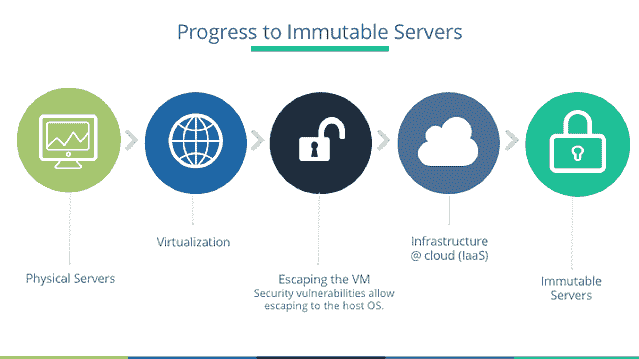
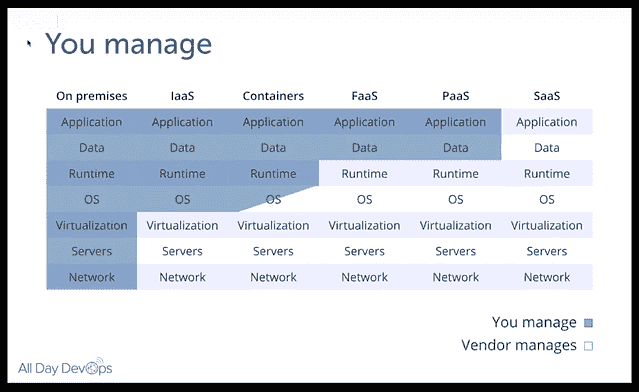
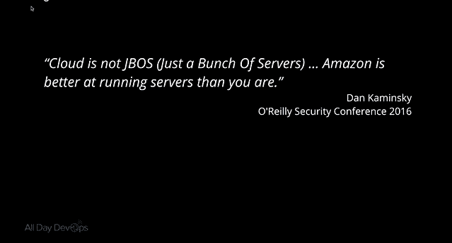

# 在无服务器的世界中保护不可变服务器

> 原文：<https://devops.com/securing-immutable-servers-serverless-world-2/>

雪花是美丽的，独特的创作。但是，让我们把它们留在大自然中。它们不属于我们的服务器基础设施。雪花服务器的每种配置都略有不同，这可能会引入不必要的安全漏洞和复杂性。虽然在 IT 基础设施中很常见，但在 DevOps 领域，它们正逐渐成为历史。

在 2016 年的[全天 DevOps](https://www.alldaydevops.com/) ，*Erlend Oftedal([@ webtonull](https://twitter.com/webtonull))，在 [Blank](https://blankoslo.no/) 和 [OWASP Norway](https://www.owasp.org/index.php/Norway) 分会负责人的陪同下，讨论了无服务器架构中不可变基础设施实践的优势。Erlend 向我们展示了对安全性的积极影响，并提供了对潜在问题的见解。*

 *Erlend 概述了从物理服务器到不可变服务器的进展，讨论了每一步的好处以及导致下一阶段的关注点，以不可变服务器结束——也就是说，它们不能被改变。一旦建立起来，它们就设置好了。自动化流程加上不变性原则可以消除雪花服务器。

不变性并不是一个新概念。一些经典的例子包括现场 Linux 光盘，网吧，学校，图书馆和酒店商务中心。要设置不可变的服务器，Erlend 概述了以下步骤:

1.  找到合适的基础映像
2.  为应用程序构建一个特定的映像
    1.  属国
    2.  应用
    3.  秘密
3.  将映像部署到服务器
4.  对于新版本，重复步骤 2-3

当然，这立即引发了问题:

*   *数据呢？*他指出，由于数据本身会发生变化，因此数据必须存储在外部。
*   您如何部署变更？嗯，你不要换服务器。你取出一个，放入一个新的。如果那个失败了呢？回滚到上一个。
*   你是如何管理秘密的？您可以在中构建秘密、利用云密钥管理或使用第三方服务。
*   我们如何应用安全补丁？如果真的不可变，你用补丁部署一个新的服务器。然而，您可以拥有一个半不可变的服务器，它允许自动安装补丁，但仍然不允许登录或手动更改。
*   *说到安全，有哪些安全优势？*首先，如果攻击者在您的服务器中，当您更换服务器时，它将被排除，尽管如果漏洞没有得到修补，它可能会回来。通过删除所有不必要的包，它还允许非常特殊的图像。使用这些专门的映像，您可以更轻松地审计和监控系统中的意外文件更改、登录和连接。

Erlend 讨论容器是因为它们离无服务器世界更近了一步。容器隔离进程，所有进程都运行在同一个操作系统上。当然，您可以使它们不可变，但是不管它们是否可变，您都需要考虑一些关键的安全最佳实践:

*   不要在容器内以 root 身份运行
*   实现用户名称空间，以便容器内的根帐户与容器外的根帐户分开
*   利用能力和资源所需的最少特权
*   让它们保持最新
*   使用 Sonatype Nexus、Twistlock、Clair 或 Aqua 等工具自动扫描
*   分离不可信和可信容器

Erlend 还涉足无服务器架构。虽然对于什么才算是无服务器还存在争议，但 Erlend 强调了五个原则:

*   使用计算服务按需执行代码
*   编写单一用途的无状态函数
*   设计基于推送、事件驱动的管道
*   创建更厚、更强大的前端
*   接受第三方服务

迁移到不可变的、无服务器的基础设施是一个要讨论的话题，远远超出了这篇博客甚至 Erlend 的会议。然而，无论你将来做什么，请记住他的临别赠言:“云可以解决你的许多问题，但最终你不能转移你的安全责任。”

厄伦德的会议充满了信息。如果这激起了你的兴趣，你应该[观看他在 DevOps 2016 全天的完整会议](https://www.youtube.com/watch?v=nTqE9A5qdTc&feature=youtu.be)(仅 30 分钟)。会议的其他 56 个演讲也可以在网上免费获得[点击这里](https://www.sonatype.com/all-day-devops-on-demand?__hstc=160429922.7ed0d7bbaf4fd31550bdbacbb4f69b40.1487782980826.1501687440528.1502891699746.17&__hssc=160429922.1.1502891699746&__hsfp=1674733363)。

此外，今年的全天 DevOps 是 10 月 24 日。这是网上免费的，所以一定要查看[www.alldaydevops.com](https://www.alldaydevops.com/)了解更多并注册。

— [德里克·威克斯](https://devops.com/author/derek-e-weeks/)*