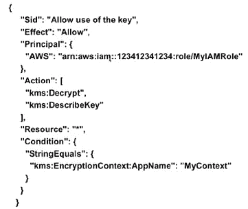
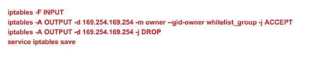

# 如何完全自动化 CI/CD–甚至机密

> 原文：<https://devops.com/fully-automate-cicd-even-secrets/>

想象一个世界，其中您的持续集成/持续部署环境是 100%自动化的，包括凭证的传递。

美国领先的银行 Capital One 已经实现了这一点，Capital One 的软件工程总监 Andrey Utis 在他的演讲中概述了该公司如何实现这一点，他在[全天 DevOps 会议](https://www.alldaydevops.com/)上发表了“与 KMS *的应用程序秘密管理*。

安德烈一开始就说了我们都知道的话:安全需要放在首位。此外，我们在全天的 DevOps 会议上反复听到的一个信息是在可以自动化的地方实现自动化。这种组合令人望而生畏，似乎不可能实现—当有人需要输入凭据，而我们又无法将凭据存储在每个人都可以找到的位置时，我们如何实现安全自动化？毕竟，凭据提供了对数据库的访问，这些数据库通常包含个人身份信息和其他受保护的信息。无论是有意还是无意，违规都会给公司和个人带来灾难性的后果。

Andrey 的团队使用 Amazon Web Services (AWS ),因此他们赋予实例 IAM 角色，允许它们访问其他 AWS 资源。关键是什么(双关语)？在 AWS EC2 实例上，有一个神奇的 IP 地址，您可以对其进行 HTTP 调用，它将返回临时 AWS 密钥。然后这些键对不同的数据库服务进行 API 调用。

这里是解决方案:AWS KMS 是加密即服务。KMS 上下文允许您将“盐”添加到加密中。只能用同样的“盐”解密。KMS 密钥策略限制了哪个 IAM 角色可以使用密钥/盐进行解密。主 KMS 密钥只能用于解密自己的密钥。

以下是 KMS 策略的代码示例:

这允许多个应用程序在一个 AWS 帐户上，同时限制开发人员对他们被授权的应用程序的访问。

下面是实际的协议:

1.  创建 KMS 主密钥(可由多个应用程序共享)
2.  为您的服务器创建 IAM 角色
3.  添加允许解密特定上下文的 IAM 角色的 KMS 密钥策略
4.  用密钥和上下文加密您的秘密，并将值存储在 GitHub 中
5.  在部署或运行时，调用 KMS API 进行解密

IAM 角色还有一个更广泛的问题，因为凭证是通过调用“神奇的”元数据 IP 地址 169.254.169.254 生成的。生产环境中的开发人员，即使对实例有“只读”访问权限，也可以调用 KMS API 来解密这个秘密。开发人员应该根本不能生成生产 IAM 凭证，所以您用以下代码阻止了这个神奇的 IP 地址:

为了使其自动化并可重复使用，该团队创建了一本厨师食谱，他们称之为“公文包”，用于抽象解密秘密。他们还有 iptables cookbook 来阻止除用户组白名单之外的所有用户的元数据 IP 地址，比如 root 和任何进行 AWS API 调用的特定于应用程序的组(参见上面的代码)。

Andrey 提到，Vault [可能很快会有一个可行的解决方案](https://www.vaultproject.io/docs/auth/aws-ec2.html)。它使用已签名的 EC2 身份文档来验证调用者。目前的缺点是，它只支持 AMI ID 授权(但应该很快会支持更多),并且秘密不受源代码控制/版本控制。正如 Andrey 指出的，这对于数据库密码等“配置机密”来说并不理想。

在接下来的一个问题中，安德烈被问到，“最重要的教训是什么？”他回答说:“这是一个新领域。大多数公司要么没有完全自动化，要么没有完全保护整个管道。所以，外面的信息很少。”

嗯，在 Andrey 的完整演讲中有更多的信息，你可以在这里在线观看。如果你错过了其他任何 30 分钟长的全天 DevOps 演示，它们很容易找到并免费提供[在这里](https://www.sonatype.com/all-day-devops-on-demand?__hstc=160429922.7ed0d7bbaf4fd31550bdbacbb4f69b40.1487782980826.1497886214230.1499868360480.9&__hssc=160429922.8.1499868360480&__hsfp=3068842812)。

最后，请务必在此为您和您团队的其他成员注册 2017 年全天 DevOps 大会[。今年的活动将提供 96 场由从业者主导的会议(不允许供应商推介)。10 月 24 日，这一切都是免费在线的。](https://www.alldaydevops.com/)

— [德里克·威克斯](https://devops.com/author/derek-e-weeks/)