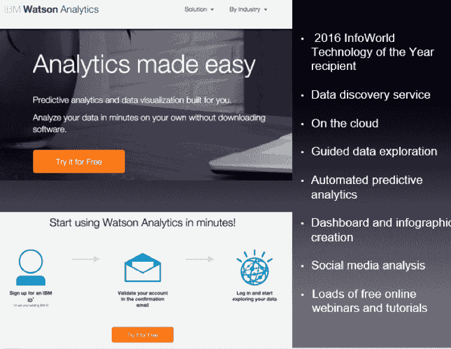
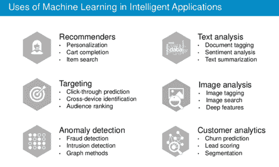
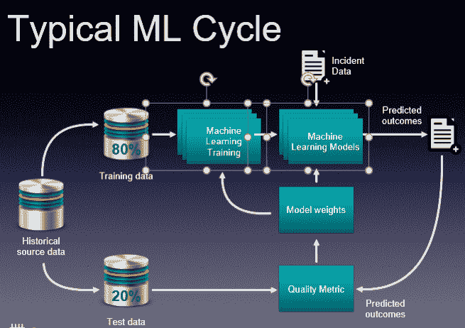

# 云中的数据科学行业视角

> 原文：<https://devops.com/data-science-industry-perspectives-cloud/>

原则上，云正在成为一种商品。谷歌、亚马逊和其他公司正试图将几乎所有东西商品化，包括用于数据收集、数据存储和数据转换的工具。从近期来看，我们应该期待今天过于复杂的平台工程会变得更加简单。

然而，随着数据工程的出现，这种简化在不久的将来的前景并不明朗。目前，甚至对于 ETL(提取转换负载)也没有单一的简单解决方案，例如 Amazon 数据管道或 Amazon Glue(尚未完全发布)。它们代表了人们现在一砖一瓦建立起来的一些非常简陋的开端。数据工程师、建筑师和其他专业人士正在构建这些工具来解决现实生活中的问题。

从数据科学的角度来看，新的机器学习即服务解决方案就像雨后春笋般涌现。市场上有很多这样的软件:Big ML、Data Robot、Azure ML、Amazon ML、IBM Watson、Google Prediction 等等。但是什么是机器学习即服务(MLaaS)？

让我们以 IBM Watson Analytics 为例:

 MLaaS 是一组预设的向导，用于创建机器学习模型，并通过 API 使用这些模型。例如，我们需要识别文本，并从中分离出一些事实和数据。要做到这一点，我们只需点击几次就可以启动服务，插入原始文本，然后得到一个标记出来并经过分析的副本。在这种情况下，该服务将 NLP(自然语言处理)商品化。VTT 也是如此(语音到文本):我们插入一个音频文件，得到文本版本的对话。

机器学习技术还有其他用途:

机器学习与数据紧密合作。但是拥有数据是一回事，拥有可以帮助用户的可操作数据是另一回事。如图表所示，上面的一个主要趋势是数据服务的商品化。

这些基本服务做了它们应该做的，这很好。你不需要雇佣数据科学家来完成这些任务。但如果你是一家像 Grammarly 这样的公司，其专业知识在于实际的文本识别、提供推荐和文本分析，那么现成的服务是不够的。从语法上来说，像这样的公司必须采取一种非常昂贵的实践方法。这是他们的核心业务，使用第三方服务是不可行的。

那么你将如何使用 ML 云服务呢？

即使考虑到大量的“即服务”解决方案，主要的挑战也在于导航和理解“什么更好”、“什么是最好的”以及“它们是如何工作的”问题是这种服务是不断变化的。对你来说，最好的选择可能是使用工具-咨询服务。必须了解现在有哪些工具可用，以及哪些工具最适合您的业务。这是你可能需要的最基本也是最重要的帮助。

其次，将您的操作与这些服务集成需要特殊的工程工作。事实上，目前大多数数据科学任务都是通过这些云“即服务”解决方案解决的。但是拥有一个有强大工程背景的合适的咨询公司可以帮助你更好地利用这些现成的解决方案。他们以更快的速度为企业创造价值。没有必要发明轮子，尤其是当你的顾问知道用什么和在哪里用的时候。

如果你决定去一家大部分员工都是数据科学家的数据科学公司，他们会为你创造一些独特的天才定制解决方案，进行伟大的研究等等。这是他们擅长的。这是他们的面包和黄油。

端到端咨询公司可能是您公司的更好选择，因为它的目标是为您的业务带来价值。顾问将告诉你 MLaaS 解决方案是否适合你的机器学习需求，并对这些服务如何工作有深刻的理解。咨询公司还应该创建和构建适当的架构，并为您的业务提供定制开发工作，这是您的服务所独有的。

最后，如果你打算发展业务，进化是关键。从现成的解决方案开始，然后及时切换到可以在一组数据科学家的帮助下完成的内部解决方案。

## 关于作者/斯坦尼斯拉夫·伊瓦先科

Stanislav Ivashchenko 是 T2 SQUADEX 公司的高级开发顾问。作为一名认证的 AWS 解决方案架构师，他在构建、交付、支持和优化广泛的软件应用程序方面经验丰富。从裸机到云，从整体架构到微服务，他帮助初创公司、中型公司和大型企业改进软件交付流程。他在协调各种 DevOps 和基础架构相关工具、服务和管理实践方面拥有扎实的技能。在 [LinkedIn](https://www.linkedin.com/in/stanislav-ivaschenko-4b830a2/) 上与他联系。