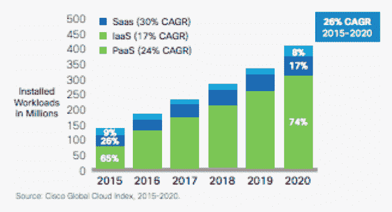

# 应用程序开发:加密的时机已经成熟

> 原文：<https://devops.com/application-development-encryption/>

随着企业寻求加速应用创新并将越来越多的工作流迁移到云，他们的需求可能会与保护数据的需求相冲突。本文将概述应用程序开发人员当前在这种新的云/DevOps 环境中保护数据所面临的挑战。它还将提供关于如何消除 DevOps 团队负担的见解，同时显著提高存储在云数据库中的数据的安全性。

## 云迁移

企业希望加快应用创新，将更多工作流迁移到云中。思科的全球云指数预测，2015 年至 2020 年间，云工作负载将增长 26%。随着这一趋势的加速，IT 项目负责人越来越多地遇到审计和法规遵从性要求，这些要求阻止敏感数据传输到传统安全边界之外。云的巨大优势包括能够获得无限的基础设施可扩展性、快速建立和拆除以及因规模经济而获得成本优势，这使得这一趋势无法遏制。

## 云时代的应用程序开发挑战

随着应用程序迁移到云，应用程序开发人员正在使用微服务来加速应用程序开发，因为微服务大大减少了开发时间，并帮助他们专注于他们的关键价值主张，无论是打车还是预订住宿。包括 Twilio 和 Braintree 在内的微服务公司的成功证明了将呼叫、消息和支付处理等非核心功能委托给领域专家的好处。

令人惊讶的是，当涉及到像数据安全这样的关键问题时，企业仍然将负担留给应用程序开发人员。这使他们无法专注于业务目标，因为他们担心安全问题，如如何最好地加密数据以及何时更改加密密钥，这些问题最好由安全领域专家来处理。

## 保护云工作负载

事实证明，加密并不容易整合到企业工作流中。加密应用程序数据可以防止数据库处理它。然后是管理密钥的问题，密钥可能会丢失或过期。随着控制问题的出现，加密云工作负载带来了一系列全新的挑战。如果云供应商可以获得这些密钥，那么是什么阻止了他们被政府以国家安全为由传唤解密数据呢？除此之外，从本地数据库迁移到云也很复杂，而且不会给数据带来风险。

## 实际的方法

解决这一问题的实用方法是使用现有的加密解决方案，这些解决方案可随时提供敏感数据的检测、分类、策略实施和监控。这些解决方案可以在列级保护应用程序数据，但可以轻松集成到现有的企业工作流中。应用程序开发人员可以根据数据分类矩阵识别敏感数据，敏感数据在插入数据库时会自动得到保护。使用现有的加密技术，这些数据甚至可以在不解密的情况下进行处理，从而确保最高级别的安全性。

## **关于作者/ Ameesh Divatia**

Ameesh Divatia 是全球首个端到端数据库加密解决方案开发商 [Baffle](https://baffle.io/) 的首席执行官和联合创始人。Ameesh 是一位连续创业者，拥有将创新理念转化为成功业务的记录。在 [LinkedIn](https://www.linkedin.com/in/ameeshd) 上与他联系。