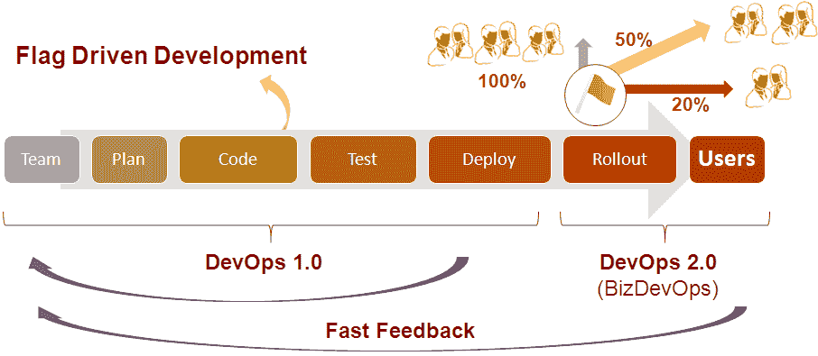
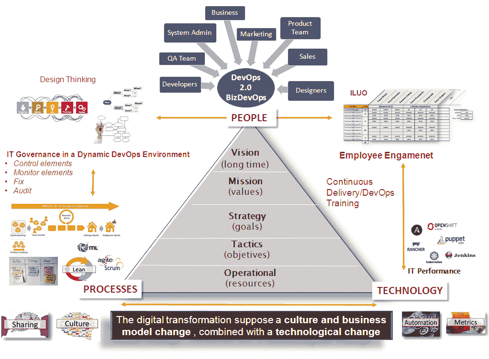

# 面向数字化转型的 DevOps 2.0

> 原文：<https://devops.com/devops-2-0-digital-transformation/>

我们已经知道 DevOps 是一种文化，一种运动，一种软件开发和交付的哲学。它专注于整个组织的沟通、协作和持续集成——这是一个软件开发的新概念，采用起来并不容易。它旨在通过消除开发人员和 It 运营团队之间的障碍来简化软件交付。它还旨在减少流程的低效，采用新工具，甚至提出业务架构的变更。

敏捷实践允许开发团队更频繁地迭代交付，等等。在 DevOps 中，整个流程周期是自动化的，以实现持续集成和持续部署(CI/CD)。测试和安全团队遵循端到端策略，自始至终参与其中。同时，根据精益原则，我们从整个流程中剔除了没有附加值的部分。因此，it 获得了更高的生产率、最大的价值和上市时间的改进。

谈论 DevOps 就是思考技术、模式和良好的实践。它将帮助我们为我们的组织提供一个高效的软件架构——一个基于微服务的架构，具有一切即服务的理念(XaaS)。我们谈论的是容器、自动化、弹性、自我扩展、代码、监控、配置管理等基础设施、自我维持和适应性强的系统和生态系统，所有这些都允许我们通过快速、可靠和频繁的开发来交付价值，更不用说零停机时间，当然还有撤销更改的能力。

## 我们如何准备满足用户的期望？

DevOps 旨在帮助组织快速生产软件产品和服务。但是终端用户的要求越来越高。我们必须使用允许我们更快地向生产环境交付功能性产品的技术，从而降低相关的风险。

目前，与几年前相比，我们面对的用户在动态和交互体验方面拥有更多的技术知识和更高的期望。这已经发展并产生了一个新的版本，称为 DevOps 2.0 或 BizDevOps(业务、开发和运营)。

作为运动的起源，DevOps 1.0 专注于运营团队向开发团队和 SQA 团队提供持续的反馈。然而，DevOps 2.0 现在专注于将反馈的好处扩展到整个组织(营销、销售、产品等)。).这将有助于更好地适应 IT 繁荣和数字化转型(物联网、智能平台、大数据等)。).DevOps 2.0 的额外好处是更快的连续软件交付，而不损害生产中系统的稳定性。

## **切换功能或功能标志**

此时，关键是使用有助于分离新功能的软件交付的技术。换句话说，它是基于业务规则而不是运营团队，使这些新功能对最终用户可用。这个想法是，例如，市场和销售部门可以使用“标志”来决定何时向最终用户发布或启用新功能。它将允许我们更频繁地在生产环境中部署新功能，而无需向最终用户提供这些功能。这消除了生产环境中日常部署过程产生的“恐惧”。在 DevOps 2.0 中，这就是所谓的首次展示。

使用这种简单的开发最佳实践，称为标志驱动开发，我们并没有为 100%的用户提供新的功能。它将分阶段交付，从 1%的用户开始，然后是 10%，然后是 30%，等等。当事情没有按预期运行时，能够快速启用或禁用该功能。此外，它允许我们为不同类型的用户提供不同版本的功能(客户细分)。有几个 SaaS 模型和开源解决方案，我们可以用来实现这种类型的技术，如功能标志，切换或控制。

## DevOps 2.0 技术有什么好处？

在开发过程中使用这种类型的技术有以下好处:

*   快速缩放
*   系统的稳定性
*   应用程序的完整性不会受到损害。

这样，在任何生产环境中，我们都成功地降低了与每个新功能交付相关的风险。业务涉众可以控制新特性何时对最终用户可用，最终用户不断要求新的变化和改进。

对于组织而言，DevOps 2.0 将为营销、设计、销售和业务等非技术团队带来 DevOps 力量。现在，所有团队都将拥有 DevOps 文化中所需的技能和职责。它增强了信心、沟通和反馈，这是 DevOps 战略中所有团队所需要的。

因此，DevOps 2.0 方法的主要支柱之一是能够通过控制面板界面控制生产环境中应用程序新功能的启动。这个过程将由技术人员和非技术人员以受控的方式启动。此外，该过程将与开发和持续部署分开。

同时，这种类型的编码技术将允许执行实时分析，对系统的功能进行改变，这也可能影响应用性能监控(APM)工具。这使得可以确定何时特定功能会降低全局系统性能并需要快速禁用，以及确定哪些功能正在改善最终用户体验(UI/UX)。

有很多关于这些“快速反馈”实践的文章。我希望这篇文章能帮助您更好地理解 DevOps 对您的组织的潜在影响。

## **关于作者/赫苏斯·佩雷斯·佛朗哥
**

Jesús Pérez Franco 是 T2 Gfi 公司的运营经理。他最热衷的是敏捷开发和 DevOps Continuos 交付(持续集成、部署、QA 自动化和基础设施代码等)。).在 [Twitter](https://twitter.com/jpefranco) 和 [LinkedIn](https://www.linkedin.com/in/jpefranco/) 上与他联系。