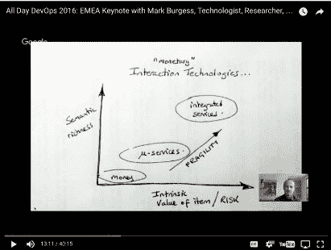
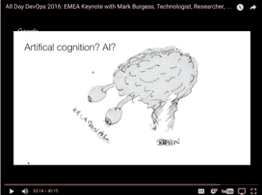

# DevOps:信任、义务和承诺

> 原文：<https://devops.com/devops-trust-obligations-promises/>

马克·伯吉斯( [@markburgess_osl](https://twitter.com/markburgess_osl?lang=en) )是一名理论物理学家，但在他在 [2016 年全天 DevOps 会议](http://www.alldaydevops.com/?__hstc=31049440.5c975bf4c2f7d75bed4a82ecdebc1a21.1488814769496.1494422979332.1494427200398.31&__hssc=31049440.4.1494427200398&__hsfp=20068296)的主题演讲中，他更多地谈论了经济学和人类互动，而不是物理学。作为 DevOps 会议的主题演讲，这两者之间有什么关系？

好吧，再介绍一下背景，Mark Burgess 也是配置管理和自动化框架 [CFEngine](https://cfengine.com/) 的创始人和前 CTO，并且是《承诺理论》的作者。在 CFEngine 工作时，Mark 致力于应用软件中自主代理如何相互作用的理论。许诺理论诞生了。

## **探索承诺理论**

许诺理论与义务理论背道而驰。义务理论在假设人们(或代理，在软件的情况下)根据他们遵守规则的义务选择行为的基础上看待人类的交互和行为。代理有义务采取某种行动。承诺理论认为，遵守规则的愿望是自愿的，代理人只能对自己的行为负责，而不是对其他代理人的行为负责。

在他的演讲中，马克开始关注我们社会中的人类行为和趋势。例如，随着技术的进步，我们对彼此的需求在减少，尽管我们通过交流的相互依赖性在增加。例如，我们的智能手机使我们能够在没有他人直接互动的情况下做几乎任何事情。

看看社会中的互动，信任是我们交流、工作社区和社会功能的基础。他认为，“承诺是意图的来源，所有的承诺和观察者都可以通过它来校准他们的期望。”金钱就是一个例子。金钱没有内在价值，但我们使用它，因为我们相信支持者会支持它的价值，而且它比以物易物更方便。他解释说，在旧的货币经济中，银行和政府是信任的提供者；在新的服务/IT 经济中，服务提供商是信任的基础。

## 代理商如何做出承诺

你如何建立这种信任？进入承诺理论，它描述了代理如何相互做出承诺，以及这如何导致他们之间的信任。马克概述了承诺理论的“成分”:

1.  代理人和超级代理人在一个等级体系中作出承诺。
2.  一个代理永远不能对另一个代理的行为做出承诺(只能是自己的)。
3.  代理人的承诺不需要被其有意或无意的接受者接受或使用！
4.  代理人做出自己的估价:你拥有的东西只值别人愿意给你的价钱。
5.  依赖使承诺无效。

理解这一点的核心是，你必须理解协作是由语义、单词的含义和动态组成的:所有事情是如何工作的。我们不断增长的服务经济正推动我们走向语义爆炸，因为文字比机械更重要。作为一个例子，马克描绘了新旧经济中承诺依赖的等级。看看旧经济，我们有更多的动态货币，其层级是:

零售→货币→银行→央行→政府。

在新经济中，我们有更多的语义服务，层次结构是:

客户→网络可用性→提供商→互联网管理机构→公司/服务机构。

## 合作的必要性

从根本上说，没有合作，这些系统都无法运行。因此，生产是生产者和消费者之间的一个认知过程，也是这些组织内部的代理人之间的一个认知过程，他们必须相互作用。我们经常创建管道来描述这些交互，但是系统内的相互依赖关系通常比管道能够建模的要复杂得多。

这只是冰山一角。马克有三本书详细探讨了这个问题:“在承诺中思考”、“寻找确定性”和“承诺理论”

最后，马克提出了一个观点，即技术在将我们结合在一起和将我们分开两方面都做得很好。我们需要小心，不要让自己脱离我们创造的系统，否则我们可能会让自己消失。

## **DevOps.com 支持全天 DevOps 会议**

如果这激起了你的兴趣，你可以观看马克的全天 DevOps 会议(只有 40 分钟)。届时，您可以在线免费观看 2016 年会议的其他 56 个演示文稿。最后，请务必在此为您和您团队的其他成员注册 2017 年全天 DevOps 大会[。今年的活动将提供 96 场由从业者主导的会议(不允许供应商推介)。它于 10 月 24 日免费上线。DevOps.com 是 2017 年全天 DevOps 的媒体赞助商。](http://www.alldaydevops.com/?__hstc=31049440.5c975bf4c2f7d75bed4a82ecdebc1a21.1488814769496.1494422979332.1494427200398.31&__hssc=31049440.4.1494427200398&__hsfp=20068296)

— [德里克·威克斯](https://devops.com/author/derek-e-weeks/)