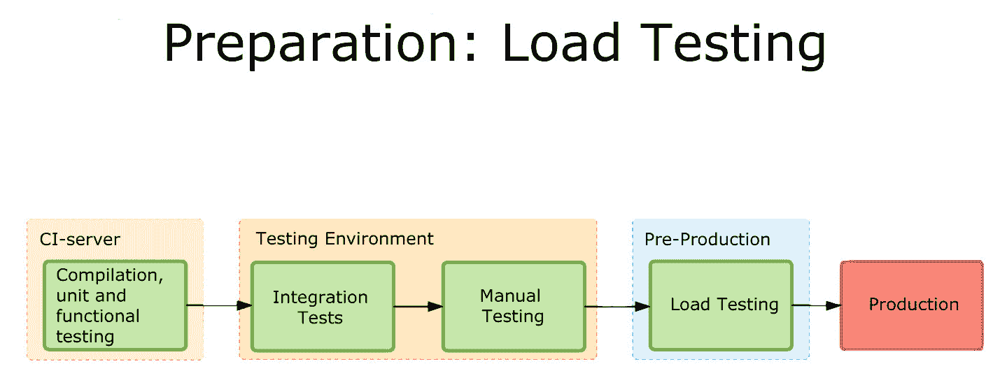

# 一个团队的微服务之旅和 CD 成长

> 原文：<https://devops.com/one-teams-microservices-journey-cd/>

开发经理 Vadim Madison 出版了一部[编年史](https://kukuruku.co/post/microservices-in-a-high-load-project/)，讲述了他的团队从单一应用程序向微服务模型的转变。在这个过程中，他们用于持续集成/持续交付(CI/CD)的工具和方法必须被扩展，甚至在几个阶段中被改变。这是一个很长的阅读，但随着时间的推移，因为没有多少人记录完整转换的情况。

他的工作中更有趣的一部分是他们必须建立的软件基础设施，以覆盖应用程序的 CI/CD/监控。这比原来的应用程序要复杂得多，而且必须对其进行管理。DevOps 的好处之一是使这些工具的管理更容易，他确实谈到了编写脚本和实现 API 以从池中取出问题实例，并确定哪里出错了，以便它们可以再次经历 Dev/CI/CD 周期。

One of the graphics showing integration.

有趣的是团队发现了局限性并中途更换了工具。这是一个过程，Madison 在最后暗示了他们已经开始消除 TeamCity(或者至少限制他们使用它的目的)的事实。我认为，当大多数人开始进行高速开发操作，甚至是持续监控的低速开发操作时，他的团队遇到的一些项目会逃过他们的注意，直到他们发现一个问题。架构的发展将会发生——你将会自动化更多，构建更多，监控更多，发布更多。问题是，你看得有多远？直到最近，答案几乎是“不远”，因为我们没有像麦迪逊那样的案例可以借鉴，也没有看到与我们正在做的事情有相似之处。但这种情况正在开始改变。

当然，CI/CD/ARA 供应商可以提供帮助。总的来说，他们有很多关于地形的知识，以及人们如何使用工具来解决新架构的需求。但是更多像麦迪逊这样的公开文件也是很好的。

即使您正在以快得多的速度前进，向前看并增加在 CI/CD/ARA 空间中采取的步骤可以提供额外的弹性，并且在适合您的项目成熟度的级别上进行监控可以增加额外的“我们知道，我们可以恢复”的内容有一些引人注目的失败是由监控指示的，但是通过监控的数据流量足以掩盖它。如今，最好的解决方案是在适当的级别进行监控，然后将监控反馈到系统中。

但是您将支持更多的软件基础设施。工具的增长是不可避免的:当您将功能扩展到机器/实例/容器时，您将需要将 CI/CD/ARA 工具扩展到多个相互关联的目标，并监控整个系统及其性能瓶颈。目前，所选择的工具并不总是广为人知的，所以让新的 Dev/DevOps 团队成员快速熟悉更模糊的工具的过程应该在你的待办事项列表中。

唐·麦克维蒂