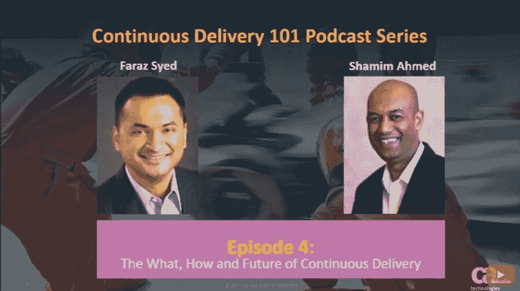

# CD 101 播客:持续交付的内容、方式和未来

> 原文：<https://devops.com/104709-2/>

既然我们已经到了 CD 101 播客的第 4 集,让我们来谈谈一些基本概念——比如这一切是什么、如何以及未来。

等等……也许我们可以——或者应该——早点触及这些关键话题。或者不是。至少不是未来的部分？无论如何…

虽然这种(大部分)向后看的取向可能看起来有点奇怪，但我认为我们实际上是在正确的道路上导航对话。让我们倒回去看一下我们从哪里来。

**第 1 集:**我们强调了这个叫做 CD 的东西的许多[基础，但是我们更多的是从概念和最佳实践的角度来做的。虽然所涉及的想法和过程确实会在现实世界中引起共鸣，但随着 CD 在实际应用中的增长，我们在这一集中讨论的主题更接近于我们听到的水冷器对话。](https://devops.com/welcome-continuous-delivery-101-podcast/)

**在第 2 集:**我们讲述了整个[你如何“实现敏捷性”](https://devops.com/cd-101-podcast-episode-2-agile-enterprise/)的对话片段。这是重要的，也是其他一些基本问题的前奏。数字化转型的整个过程始于变得敏捷，如果不这样做，你就无法真正采用持续交付；因此，这是为今天的讨论提供素材的另一个好地方。

**在第 3 集:**我们看到了[用敏捷开发和持续交付重新发明“现代软件工厂”](https://devops.com/cd-101-podcast-build-modern-software-factory-agile-development-continuous-delivery/)的前景。好了，也许我们在这里有点超前了，但我坚持认为这是一个需要提前考虑的重要部分，它建立在其他构件的基础上。与第 2 集中涉及的主题一样，在动手之前，理解全局挑战和好处是至关重要的。

现在来看看一些细节。

在[第 4 集](https://www.youtube.com/watch?v=u_5F-SDSlrw&t=13s)中，我们听到 CA Technologies 的持续交付解决方案首席技术官 Shamim Ahmed 回答了他在与希望在现实世界中采用 DevOps 和持续交付实践*的企业实践者交谈时最常听到的九个紧迫问题*。

因此，虽然之前的这些对话很重要，但在您调用自己的策略时，这是一组需要考虑的重要主题，包括:

1.  DevOps 和连续交付有什么区别？
2.  在 CD 中实现速度/质量的主要障碍是什么？
3.  我们如何克服这些障碍？
4.  我们如何开始裁谈会之旅？
5.  您希望在 CD 计划中跟踪哪些关键的顶级指标？
6.  为了实施 CD，我们需要对组织进行哪些变革？
7.  我们需要实现哪些关键功能？
8.  我们如何整合我们环境中所有不同的工具？
9.  持续交付的[未来会如何演变？](http://blogs.ca.com/2016/12/21/three-continuous-delivery-predictions-2017/)

好吧，最后一部分对我们来说更像是假设——尽管我们喜欢从实际的角度思考，基于对所有其他重要的现实世界采用动态的回答。

收听并希望能学到很多关于你的方法的优点和需要改进的地方。

一如既往，您可以通过以下方式找到《持续交付 101 播客》的第 4 集:

*   在你的电脑上的 YouTube 上听它
*   从 [iTunes 商店](https://itunes.apple.com/us/podcast/continuous-delivery-101/id1149114223?mt=2)下载
*   通过搜索“连续交付 101 播客”通过播客应用程序下载

尽情享受吧！

——[斯科特·爱德华兹](https://devops.com/author/scott-edwards/)