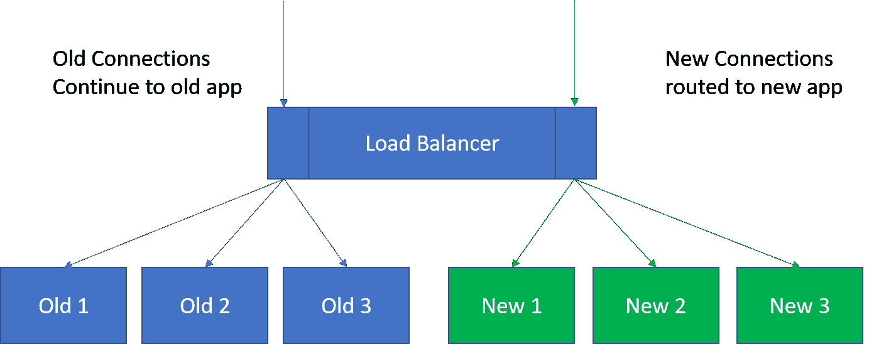

# 在蓝/绿部署中使用负载平衡

> 原文：<https://devops.com/using-load-balancing-bluegreen-deployment/>

自动化部署过程的最大痛苦之一是最后一步，当每个人都同意是时候将累积的变更公之于众了。在这个过程中，系统会崩溃，用户会突然发现自己被切断了。为关闭期安排这样的更改可能是有用的，但是“关闭期”很少是“没有用户受影响”的时期。DevOps 的目标之一应该是最小化对用户的影响，因为重点是使事情更加可重复和一致。蓝/绿部署是为了使持续交付(CD)的最终推广步骤更加顺利而引入的流程之一。

据我所知，这个过程首先是由 Jez Humble 和 David Farley 在《持续交付》一书中提出的，建议您拥有两个互为镜像的环境——一个测试环境和一个生产环境。然后，到了发布的时候，路由器被更改为将用户发送到“测试”环境，实际上，它变成了产品。这种简单化描述的问题是，在“切换”时，系统中的每个人都是“隔离的”，因为新系统不知道他们在做什么。这对用户来说不是最好的解决方案；事实上，这是彻头彻尾的破坏性。

## 比如负载平衡停顿

这与我谈论的使用负载平衡的事情并没有太大的不同，并且 [F5 Networks](https://www.f5.com/) (我从那里得到这个想法)已经谈论它有一段时间了。您可以告诉一个好的负载平衡器停止向池中的服务器 X 提供连接，让它稳定下来，然后退出服务进行维护。同样的技术可以用来说，“让现有用户结束他们现有的连接，但是不允许到这些服务器的新连接”，将所有新的连接/用户定向到新的部署，同时不丢弃可能正在做某事的现有用户的连接。

现在，在负载平衡中，您必须考虑在任意结束会话之前允许用户保持连接多长时间，但是在 REST APIs 的世界中，这没有在更长时间的客户端-服务器风格的连接中那么重要。不过，最终，每个人都必须被迫接受新系统，这必须有一个明确的界限。那时，只需在负载平衡器上进行切换，并将旧的生产系统从池中取出，就会迫使用户连接到新的系统。

## 它也适用于 A/B 测试

类似的过程可用于在子集上试验新特性。一旦有了负载平衡器，并且您知道要测量什么来确定用户是否喜欢某个新特性，负载平衡器后面的一两个实例就可以启动并开始接受连接。负载均衡器会自然地开始使用这些服务器，很快您就会有一部分用户看到新的特性，而大多数人会愉快地继续使用旧的特性。测试完成后，就可以决定是用新代码撤销服务器/实例，还是将池中的所有服务器都转移到新代码。

总的来说，随着您的组织进入 CD 下更频繁的版本，将需要提供更少的部署中断。寻找蓝/绿部署之类的解决方案，尽可能使这些版本不造成中断。

唐·麦克维蒂