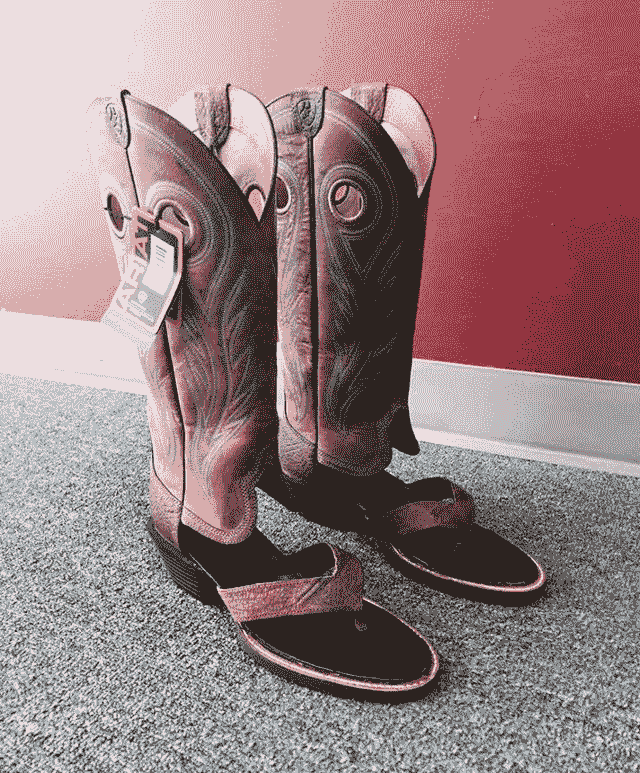

# 靴子和凉鞋:了解市场

> 原文：<https://devops.com/boots-sandals-know-market/>

靴子和凉鞋基本上是一样的——在你四处走动时保护你的脚。问题是它们的目的略有不同。你不会在威斯康辛州的隆冬穿凉鞋出门，也不会在休息日穿靴子去海滩闲逛。事实上，靴子和凉鞋已经存在很久了，在特定的环境下衡量它们各自的优点是相对简单的。DevOps 工具就不一样了。

Cowboy Boot Sandals.

*每隔几年就会有新闻报道说有人发现*在零下的天气里只穿着*凉鞋，这并不常见，它们出现在新闻中是有原因的。

## 变动率

DevOps 市场的成熟速度是很少有企业能够跟上的。当开发过程和操作过程都在变化时，新的工具被引入，两个团队越来越多地协同工作来支持业务，然而另一个市场空间不是他们想要研究的，而工具链中的另一个工具也不是他们想要“突然出现”的东西

但是 DevOps 空间还很年轻，有很多东西可以帮助实现这些目标。在过去的几个月里，我有理由研究应用程序发布自动化(ARA)、云安全审计和全局文件系统(GFS)，这三者都在帮助 IT 适应和自动化方面带来了一些东西。问题是，在每种情况下，市场都有点混乱。ARA 必须解释为什么它比 Jenkins 单独做得更多，云安全审计必须解释为什么它比调用云供应商 API 来完成相同的任务更好，GFS 必须解释为什么它不仅仅是云存储网关，以及它如何帮助企业。

他们可以。但是在考虑它们的时候，你需要做研究，弄清楚这个市场，以及这个市场如何适用于你的组织。这有点不幸。随着时间的推移，DevOps.com 和其他网站可以通过谈论这些工具来提供帮助，供应商自己的宣传页面可以帮助你了解他们正在填补什么空白，但这是跑腿工作(尽管在许多情况下，跑腿工作是值得的)。例如，ARA 将应用供应工具与 CI 工具结合在一起，提供了统一的工作流程。并且它使部署过程更加敏捷。如果您正在运行许多定期(不是每小时甚至每周，而是定期)部署的项目，并且有一天您可能希望将它们部署到不同的环境中，ARA 可以提供帮助，加上它提供的大量其他功能，桥接 DevOps 硬币的两面可能是它最大的驱动力。对于我提到的其他两个工具集，同样类型的事情也是可能的，但是为了保持足够短以便阅读，所以将把它留给那些对 GFS 或云安全审计感兴趣的人来研究。

## 关键是知道为什么和哪一个

最后，如果您正在构建 DevOps，您希望尽可能地自动化这个过程。这意味着随着市场的成熟，你会想要探索新事物。这些工具可以帮助许多组织提供更顺畅或更安全的流程，但了解市场存在的原因是第一步，只有这样才能决定是否要评估产品。它们并不能为所有客户提供帮助，因此了解哪些工具适合您(例如，如果您是一个没有云的办公室，则不需要 GFS 或云安全审计),将有助于您缩小工具集的范围，从而改善开发运维工作。

无论你做什么，不要买它的“凉鞋牛仔靴”。它*可能*看起来不错，但是在它的两个目标环境中都不会很有用。😉

唐·麦克维蒂