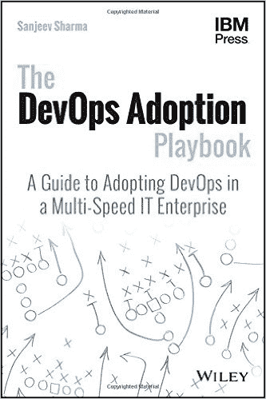

# DevOps 聊天:Sanjeev Sharma 的“DevOps 收养剧本”

> 原文：<https://devops.com/devops-chat-devops-adoption-playbook-sanjeev-sharma/>

 在最近的 IBM 互联大会之前，我有机会坐下来和 IBM devo PS 采用首席技术官 Sanjeev Sharma 聊天。我和桑吉夫谈过很多次，他是《DevOps.com》的撰稿人，也是《傻瓜的 DevOps》的作者桑吉夫出了一本新书，名为“[《devo PS 领养手册》](https://www.amazon.com/DevOps-Adoption-Playbook-Multi-Speed-Enterprise/dp/1119308747/ref=sr_1_1?ie=UTF8&qid=1491268331&sr=8-1&keywords=devops+adoption+playbook)”

没有不尊重“傻瓜的 DevOps”书，剧本是在一个完全不同的水平。这本书不仅代表了 Sanjeev 多年来的学习成果，也代表了整个 IBM，以及他在此期间所学习的 DevOps 中的一些知名人士。

“DevOps 采用行动手册”为 DevOps 制定了明确的“如何做”,包括价值流映射、如何引领文化转型以及将 DevOps 扩展到企业等主题。正如 Sanjeev 自己所说，这本书从他开始的最佳实践开始，试图吸收他所学到的一切。

Sanjeev 也忠于“剧本”范式。他自始至终都提到板球、足球和其他运动。这是一本很好的读物，组织得很好。正如我告诉 Sanjeev 的，在一个充满“是什么”的领域中，“DevOps 收养剧本”是一个“如何做”的剧本。我强烈推荐。

像往常一样，下面是我们对话的音频流，下面是我们对话的文字记录。

[https://w.soundcloud.com/player/?url=https%3A//api.soundcloud.com/tracks/315165721&color=ff5500&auto_play=false&hide_related=false&show_comments=true&show_user=true&show_reposts=false](https://w.soundcloud.com/player/?url=https%3A//api.soundcloud.com/tracks/315165721&color=ff5500&auto_play=false&hide_related=false&show_comments=true&show_user=true&show_reposts=false)

艾伦·希梅尔:大家好。我是 DevOps.com 的艾伦·希梅尔，我是来参加另一个 DevOps 聊天的。今天 DevOps Chat 的嘉宾是 Sanjeev Sharma，他是 DevOps 的作者和 IBM 的 CTO DevOps。桑吉夫，欢迎。

谢谢你，艾伦。很高兴再次与您交谈，我很高兴参加这次 DevOps 聊天

绝对的。Sanjeev，你当然是 IBM 的首席技术官 DevOps Solutions，对吗？

**Sharma:** 确切的名称是 CTO DevOps Adoption，这并不重要，只是一个术语。我面向客户，与世界各地的客户合作，帮助他们采用 DevOps，当然主要关注 IBM 解决方案。

除此之外，Sanjeev，当然你也是两版《傻瓜 DevOps》的作者，这两本书非常成功地向世界介绍了 DevOps 的概念，当时 DevOps 还不像现在这样出名。正确吗？

对，是的。很难相信那本书已经问世多年了。我们取得了巨大的成功。伯尼·科因和我合著了第二版。我们更新了它，它非常成功。这本书出版的时候，人们大多在问这样一个问题，“DevOps 是什么，它对我意味着什么？”这就是那本书的目标。这是一本非常短的书。一个小时，一个半小时就能看完。这就像是一个虚拟版本，非常简短扼要。

**希梅尔:**是的。但实际上，Sanjeev，我想和你谈谈你刚刚通过 Wiley 和 IBM 出版社出版的新书，书名是《DevOps 采用行动手册:在多速 IT 企业中采用 DevOps 的指南》Sanjeev，我已经读了这本书，对我来说，这代表了你在过去几年中积累的所有经验和知识的顶点，帮助世界各地的组织履行他们的职责。这样说公平吗？

当然，但我想更进一步说，这不是我的知识和经验，我的知识和经验相当广泛。我确信我和世界上几十个客户合作过。我没有统计过，但他们中的一些人在多年的 DevOps 收养之旅中非常亲密。

但正如您将在本书的致谢部分看到的，这也是我在与 IBM 的同事交谈时获得的知识，与像您和其他业务合作伙伴、我们在 DevOps 行业的追随者和同事以及我们的客户交谈时获得的知识，因为我没有全天候与他们一起携带贸易工具、实施 DevOps 以及进行技术、政治和业务斗争。他们正在这样做，我通过观察他们成功或在某些情况下跌倒，然后和他们一起想出如何绕过他们面临的障碍来学习。因此，我非常感谢这些年来和我一起工作的所有人，包括我们的客户，把这本书的内容整理出来。

绝对的。桑吉夫，你太谦虚了。你和几十个 DevOps 人一起工作过。但在这个角色中，如你所说，你与 DevOps 运动中的许多思想领袖互动过，如果我们可以这样称呼他们的话。

更重要的是，当你看这本书的时候，我对这本书说过的话和我写的书评，是在一个充满“是什么”的书的世界里，你的书是一个“如何做”的书我认为这是一个重要的提醒。我们读了太多关于 DevOps 的书，这些书试图定义 DevOps 是什么，试图把你的手指放在“这是 DevOps”这条狡猾的鱼上，你在第一章的右边花了一些时间。我们对 DevOps 做了一点回顾，但是你要花更多的时间在实用的 DevOps 建议上。

这本书是你的主意吗？是什么驱使你写这本书？

当然，艾伦。如果你把这本书看做是一本“如何做”的书，而不是一本“做什么”的书，那么我已经成功地把我的信息传达出去了。坦率地说，这本书就是这么来的。大约两年或 18 个月前，当我与我们的客户一起工作时，问题开始发生变化。人们不再问我们，“DevOps 是什么？”他们问我们，“我如何收养 DevOps？你看到其他人在做什么？当你与那边的银行、医疗保健公司、电信公司、零售商合作时，我能从你的经历中学到什么？你在战壕里观察到了什么？”

我开始整理一套幻灯片。这就是这本书的出发点，作为成功的一部分的最佳实践的幻灯片。事实上，去年在 InterConnect，我和我的同事 Lee Reid，他实际上是这本书的技术编辑，我们做了一个演示，我们称之为“DevOps 采用战术手册”，这就是我想要的，这本书是一个战术手册，人们可以阅读它，或者他们可以了解它，然后根据他们面临的情况，选择一个战术，就像美式足球中的教练或队长或四分卫一样。他可以阅读并得到一个想法，“好吧。我们需要上演这出戏，因为这是这里所需要的。”

所以这绝对是一本入门书。当然，在如何让企业相信 DevOps 是为了做一个商业案例的问题上，这本书有一些战略方面的内容。正如它的名字所暗示的，这是一本关于如何在一个大型组织中进入并采用 DevOps 的剧本。

首先，这本书可以在亚马逊和其他传统书商网站上买到。正确吗？

绝对是。这是我的第一本零售书。你提到的第一本书《傻瓜 DevOps》是我们免费赠送的，由 IBM 赞助。所以对我这个作家来说，当这本书出版时，我知道它会上市，我做的第一件事就是开车去最近的巴恩斯&书店，它实际上离我家有 15 英里，只是去看看书架上的书。所以是的，它在所有主要的书店都有售，既有实体书也有电子书。

**Shimel:** 我来问一下，我想我大概知道答案。你有没有拍一张照片，一张你和你身后书架上的书的自拍？

我也想这么做，但是这本书摆的角度很尴尬，所以我没法看进去。所以我就拍了一张这本书和其他书放在一起的照片。而且，你知道，把相机给别人就不是自拍了。这是在中午。他们不让任何人进书店。这真是太搞笑了。我希望我录下了整个过程。

非常酷。桑吉夫，人们可以得到这本书。他们可以亲眼看到你。此外，我会提到，这是一本书，如果你有什么具体的东西要钻研，一个特定的问题，问题，你想深入研究的主题，目录和它的布局方式使它非常容易做到这一点。所以你可以用它来定位你要找的东西，或者你可以把它作为整本书的概述。不管怎样都很好。

夏尔马:谢谢。

**Shimel:** 但是，Sanjeev，书中有几个术语我很喜欢，其中之一就是你谈到的快速瀑布的概念。里面提到过几次，我也看到其他人提到过。

夏尔马:对不起。*【音频中断】*

Shimel: 我是在那里分手的吗？我道歉。

你能重复一遍吗？

Shimel: 当然可以。

夏尔马:对不起。

**Shimel:** Sanjeev，你说说这个快速瀑布的概念。你听到了吗？

是的，我做到了。谢谢你重复这句话。我们看到了非常广泛的成熟度级别和各种业务需求，我们与客户一起了解他们如何采用 DevOps。所以当我进入一个组织时，没有一个组织是铁板一块的。没有一个组织是同质的。你可以看到组织的一部分，没有任何东西被破坏，一切都很好，但是他们使用一种非常老派的瀑布方法来交付系统。**

所以问题是:你在那里做什么？您是否在维护期间中断了正在工作的东西，更多地尝试引入敏捷原则或尝试引入持续交付？或者你只是让他们提供的东西更有效率？

我在书中的论点是，你专注于优化。你看看输送管道。你做我们称之为价值流图的工作，看看哪里有浪费，哪里有瓶颈，并寻求消除或减轻这些，而不一定需要端到端的巨变来说，“不，你必须停止对你有用的东西。您的业务不需要您加快速度。您的业务不需要您更加创新，因为这是中的一个应用程序

-但你必须破坏它。"

要么全有要么全无的方法是行不通的。也很贵。那么我们如何让它更有效率呢？我不喜欢“快速瀑布”这个词。我想称之为“优化瀑布”。你专注于优化。是的，最终你的目标应该是转向完全敏捷。你的目标应该是转向持续交付，但是你不可能一天就做到。你不能同时在每个项目、每个系统和每个应用程序中做到这一点，但是你可以做一些事情来让每个人开始优化之旅。

对我来说，这就是我在书中提到的。开始吧。从你所在的地方开始。了解你的最终目标。但你不必以光速到达那里。你不必昨天就赶到那里，也不必一起赶到那里。你必须做出商业决策，决定引入多少变化，你能消费多少变化，以及此时你能承受多少变化。也许今天不行，也许只能明年了。这是对你真正准备做的事情背后的一些想法的总结。

**Shimel:** 明白了。Sanjeev，你提到了价值流图。这是我多年来看过你表演的一个工作坊，非常棒。如果有人有机会参加你的价值流研讨会，他们绝对应该参加。你能给我们一点点这其中涉及的概念吗？

当然可以。我要补充的是，价值流图作为一种练习并不新鲜。从上个世纪，可能是从 20 世纪 50 年代开始，它就在精益运动中出现了。这是一种技术，通过这种技术，您可以查看流程，并尝试找出可能存在浪费的地方，然后进行根本原因分析，以确定为什么会存在浪费，并制定减少浪费的计划。

因此，在 DevOps 中，如果您将您的交付管道视为一个价值流，需求从一端进入，代码运行和产品由用户使用，在另一端获得商业价值，我们做了一个价值流映射来查看浪费在哪里。因此，我们关注的是通过交付渠道的人工制品。

那些文物是什么？谁是接触那些工件并对它们执行操作的涉众，谁对它们进行处理？从一个利益相关者到另一个利益相关者的转变是如何发生的？当工件从一个涉众到下一个涉众时，它是如何被转换的？工件存在于什么环境或工具或存储库中，它是可消费的吗？

精益中有一个概念叫做完成百分比和可用百分比，它告诉我:当我得到一个工件时，我能把它作为 _____ 来消费吗？来自业务的需求可供开发人员使用吗？测试人员可以使用开发人员的代码吗？是否有导致浪费的手动任务？人们正在做的工作没有给产品增加价值吗？它们不像状态报告那样增加任何商业价值。它们有一定的价值，但是状态报告真的被用来改进产品吗？或者它们真的被使用是因为有些人需要一个视图，他们不得不花时间来创建这些报告，而不是有一个实时的仪表板，人们可以随便看看？

因此，一个价值流图练习，你所看到的是我们与客户进行的半天研讨会，我们进去拿他们的一个项目，做一个价值流图，以了解浪费在哪里。很多时候，实际上更多的时候，我们在一个部门或一个计划或一条业务线的水平上做，并为这条业务线寻找:价值流看起来像什么，瓶颈在哪里？废物在哪里？

然后，我们花一些时间对我们发现的每个瓶颈进行根本原因分析。然后，我们离开并带回来一份推荐的采用计划，其中包括我们建议的开发运维实践、功能和工具以及组织变革，以帮助缓解这些瓶颈。所以这是我们做的一个非常有力的练习。

在我的书里，有一整节都是关于它的。在 YouTube 上，如果你用谷歌搜索 DevOps 白板，你会发现我也在做一个模拟价值流图。有一个 30 分钟的视频是我和我的一个同事一起做的。因此，这是我们已经取得了很多成功的事情，我认为这是每个组织都应该做的事情。

**Shimel:** 我同意你的观点，我也看过视频。桑吉夫，我们快没时间了。我想暂时离开这本书，谈一谈互连。IBM 今年的互连将在两周后举行。我知道你会出现在那里，我想这本书与你所说的有关。什么事？

绝对是。IBM 出版社和威利一起是这本书的出版商。周三下午我们将举行一场签售会。他们会设立一个。所以如果你有一本书，如果你的一个听众有这本书，他们可以把它带到那里。我会非常乐意签字并和他们聊天。他们也将在 IBM 出版社商店出售这些书。

我被告知——我不知道我是否应该这样说，但是如果你来参加 DevOps 会议，在 DevOps 会议的一个环节中，在一些会议中，我们还会发放一些令人惊讶的书籍。但是不要告诉任何人。

不，我当然不会。

这是一个大秘密。不，不，不。就我个人而言，我正在进行三场会议，其中一场是与客户的小组讨论，还有两场相关的会议。它们都是我从书中挑选出来的主题，是书中的个别章节。一个是为开发运维构建业务案例，另一个是采用开发运维的基于风险的模型。

第三个是小组讨论，第四个是我正在做的关于推动创新的研讨会。所以它比 DevOps 更宽泛。这将是一个半小时的研讨会。所以这几天会很有趣，我期待着在那里见到你的听众。

绝对的。你猜怎么着我们会试着在这个播客的文字记录和笔记中找到一些链接。

但现在，我想我们就到此为止了。桑吉夫，恭喜你写了本好书。我的意思是《傻瓜的 DevOps》当然是一本好书，但这是一本书。向你和你的团队致敬。你做了一个非常好的指南。我期待着在互联上听到和看到你。当然，我们在这一年中会经常碰面，我相信我们会继续这样做。

桑吉夫·夏尔马-

当然，艾伦。非常感谢邀请我，我期待着很快再次聊天。

绝对的。桑吉夫·夏尔马(Sanjeev Sharma)的新书《DevOps 领养行动手册》(The DevOps Adoption Playbook)出版了，由威利出版社和 IBM 出版社出版。Sanjeev，感谢您今天参加 DevOps 聊天，我们很快会与您联系。

谢谢你邀请我，艾伦。我很快会和你联系的。

希梅尔:好的。我是 DevOps.com 的艾伦·希梅尔，我们将在下一期 DevOps 访谈节目中再见。

— [Alan Shimel](https://devops.com/author/ashimmy/)