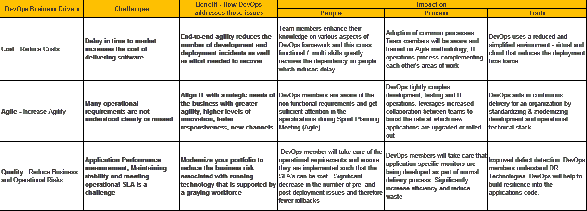

# DevOps 业务驱动因素:可视化表示

> 原文：<https://devops.com/devops-business-drivers-visual-representation/>

向面向开发运维的组织转型的企业通常会注意到三个关键驱动因素:管理成本、提高敏捷性和提高业务价值。

组织今天面临的许多挑战可以直接映射到这些业务驱动因素。其中一个主要挑战包括延迟跨部门协作的沟通结构，以及必须应对文化转变。在技术方面，不同的开发和生产环境是一个障碍。

DevOps 从来没有规定一套标准的固定实践，所以组织发现很难知道哪些实践将对他们有益。开发运维的意义已经发生了变化，开发运维的新工具和流程已经出现。所以其中一个挑战就是 DevOps 不仅仅是不清楚，而且还在进化。

当我们谈论 DevOps 时，受到影响和受益的三大支柱是人员、流程和工具。采用 DevOps 的好处几乎会立即显现出来，因为在这些类型的组织中，应用程序开发的速度可以按周或按月衡量结果，团队的价值也很容易识别。

下表在单一视图中传达了我们如何将 DevOps 的业务驱动因素与挑战、优势和影响对应起来。

## 关于作者/ Aparna Balasundar

Aparna 是 TechStar Group 的 DevOps 业务主管。她在 IT 领域拥有超过 15 年的经验，擅长开发运维、服务产品开发和销售支持活动。在 [LinkedIn](https://www.linkedin.com/in/aparna-balasundar-b6568421/) 上与她联系。