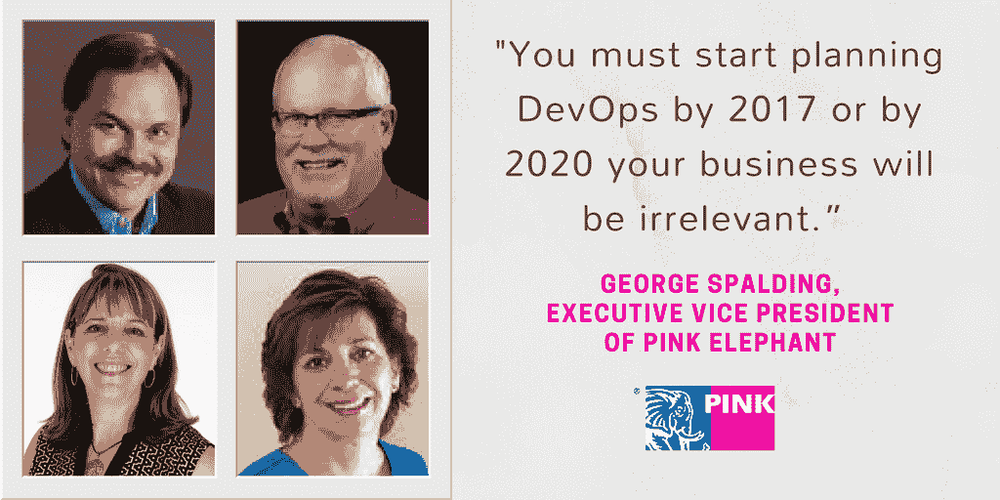

# 来自 Pink 的 DevOps 观点 17

> 原文：<https://devops.com/devops-viewpoints-pink17/>

最近，我有机会采访了 Pink17，这是 Pink Elephant 在内华达州拉斯维加斯举办的第 21 届国际 IT 服务管理年会暨展览会。在这种情况下，在维加斯发生的事情*没有*留在维加斯；相反，大多数人带着围绕 Pink17 的主题“沟通、联系”的可操作的收获回家。改变”，以帮助他们发展业务。

该课程内容丰富、内容全面，包括鼓舞人心的主题演讲人、12 个专题讲座和 120 多个专题讲座，是名副其实的涵盖 IT 服务管理(ITSM)领域的大杂烩。这包括许多深思熟虑和信息丰富的 DevOps 为重点的轨道。整个事件是一个组织和执行良好的会议。与我交谈过的与会者认为这些会议是有意义的，同行网络是非常宝贵的。无论您是为了战略愿景、战术计划还是运营诀窍，Pink17 都能满足您的需求。

在这篇文章中，我将介绍会议的一些重要收获，以及我与 Pink Elephant 的三位思想领袖进行的一些有趣的对话，包括他们对 ITSM 地区 DevOps 的愿景。

## **IT 的成功在于提供商业价值**

在开场白中，Pink Elephant 的执行副总裁乔治·斯伯丁(George Spalding)向 IT 专业人士传达了一个信息:“你必须在 2017 年之前开始规划 DevOps，否则到 2020 年，你的业务将变得无关紧要。”

这一信息在许多 DevOps 会议中得到了支持，例如“敏捷、精益和 devo PS——共同努力提高 ITSM 效率”,由 Pink Elephant 的研发副总裁 Troy DuMoulin 演示。在这个会议中，DuMoulin 揭示了敏捷、精益和 DevOps 实践如何协同工作来帮助组织实现更好、更快和更便宜的难以实现的挑战。

据 DuMoulin 说，在过去的三年中，IT 世界发生了很大的变化，尽管许多做法是相同的，但 IT 专业人员现在需要更快地完成工作，同时提供额外的业务价值。“语言已经变了。我们不再谈论成熟度、稳健性、合规性、风险和可用性，”杜默林说。"现在敏捷、精益和开发运维都是关于速度的概念，而效率是关键."

### 我们没有发明 devo PS——它一直就存在。IT 社区正在完善它

根据几位 DevOps 发言人的说法，DevOps 不仅仅是一个实体，而是一个由动态部件组成的系统，这些部件共同工作。当一切都是为了追求快速流动时，DevOps 可以被视为一个价值生成系统。根据 Pink17 的 DuMoulin 和其他人的说法，ITSM 的专业人士认识到的关键是 DevOps 文化是为他们现有的工作创造一个快速的流程——而不是取代它。

### **开发运维团队为成功的开发运维提供真正的价值**

在主题为 **"** DevOps 团队:持续参与方法"的会议上，DevOps 研究所(DOI)的联合创始人兼董事会成员 Jayne Groll，同时也是 Pink 智囊团的成员，提供了对正在为成功的 DevOps 带来真正价值的新兴 DevOps 角色、技能和能力的见解。特别是，她为开发运维团队探索了各种模式，以支持持续参与、共享责任、更快的部署以及增强开发运维、运营、安全、QA 和支持之间的信任。

除了定义 DevOps 中的新兴角色和技能，包括那些专注于人员、实践和自动化的角色和技能，Groll 还讨论了创建 DevOps 团队的模型和方法，包括他们的价值创造如何不同于当今的分层 IT 组织。

“DevOps 团队是连续的、跨职能的，”Groll 说。"这些团队展示了‘CALMS’价值观——文化、自动化、精益、测量和共享."

### **确保合适的人在合适的时间出席**

Jack Probst 是 Pink Elephant 的首席顾问，也是 Pink 智囊团的成员，他认为当大多数人谈论 DevOps 时，他们认为这是一场自动化游戏，而实际上这是一场组织变革和文化努力，因为人们真的在重新思考工作的进行方式。根据 Probst 的说法，IT 专业人员面临的最大挑战是找到时间来确保所有合适的人在合适的时间出现在会议桌上。不管使用什么 DevOps 工具，如果人们不互相交流，DevOps 就不会起作用。

“对我来说，DevOps 定义了你在一个组织中把乐高积木放在一起使其工作的方式，”Probst 说。“DevOps 有很多争议，但其核心是人的问题。采纳和适应，找出什么是重要的，并让它在你的组织内部发挥作用。”

此外，为了避免短视的想法并在 DevOps 计划中获得最佳结果，组织需要从人和文化的角度考虑 DevOps，而不仅仅是工具。

### **从为什么开始？**

Pink Elephant 的管理顾问 Robin Hysick 在她的会议“黄砖路&有效的组织变革经理”中，讨论了变革管理知识体系(CMBok)的 13 个关键知识领域、相关的专业认证水平以及 CMBok 涵盖的方法和技术如何帮助组织管理成功的项目和变革计划。

Robin 关于将 DevOps 集成到现有 ITSM 系统中的观点是关于为什么的。

“一个组织要做的第一件事，首先要明白为什么？我喜欢让人们去参考西蒙·西内克和他的‘黄金圈’解释。“我们从来没有这样做过。…除非组织知道他们为什么要做这样的事情，否则他们不会在开发运维与变革管理方面取得成功。”

此外，Hysick 还教授 DevOps 学院的 DevOps 基础和认证敏捷服务管理课程。她说，当人们来到这些课堂时，他们通常不知道 DevOps 是什么——当他们离开时，他们理解 DevOps 背后的概念及其来源。最重要的是，IT 专业人员从课堂上回来后，确切地知道应该向他们的决策者询问什么，以便他们能够最好地确定如何实现 DevOps 解决方案。

## **结论**

那么，我从 Pink17 Vegas 的经历中学到了什么呢？主要是 DevOps 不仅仅是关于工具、自动化或持续交付，它是关于人的。坐在同一张桌子上的合适的人，他们有智慧和热情去抓住他们业务的核心“为什么”因素？

IT 经理经常忙于快速生产产品的日常需求，以至于忘记了他们最初这样做的原因。在我们狂热的颠覆性技术世界中，最重要的问题被遗忘了:为什么？

在 Pink17，IT 专业人员了解到，要成功实施开发运维计划，他们需要在开始下一个冲刺或说“我们现在正在进行开发运维”之前先做好准备，并弄清楚为什么他们的企业想要“进行开发运维”他们试图解决的业务问题是什么？他们想做什么改变？为什么这会给他们的业务带来好处？他们业务的机会或紧迫性是什么，然后定义他们需要做什么来实现这一结果？无论是带来更多的工具，实现自动化还是更多，都应该从为什么开始？

你参加 Pink17 了吗？你最喜欢的会议是什么？想参加 Pink18，点击阅读更多[。](https://www.pinkelephant.com/en-US/Pink18/About) 

— [英格丽的两面](https://devops.com/author/ingrid-sides/)