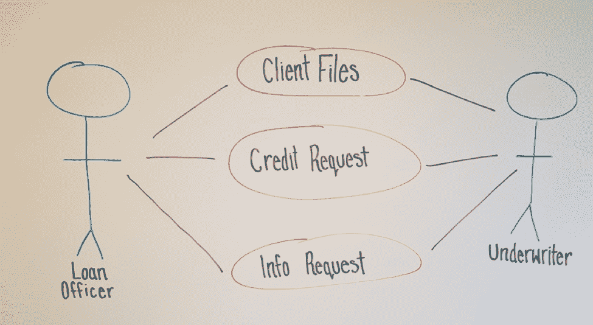

# 用图表推进开发

> 原文：<https://devops.com/advancing-devops-diagrams/>

[应用程序模型](https://devops.com/modeling-place-devops/)对于规划应用程序特性、计划的变更和当前的缺陷非常有用，甚至对于路线图也是如此。模型需要组织的时间和精力，并且只能在建模团队开发出通用语言时才能创建和维护。然而，付出的努力是值得的，因为它可以为更好的 DevOps 环境奠定基础。

建模团队将代表不同的组织背景，并且必须弥合技术人员和非技术人员之间常见的理解差距。该团队还将包括运营和开发专业人员，以便协作不仅能加深理解，还能从一开始就奠定满足企业、开发和运营需求的框架。

建模团队可以使用图表，通过向想法和过程添加更多的上下文来促进对通用语言的理解和创建。图表是一种向下钻取的练习，可以画在白板上，画在记事本上或者用 UML 工具形式化。

随着图的迭代，它们在技术上变得更加正确，并且可以很容易地保留下来供将来讨论。此外，一些图的基础经常支持其他类型的图，这些图可以对开发团队有所帮助(例如[类](https://en.wikipedia.org/wiki/Class_diagram)或 [ERD](https://en.wikipedia.org/wiki/Entity%E2%80%93relationship_model) )，并提供一定级别的技术文档。它们还为建模团队提供了一个讨论的基础，将讨论反馈给他们的组织单位，以获得反馈和改进。

最后，也许是最重要的一点，*图表有助于消除叙述性描述和讨论固有的模糊性*。消除歧义是通用语言的核心，并使清晰的交流成为可能，这是 DevOps 的关键要素。

我们可以通过关注一个小而简单的操作在图表中展示这种向下钻取:描述当一个新客户进入银行系统申请商业贷款时会发生什么。

## 用例图

一个常见的起点是用例图，如下图所示。

该图显示了几个关键数据点:

*   涉及到两种类型的员工(演员):信贷员和承销商
*   信贷员和承销商与三个业务元素进行交互:客户文件、信贷请求、请求的信息

对于讨论之外的人来说，这个图可能看起来不是很有用，但是它是创建更深入和有用的图的第一步。

## 活动图

用例图的一个逻辑和简单的步骤是活动图。它采用了许多相同的概念，并将其扩展为一步一步的程序，这些程序是通过讨论当前程序以及合规性和法规需求而建立的。

通过将程序划分成垂直的“泳道”,我们现在有了流程的顺序，以及谁或什么对其负责。

第一个分区标记为 Loan Officer，显示了在系统可以做任何事情之前他们负责的三个过程(创建客户文件、创建信贷请求和上传财务报表)。在移动到第一个位置之前，这三个部分都必须存在。

一旦处理好这些项目，系统就通知第二个参与者，即承保人，有一个信用审查需要他或她执行，以及在哪里找到所需的数据。

然后承销商决定贷款是否被批准。无论这是一个半自动过程还是完全由人工完成，都超出了此图的范围；我们只需要知道下一步会有什么决定。我们可以看到，承销商有两种选择。他或她可以:

1.  决定贷款(批准或拒绝——再次，超出范围)，在这种情况下，系统从那里接管。
2.  向信贷员请求更多信息(可能上传了错误的文件或者需要来自客户的更多数据)。然后，系统会通知信贷员，流程重新开始。

活动图对文档很有用，因为它们开始向整个业务流程添加结构。他们还开始定义哪些流程是:

*   由人类管理
*   由正在开发的应用程序管理
*   代表应用程序将与之交互的系统，操作需要保护该系统

即使在技术上不是 100%正确的(因为我们的示例并不完全正确)，它们仍然以一种有意义的方式表示信息，任何很少或没有指导的人都可以理解。

## 数据流图

有了数据流图(DFD ),这些图开始描绘出发生的系统和程序以及数据流。到目前为止，DFD 比其他图更复杂，它在显示不同过程如何交互方面变得非常有用。尽管随着更多层的增加，DFD 变得更加详细，但无论背景如何，它们仍然可以被建模团队的任何成员理解和解释。

运营团队通常会发现它们很有帮助，因为它们会标出何时可以访问或存储敏感数据。在我们的例子中，诸如公司纳税申报表之类的东西将被存储和访问；显然需要实施一些安全措施来确保只有那些有权限的人才能看到它们。

在创建数据流图时，讨论是关键，因为一个人拥有创建一个没有问题和答案的数据流图所需的所有知识是非常罕见的。基于我们当前的图表和一些问题，例如:

*   客户端 id 是手动创建的，还是系统的一部分？
*   请求是发送给特定的人，还是通过队列传递？
*   信贷决策是原始申请的一部分还是保存为单独的文件？

可以拟定一个 DFD:

DFD 乍看起来可能很复杂，但当一点一点来看时，它很简单，几乎不用解释就能理解。它对开发团队也很有帮助，因为它在粒度级别上隔离了特定的过程。

例如，开发团队可能会看到流程“Get ID”，知道这是一个系统流程(非手动的)，并意识到他们在现有的应用程序中已经有了一个类似的模块，可以用于该应用程序。

当然，这将是在应用程序模型中创建的许多 DFD 中的一个，这是使用 DFD 的另一个关键优势。数据流图可以分层，从上下文图开始，向下细化到所需的最小流程。这种分层自然也有助于将应用程序分解成不同的部分，既有助于创建应用程序模型的不同部分，也有助于为对话提供自然的起点和终点。

考虑到在这些讨论中可能会用到许多图表，使用建模工具来轻松地创建、编辑、分层和存储图表以备将来使用可能会很有用。

## 其他图表

当然，这些只是一些图表，但是它们展示了图表化的过程如何有助于建模团队的交流。虽然团队可以从数据流图开始，但这将是一个更加困难的过程。然而，通过遍历一个用例和一个活动，它变得更容易，因为它将一个系统分解成可理解的部分。

当建模团队回到他们的业务单元时，它还为他们提供了易于理解的图表。他们可以解释应用程序模型，并获得高质量的反馈，以及要添加到模型中的建议。

这些图表也可以作为文档的起点，对团队有所帮助。DFD 是一个很好的起点:

*   开发团队创建详细的类图和组件图，概述应用程序架构。
*   操作的部署图，用于记录哪些数据要隔离在限制访问的防火墙后面。

虽然没有一个图表化的过程可以自己创造一种通用的语言，但是图表对团队的清晰性有极大的帮助。它们还可以作为应用程序模型讨论的记忆，以便减少人为错误和记忆。最后，通过帮助消除建模团队中的歧义，他们有助于推动更好的沟通，这是 DevOps 本质的一部分。

*注释图表是在 Astah Professional 中创建的，经许可使用。如需了解更多有关阿斯塔和造型的信息，请访问公司网站***。**

## *关于作者/斯科特·里斯*

*Scott Reece 是 DevOps 带来的更大可见性和沟通能力的忠实粉丝。作为 Astah 的朋友，Scott 已经通过使用模型和团队建设成功地缩小了项目沟通的差距。Scott 拥有超过 10 年的项目管理经验，目前在 Inedo 担任合伙人总监。*